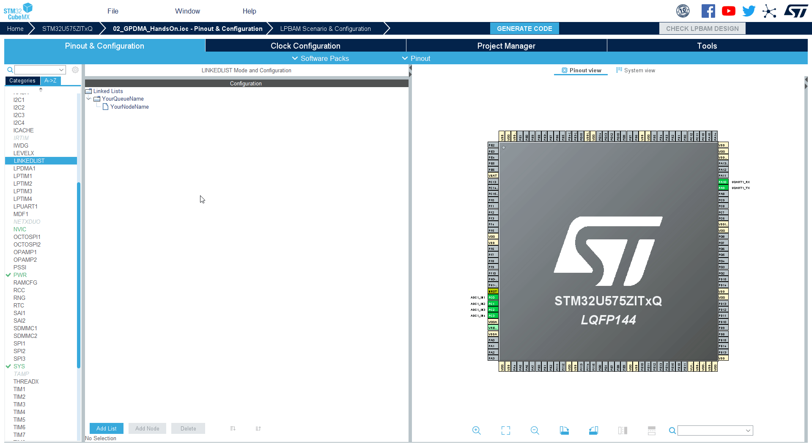
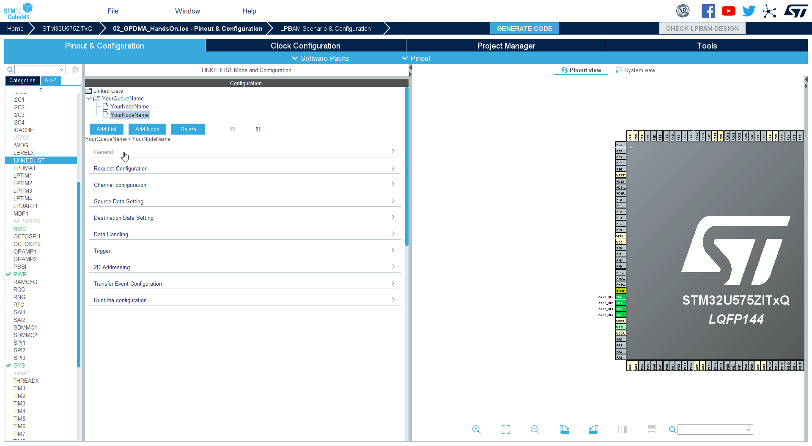
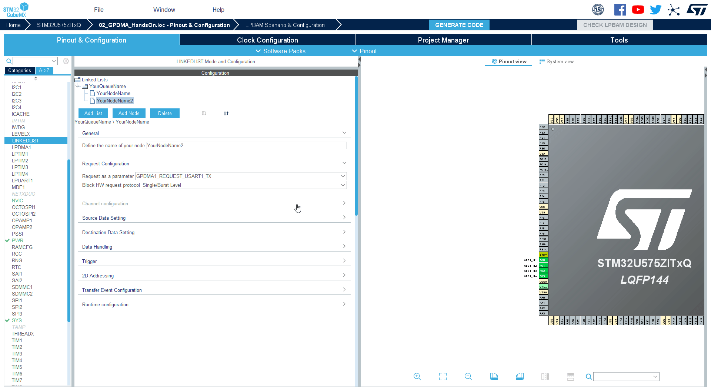
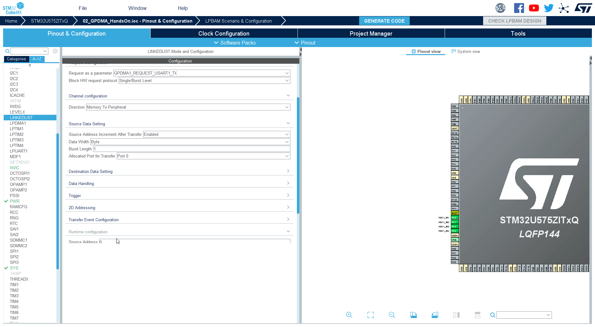

# Lxtending our list

In this part we will extend our example. By adding UART to send received `data` buffer.

How to do it:

1. We add **UART** and configure it.
2. We add new node to our **GPDMA**

ow return back to MX

# Selecting UART1

1. Go to CubeMX
2. Select `UASRT1`
3. Set **Mode** as `Asynchronous`

4. Check that pins are at **PA9** & **PA10**


1. Keep default **baudrate** `115200`

# Select LINKEDLIST

1. Go to LINKEDLIST periphery again


# Add new node

1. Select Queue YourQueueName
2. Add Node



# Configure our new node

1. Set new name `YourNodeName2`

```c
YourNodeName2
```



2. In **Request configuration** set **Request as a parameter** to `GPDMA1_REQUEST_USART1_TX`


3. In **Channel configuration** set **Direction** to `Memory to Periphery`



4. In **Source Data Sertting** set **Source Address Increment After Transfer** to `ENABLE` 


5. In **Runtime configuration** set **Source Address** to `data`

```c
data
```

6. In **Runtime configuration** set **Destination address** to `&(UART1->TDR)`

```c
&(USART1->TDR)
```

7. In **Runtime configuration** set **Data Size** to `(64*2)`

```c
(64*2)
```



# Generate code

Now we can **Generate code** and switch to **CubeIDE**

# Start UART

1. First enable DMA request on USART1
By using     `ATOMIC_SET_BIT`

Use 

```c
    ATOMIC_SET_BIT(huart1.Instance->CR3, USART_CR3_DMAT);
```

like 


```c-nc
  /* USER CODE BEGIN 2 */
  MX_YourQueueName_Config();

  HAL_DMAEx_List_LinkQ(&handle_GPDMA1_Channel15, &YourQueueName);

  HAL_DMAEx_List_Start(&handle_GPDMA1_Channel15);
  
  ATOMIC_SET_BIT(huart1.Instance->CR3, USART_CR3_DMAT);
  
  HAL_ADC_Start(&hadc1);
  /* USER CODE END 2 */
```

2. Start UART for TX

 We use `__HAL_UART_ENABLE` to start USART1

Put code
```c
    __HAL_UART_ENABLE(&huart1);
```

like 

```c-nc
  /* USER CODE BEGIN 2 */
  MX_YourQueueName_Config();

  HAL_DMAEx_List_LinkQ(&handle_GPDMA1_Channel15, &YourQueueName);

  HAL_DMAEx_List_Start(&handle_GPDMA1_Channel15);
  
  ATOMIC_SET_BIT(huart1.Instance->CR3, USART_CR3_DMAT);
  
  __HAL_UART_ENABLE(&huart1);
  
  HAL_ADC_Start(&hadc1);
  /* USER CODE END 2 */
```