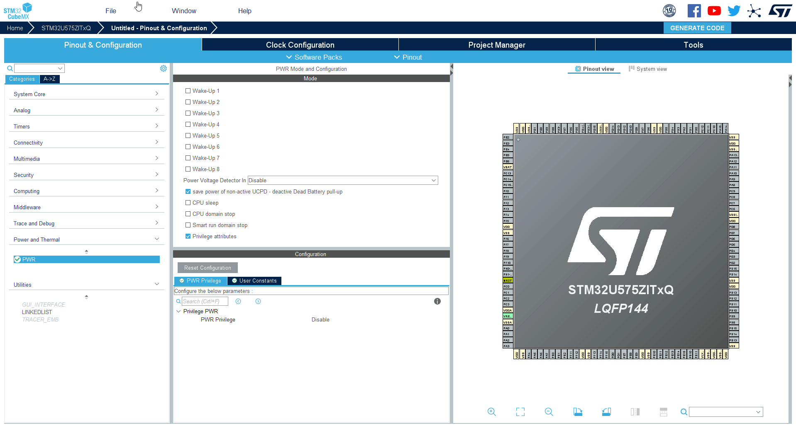
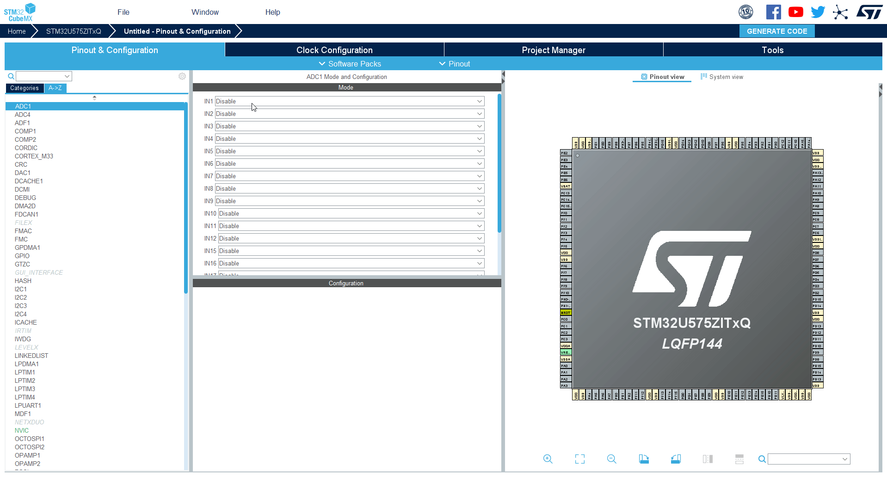
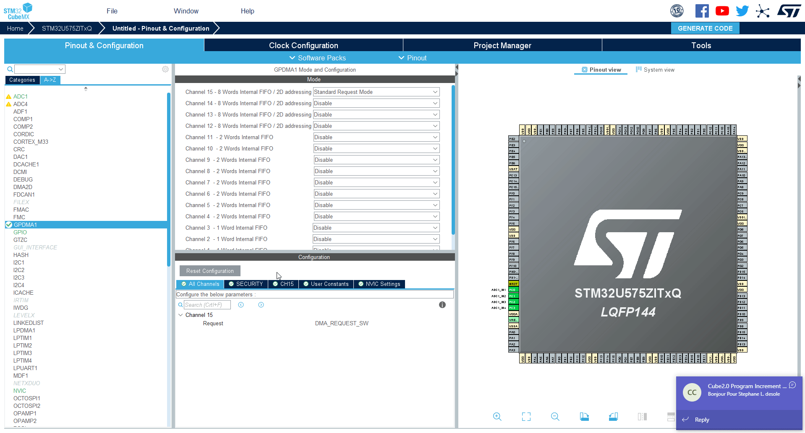

<!-- ----!
Presentation
----! -->

# GPDMA handson copcopysheet 

## 1. GPDMA + ADC

 We create simple example where first GPDMA transfersdata from ADC. 

## 2. TIM + GPDMA + ADC

Then we modify the example that GPDMA is triggered from TIM to start transfering data from ADC

## 3. TIM + GPDMA + ADC + UART

At the end we modify GPDMA again to get data from ADC and when finished to transfer them over UART. 

# GPDMA + ADC

1. Start new project. For STM32U575ZIT
   Description can be found on this [Link](./../utility_config/mx_create_project.md)

# Select ADC1 periphery

# Enable 4 adc channels

# Configure the ADC 1/3

1. Set `Continuous conversion mode` to **Enable**

2. Set `Low power wait` to **Enable**

3. Set `Enable Regular Conversions` to **Enable**

# Configure the ADC 2/3

1. Set `number of conversion` to **4**

# Configure the ADC 3/3

1. You can set ADC channel for each `Rank`

# Select GPDMA1

1. Sececd GPDMA1
2. Enable channel with 2D addressing (12-15)

# Configure GPDMA1 CH15 1/2

1. Select CH15(or channel which you selected CH12-CH15)
2. Set `Circular Mode` to **Enable**
3. Set `Request` to **ADC1**

# Configure GPDMA1 CH15 2/2

1. Set `Source Data Settings` - `Data Width` to **Half Word**
2. Set `Destination Data Settings` - `Data Width` to **Half Word**
3. Set `Destination Data Settings` - `Destination Address Increment After Transfer` to **Enable**

# Set project name and Generate project

1. How to generate project is described here [Link](./../utility_config/mx_generate_code.md)
2. Import project to CubeIDE [Link](./../utility_config/ide_import_project.md)
   