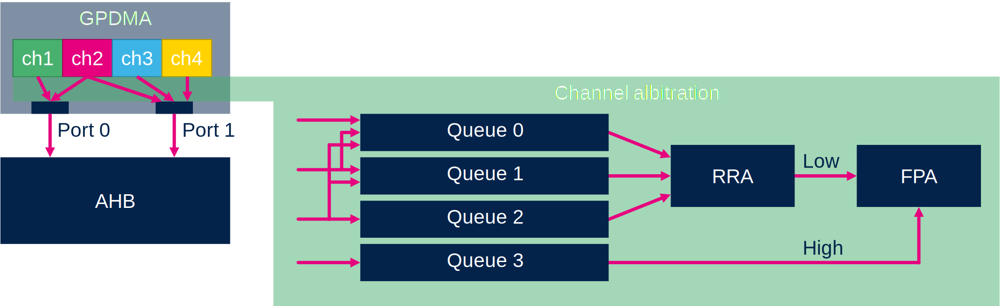
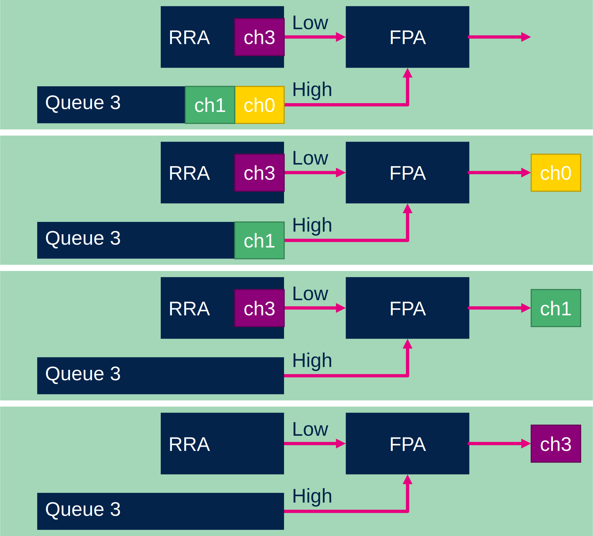
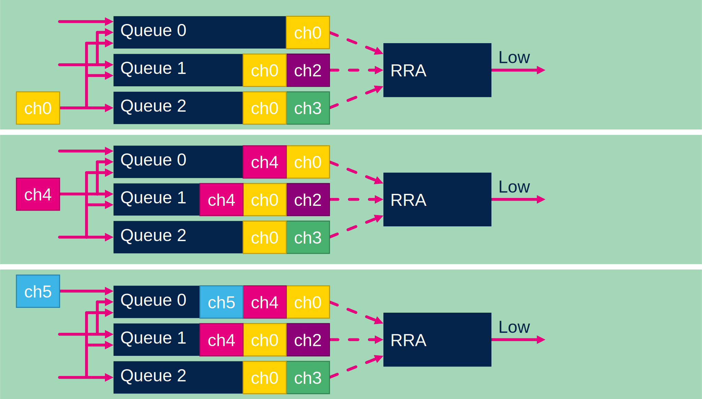
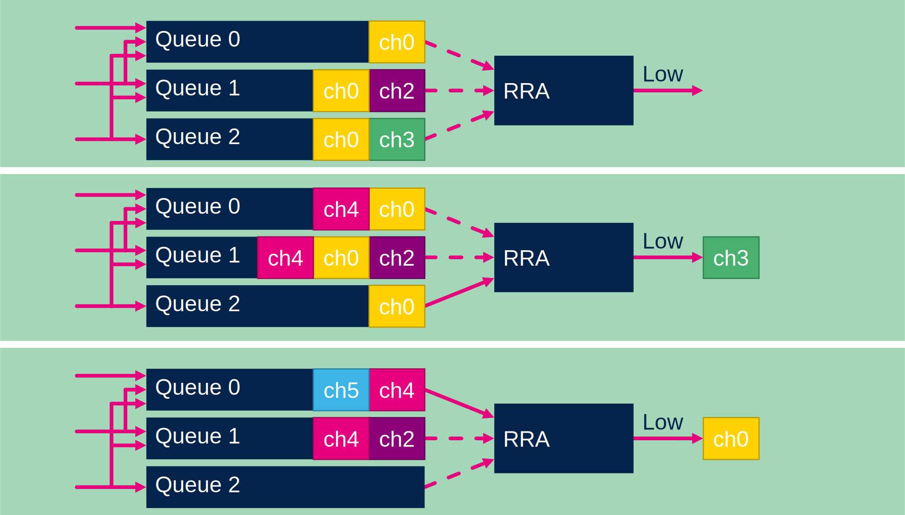

# GPDMA priprity

## Access to bus

The GPDMA is connected to AHB by two ports. 
Port 0 and Port 1. 
The ports can work in paralell and arbitration is done separately for each port. 

## Arbiter

Because GPDMA have multiple channels which cannot access the bus in same time the GPDMA must have arbiter functinality to decide which channel will be handled. For this each channels have priority

## Prioritis

They are 4 priorities. Each priority have priority queue. 
Highest priority is assigned to requests in queue 3. Lowers priority to queue 0. 

### Fixed priority arbiter

All requests in Queue 3 are handled first before other queues. This queue is for most important actions. 

### Round Robin arbiter

If not Queue 3 request is present. A round robun arbiter is used to Queue 0-2

Incoming High priority request is asigned to Queues 0-2. 
Medium priority request is asigned to Queue 0-1
Low priority request is asigned to Queue 0. 

The Low priority request have 50% smaller badnwith than Medium priotiry requests. And 33% bandwith than High priority requests. 

The RRA is exacuting request from Queue 0, Queue 1, Queue 2 and again. 
Each time a request is handled is removed from all queues. 
