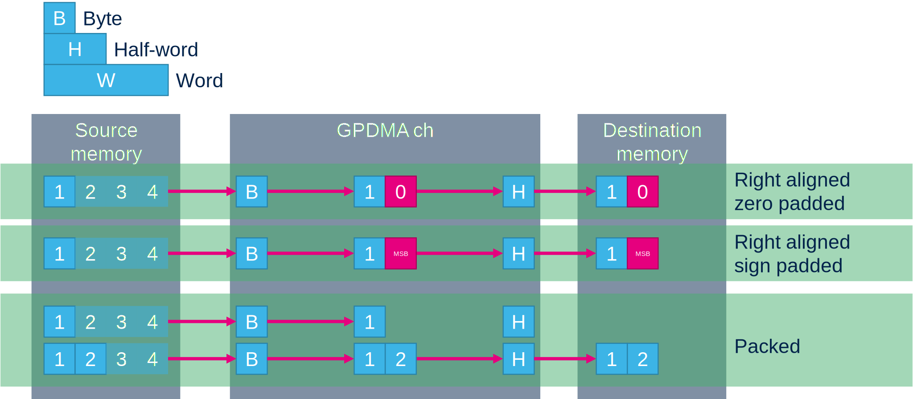
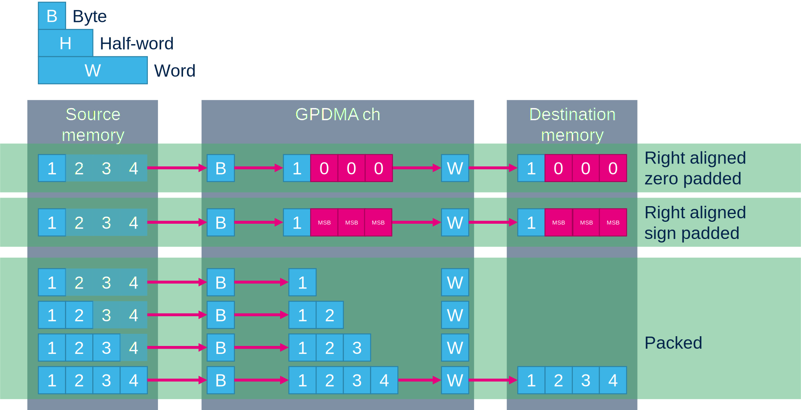
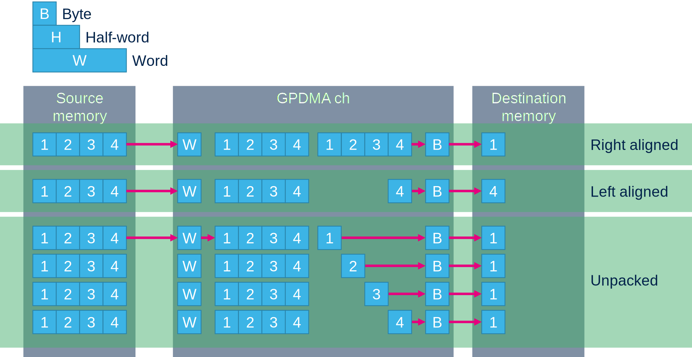
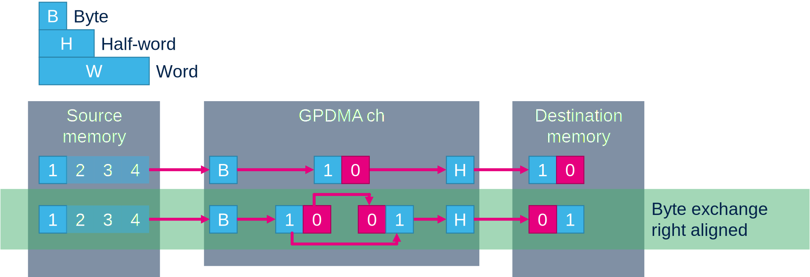
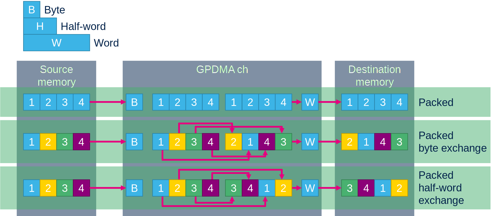
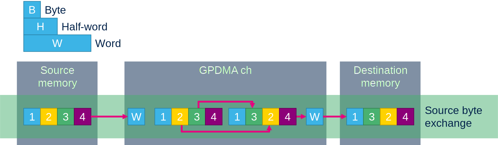
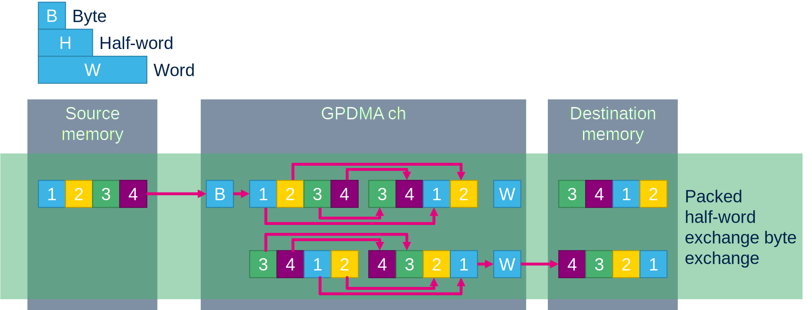

# Data alignment

The GPDMA allow to have different width for source and destination. 
There are additional option how to behave with this sizes

## Transfer small source width to bigger destination width

byte to half-word

Like byte to word.

### Right aligned data zero padded

Default settings
Byte is copied and padded with 0

### Right aligned data sign padded

Byte is copied but now padded with MSB(sign)

### Packed data

The GPDMA store 2-4 data from source memory before is written 1 write to destination

## Transfer bigger source width to smaller destination width

Like copy word on source side to byte on destination side

### Right aligned

The data are transfered only right data kept lest are truncated

### Left aligned

Data transfered left data kept right data truncated.

### Unpacked

One read is done from source location. Data kept in GPDMA and on destination side is done 2-4 writes.

# Data exchange

# Data exchange

The GPDMA have capability to exchange data during transfer

## Destination byte exchange

Possible only if destination size is more than byte.
Exchange bytes in each half-word

## Destination half-word exchange

Possible only is destination is word. 
Exchange half-words in word.

## Source byte exchange

Possible only if source is word. 
The unaligned bytes are exchanges

## Exchange combination

The exchanges is possible tombine between each other only user must be careful in thier size limits.

