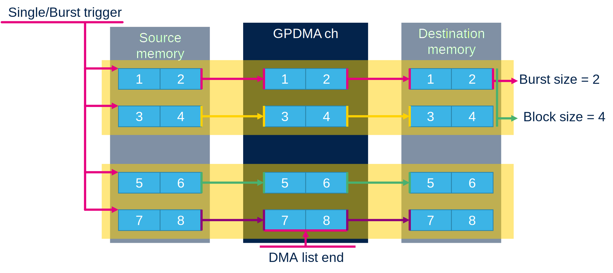
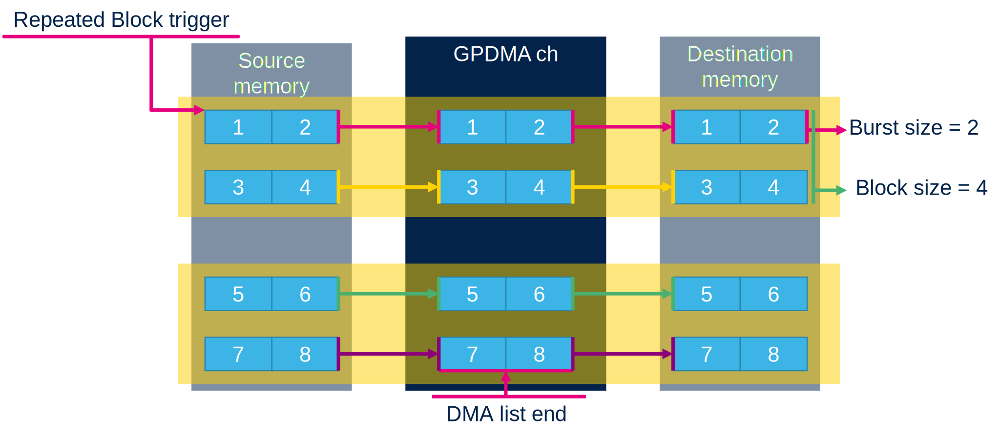
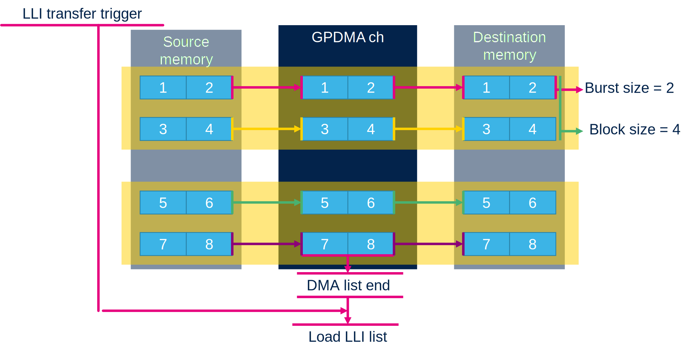

# GPDMA channel triggers

The GPDMA channel operations can be conditioned by triggers. 

## Burst trigger

The GPDMA is able to conditon burt transfer with trigger. 
So each burt must have valid trigger

## Block trigger

The block transfer can be conditioned by trigger

## Repeated block trigger

The repeated block trigger can be conditoned by trigger

## LLI trigger

Loading of new LLI is conditioned by trigger

