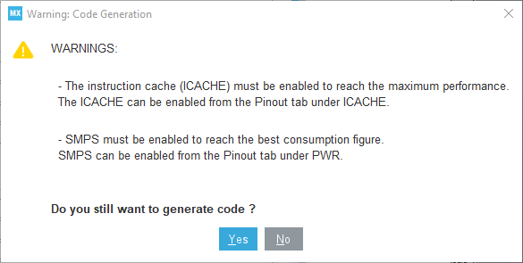
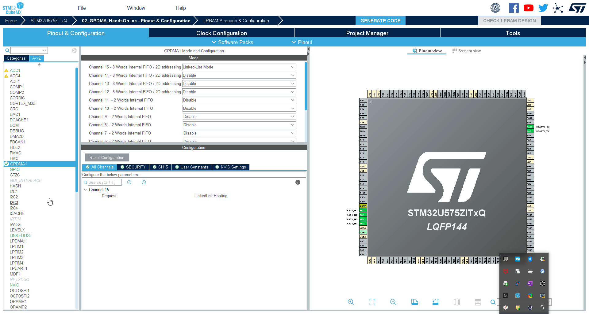

----!
Presentation
----!

# MX pupup remove

This part is optional. And it is not affecting the GPDMA.
The purpos it to repove popup about SMPS and I-Cache fore ach code generation

# Enable I-Cache

1. Select **ICache** periphery
2. Set Mode 1-way (direct mapped cache)

This enable the I-Cache which is used instead of Flash so code exacution is faster(This is not important for our GPDMA handson)

# Enable SMPS

1. select **PWR** periphery
2. Set **Power regulator** to `SMPS`

The SMPS is more effective power supply than LDO. With SMPS is possible reach lower power consumption. 
Disadvantage is that SMPS need external components. And SMPS is making bigger electrical noise then LDO. 

