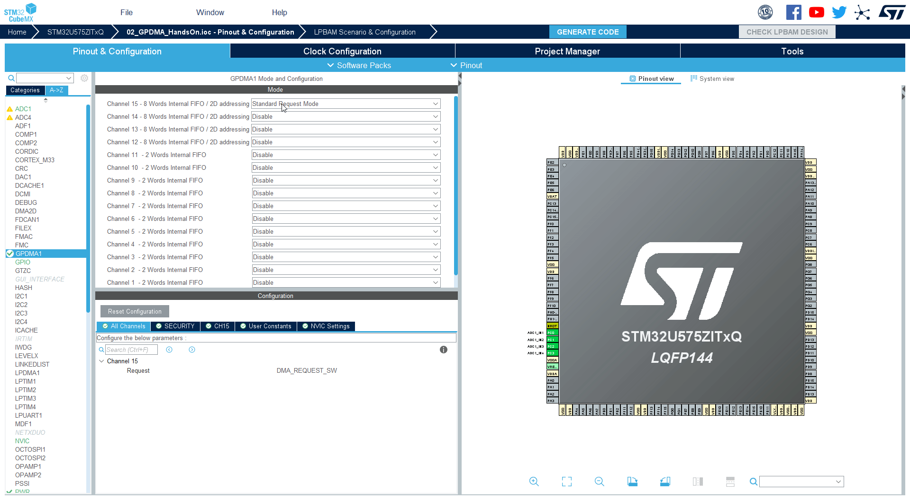
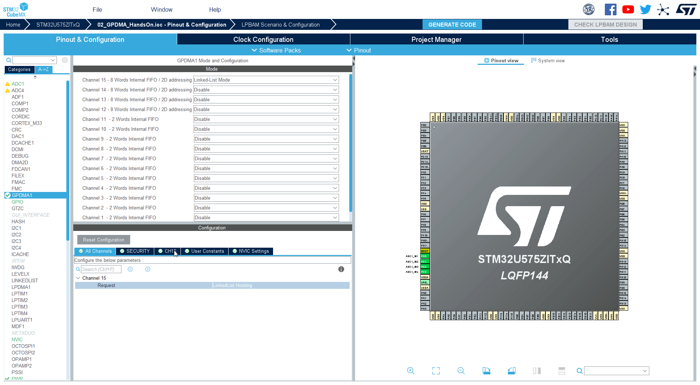
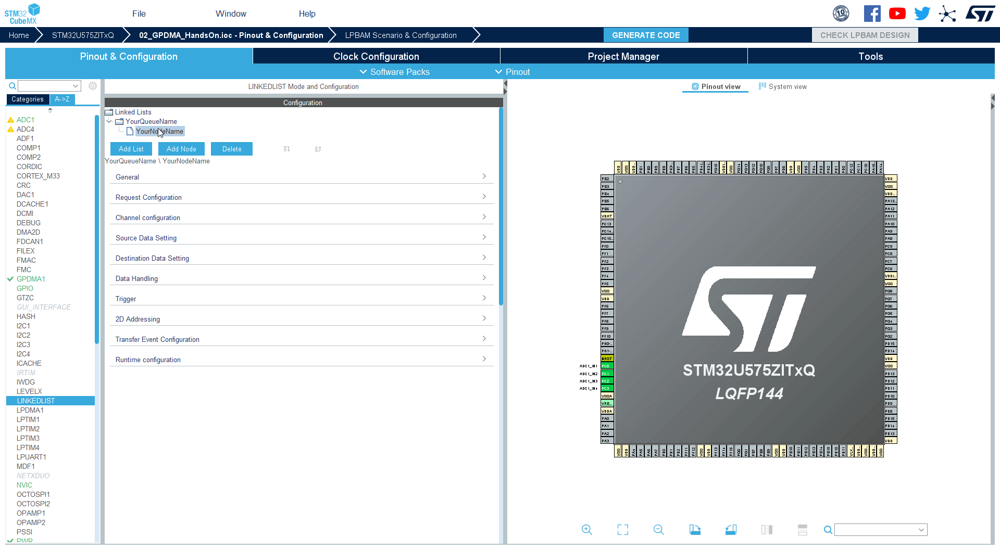
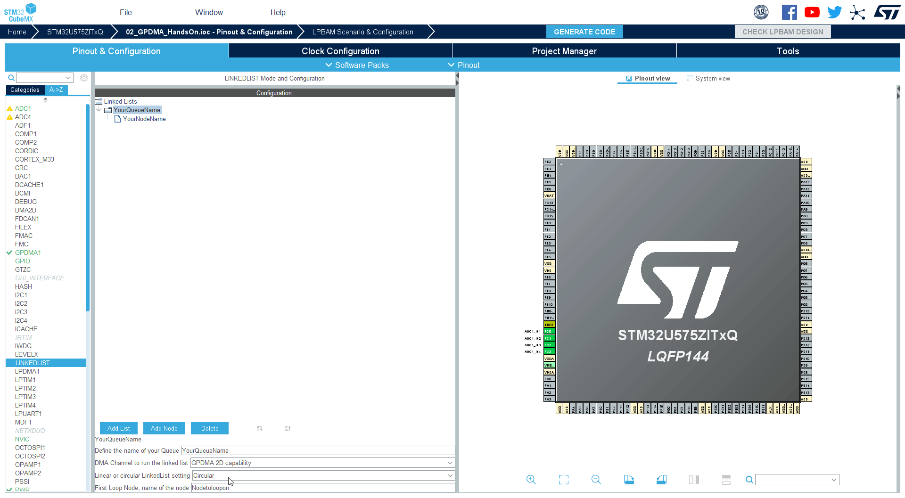
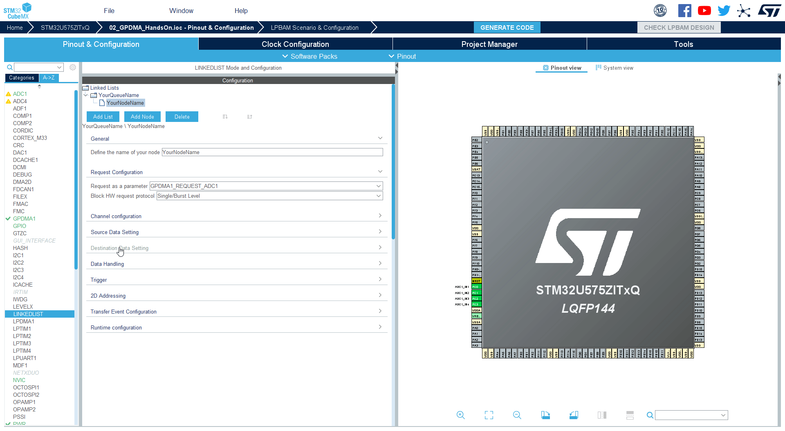

----!
Presentation
----!

# GPDMA handson adding features

## Current state

* ADC convert samples
* ADC generate request for GPDMA
* GPDMA transfer data to memory

## Next Step

* Now we do the same but with **LLI list**.
* Which allow us later add more lists in later steps

# Classic DMA circular mode

Classical DMA had bit which allow repeat the configuration.
When DMA finished it automatically reload previous configuration.


# GPDMA list mode

The GPDMA have different approach
It have **lists** containing **configuration** which is used by **GPDMA**.

When GPDMA ends it looking for new configuration based on LLR register. If is found it reload own registrs with it also with new LLR.
This configuration is called **NODE**. Multiple nodes are **queue** making list. 


# Return back to CubeMX

In MX the ADC configuration will be the same 

# Change GPDMA mode

1. Change **GPDMA** mode from `Standard Request Mode` to `Linked-List Mode`



# Configure CH15 1/2

1. Got to **CH15** Configuration



# Configure CH15 2/2

2. Set **Execution Mode of Linked List** to `Circular`


# Linked List configuration 1/2

1. Go to `LINKEDLIST` periphery in **Utilities**


# Linked List configuration 2/2

2. Add List by click on `Add List` button


# Configue List/Queue 1/3

1. Click on Queue to be able configure it. Default name is `YourQueueName`



# Configue List/Queue 2/3

2. Set **Linear or cicrular LinkedList setting** to `Circular`


# Configue List/Queue 3/3

3. Set first node in loop in our case put `YourNodeName`

```c
YourNodeName
```



# Node loop

The first node in loop is where LLR from last node in queue will be pointed.
You can select any node in queue.
In our case when YourNodeName finishes he will reload same configuration. Because he is pointing on himself.


# Node configuration

1. Select Node


# Set node parameters same as in previous configuration 1/4

1. In **Request configuration ** set **Request as a patameter** to `GPDMA_REQUEST_ADC1`
   


# Set node parameters same as in previous configuration 2/4

2. In **Destination Data Setting** set **Destination Address Increment After transfer** to `Enabled`

3. In **Destination Data Setting** set **Data Width** to `Half Word`



# Set node parameters same as in previous configuration 3/4

4. In **Source Data Setting** set **Data Width** to `Half Word`


# Set node parameters same as in previous configuration 4/4

5. In **Runtime configuration** set **Source Address** to `ADC1->DR`

```c
(uint32_t)&(ADC1->DR)
```

6. In **Runtime configuration** set **Destination Address** to `data`

```c
data
```

7. In **Runtime configuration** set **Data Size** to `SIZE`

```c
(64*2)
```


# Generate code

Now generate code and switch to CubeIDE


# Add linked_list.h include

First add **include** of `linked_list.h` into `main.c`

By adding 

```c
#include "linked_list.h"
```

To `USER CODE BEGIN Includes` section

```c-nc
/* USER CODE BEGIN Includes */
#include "linked_list.h"
/* USER CODE END Includes */
```

# Add Queue handle to main

Add `YourQueueName` extern variable to our `main.c`

By adding 

```c
extern DMA_QListTypeDef YourQueueName;
```

like 

```c-nc
/* USER CODE BEGIN PV */
uint16_t data[64];

extern DMA_QListTypeDef YourQueueName;
/* USER CODE END PV */
```

# Add size and data also to Queue config

Add 

```c
extern uint16_t data[];
```

to `linked_list.c` section `/* USER CODE BEGIN PM */` like

```c-nc
/* USER CODE BEGIN PM */
extern uint16_t data[];
/* USER CODE END PM */
```

# Call queue config

Use `MX_YourQueueName_Config` to initialize our nodes and queue.

Add

```c
  MX_YourQueueName_Config();
```

to `/* USER CODE BEGIN 2 */` section in `main.c` like


```c-nc
  /* USER CODE BEGIN 2 */
  MX_YourQueueName_Config();
  /* USER CODE END 2 */
```

# What does MX_YourQueueName_Config? 1/3

The fucntion will create our node configuration from structure by using `HAL_DMAEx_List_BuildNode`
The node is now copy of gpdma registers. 
But still no link between nodes. 


# What does MX_YourQueueName_Config? 2/3


To link nodes together MX use `HAL_DMAEx_List_InsertNode_Tail`
To create our queue.


# What does MX_YourQueueName_Config? 3/3

To put nodes into circular loo we use `HAL_DMAEx_List_SetCircularMode`


# Connect queue and GPDMA channel

To connect Queue and GPDMA we will use `HAL_DMAEx_List_LinkQ`

Add

```c
HAL_DMAEx_List_LinkQ(&handle_GPDMA1_Channel15, &YourQueueName);
```

to section `/* USER CODE BEGIN 2 */` like

```c-nc
  /* USER CODE BEGIN 2 */
  MX_YourQueueName_Config();
  
  HAL_DMAEx_List_LinkQ(&handle_GPDMA1_Channel15, &YourQueueName);
  /* USER CODE END 2 */
```

First parameter `handle_GPDMA1_Channel15` is GPDMA handle
Second parameter `YourQueueName` is our Queue

# Start GDMA and ADC

Start DMA by using `HAL_DMAEx_List_Start`
ADC is started by using `HAL_ADC_Start`

Add 

```c
  HAL_DMAEx_List_Start(&handle_GPDMA1_Channel15);
  HAL_ADC_Start(&hadc1);
```

To section `/* USER CODE BEGIN 2 */` like 

```c-nc
  /* USER CODE BEGIN 2 */
  MX_YourQueueName_Config();

  HAL_DMAEx_List_LinkQ(&handle_GPDMA1_Channel15, &YourQueueName);

  HAL_DMAEx_List_Start(&handle_GPDMA1_Channel15);
  HAL_ADC_Start(&hadc1);
  /* USER CODE END 2 */
```

## Compile code and run debug

# What we created

We have similar application like in Basic GPDMA. But now based directly on linked list, where we can add more elements


# Add link to GPDMA

We lined node to our GPDMA channel with `HAL_DMAEx_List_LinkQ`


