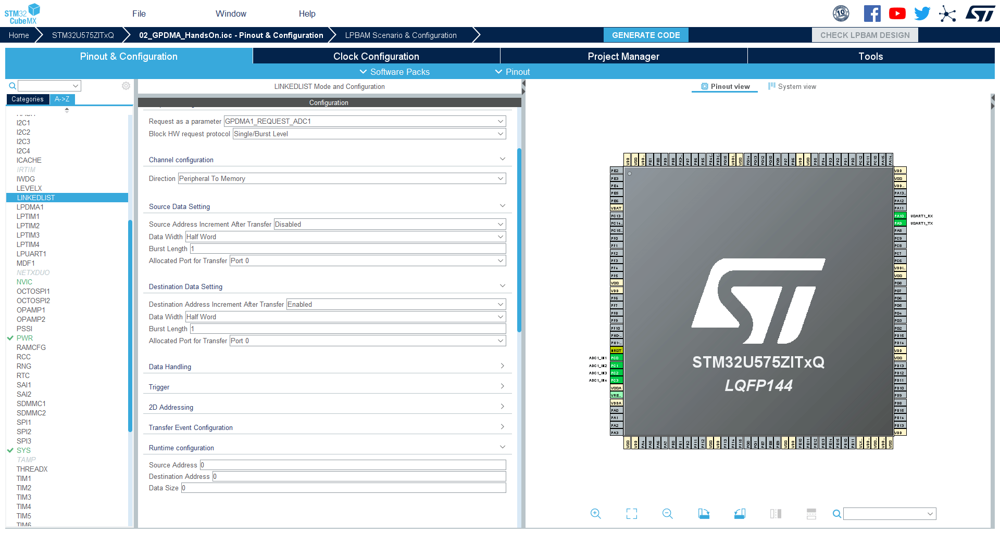

----!
Presentation
----!

# Select ADC1 peripheral

Select `ADC1` in **Analog**


# Enable 4 adc channels
Enable channels IN1 to IN4


# Configure the ADC 1/4

1. Set `Continuous conversion mode` to **Enable**

This option run ADC in loops. When ADC finish converting all its channels it will start again from beginning.

2. Set `Low power wait` to **Enable**

This option will stop ADC until the DATA are read from it. It is good to prevent overrun. And we are sure that we have still correct order of channels.

3. Set `Enable Regular Conversions` to **Enable**


# Configure ADC 2/4

1. Set `Conversion Data Management Mode` to **DMA Circular Mode**

After ADC converts value, it will create request for DMA. Circular mode here means, that after ADC finishes, all regular channels it will continue to generate DMA request in next run too.


# Configure the ADC 3/4

1. Set `number of conversion` to **4**

This will set ADC to do 4 ADC conversions which we can set.


# Configure the ADC 4/4

1. You can set ADC channel for each `Rank`

Each rank will have assigned one ADC channel to convert. It is possible to select same channel each time.


# Change GPDMA mode

1. Select **GPDMA1** in **System** category
2. Set mode to `Linked-List Mode`


# Configure CH15 1/2

1. Go to **CH15** Configuration


# Configure CH15 2/2

2. Set **Execution Mode of Linked List** to `Circular`


# Linked List configuration 1/2

1. Go to `LINKEDLIST` peripheral in **Utilities**


# Linked List configuration 2/2

2. Add List by clicking on `Add List` button


# Configue List/Queue 1/3

1. Click on Queue to be able to configure it. Default name is `YourQueueName`


# Configue List/Queue 2/3

2. Set **Linear or circular LinkedList setting** to `Circular`


# Configue List/Queue 3/3

3. Set first node in loop, in our case put `YourNodeName`

```c
YourNodeName
```


# Node loop

The first node in loop is where LLR from last node in queue will be pointed.
You can select any node in queue.
In our case when YourNodeName finishes he will reload same configuration. Because he is pointing on himself.


# Node configuration

1. Select Node


# Set node parameters same as in the previous configuration 1/4

1. In **Request configuration ** set **Request as a parameter** to `GPDMA_REQUEST_ADC1`
   


# Set node parameters same as in the previous configuration 2/4

2. In **Destination Data Setting** set **Destination Address Increment After transfer** to `Enabled`

3. In **Destination Data Setting** set **Data Width** to `Half Word`


# Set node parameters same as in the previous configuration 3/4

4. In **Source Data Setting** set **Data Width** to `Half Word`


# Set node parameters same as in the previous configuration 4/4

5. In **Runtime configuration** set **Source Address** to `ADC1->DR`

```c
(uint32_t)&(ADC1->DR)
```

6. In **Runtime configuration** set **Destination Address** to `data`

```c
data
```

7. In **Runtime configuration** set **Data Size** to `(64*2)`

```c
(64*2)
```



# Generate code

Now generate code and switch to CubeIDE