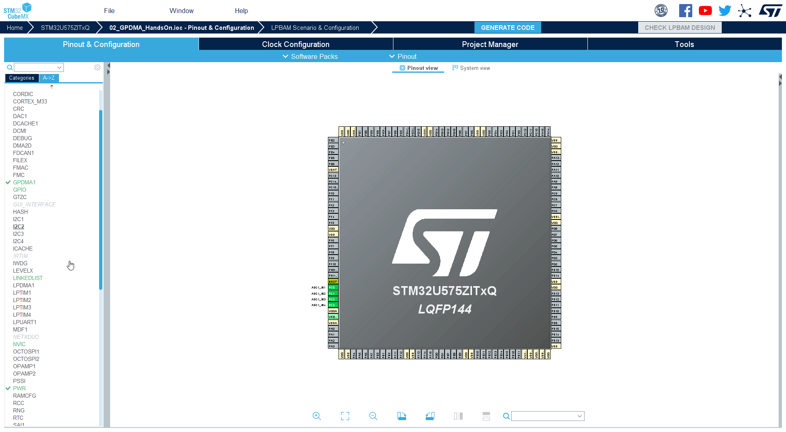
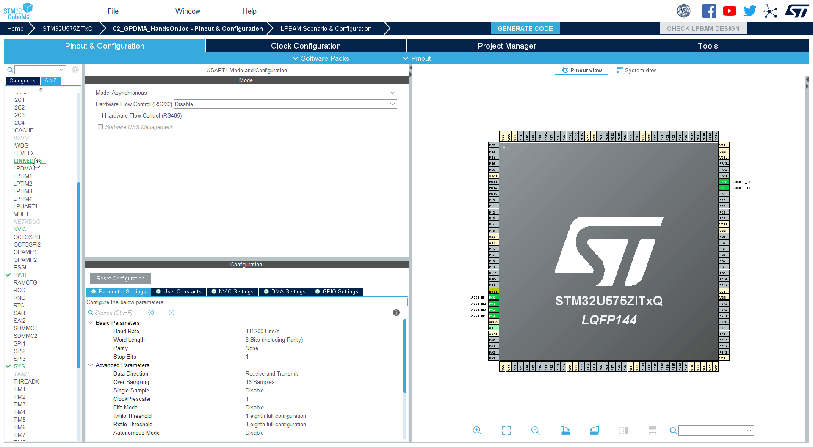
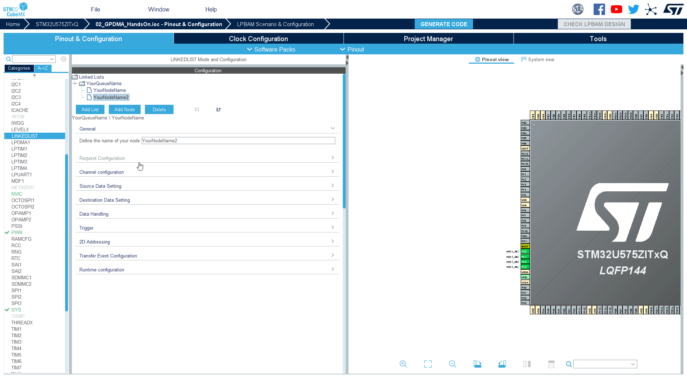
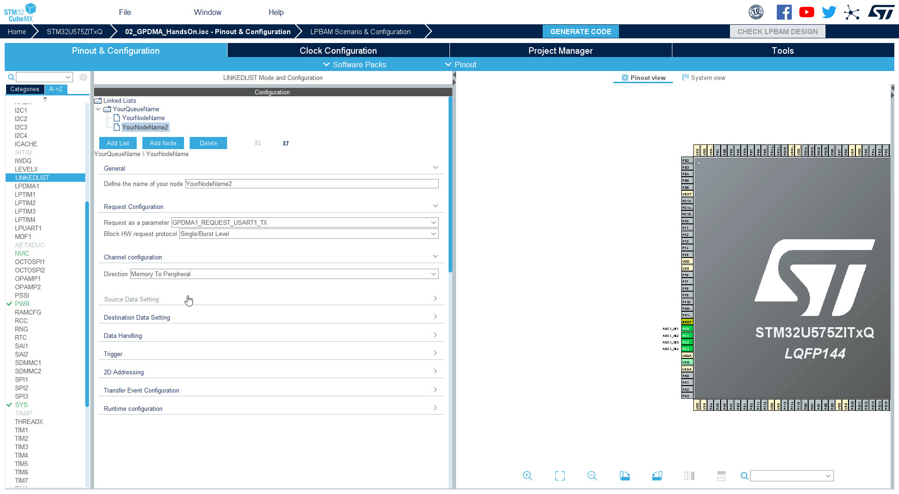

----!
Presentation
----!

# Selecting UART1

<asuccess>
we should have this from our homework
</asuccess>

1. Go to CubeMX
2. Select `UASRT1`
3. Set **Mode** as `Asynchronous`

4. Check that pins are at **PA9** & **PA10**



1. Keep default **baudrate** `115200`

# Select LINKEDLIST

1. Go to **LINKEDLIST** periphery again



# Add new node

1. Select Queue **YourQueueName**
2. **Add Node**


# Configure our new node 1/5

1. Set new name `YourNodeName2`

```c
YourNodeName2
```


# Configure our new node 2/5

2. In **Request configuration** set **Request as a parameter** to `GPDMA1_REQUEST_USART1_TX`



# Configure our new node 3/5

3. In **Channel configuration** set **Direction** to `Memory to Periphery`


# Configure our new node 4/5

4. In **Source Data Sertting** set **Source Address Increment After Transfer** to `ENABLE` 



# Configure our new node 5/5

5. In **Runtime configuration** set **Source Address** to `data`

```c
data
```

6. In **Runtime configuration** set **Destination address** to `&(UART1->TDR)`

```c
(uint32_t)&(USART1->TDR)
```

7. In **Runtime configuration** set **Data Size** to `(64*2)`

```c
(64*2)
```


# Generate code

Now we can **Generate code** and switch to **CubeIDE**
