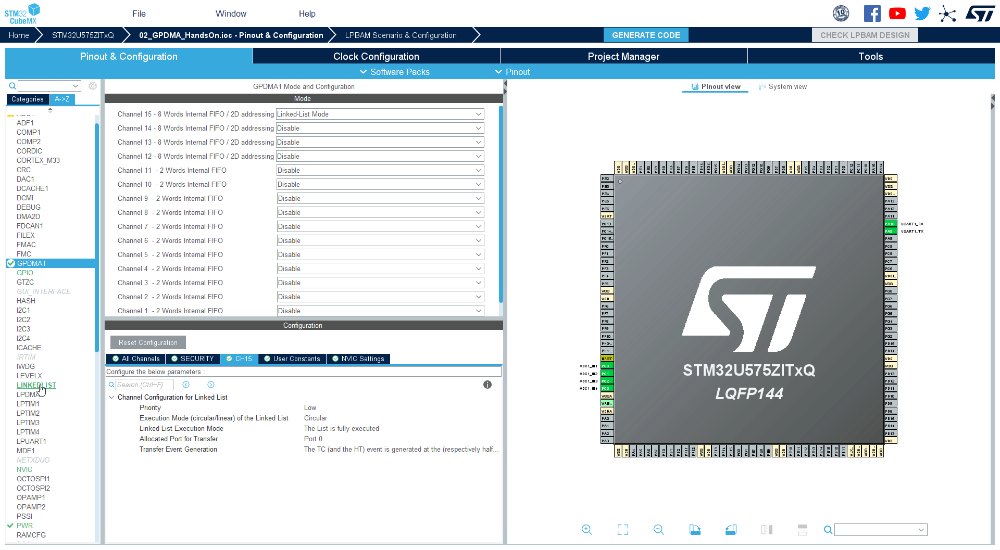
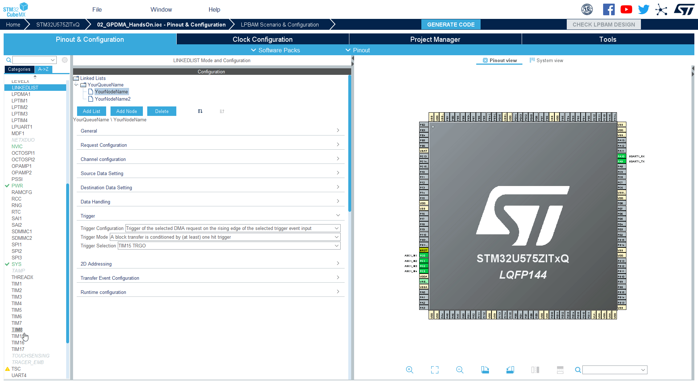
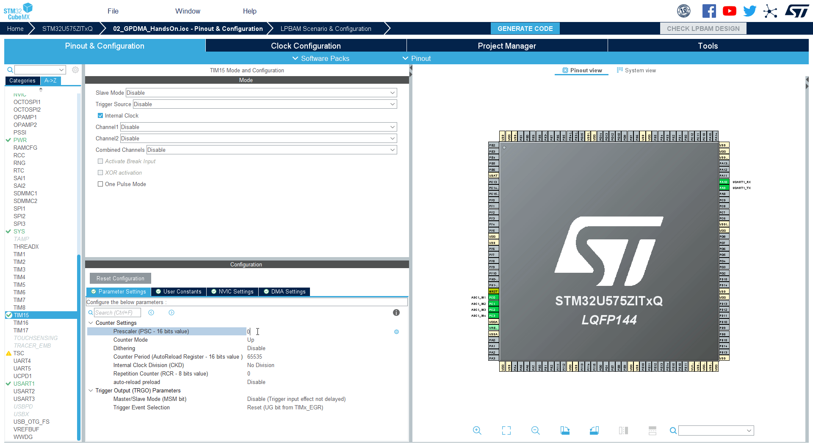

----!
Presentation
----!

# Select LINKEDLIST

1. Select `LINKEDLIST`
2. Select first node `YourNodeName`

# Select Trigger

   1. In **Trigger** section for option **Trigger configuration** set `Trigger of selected DMA request on rising edge of the selected trigger input event`
   2. In **Trigger** section for option **Trigger Selection** set `TIM15 TRGO`

# Select  TIM15 & Configure mode 

1. Select `TIM15`
2. Check `Internal Clock`

# TIM15 Configuration

1. Set **Prescaller** to `49999` (real value is 49999 + 1)
2. set **Counter Period** to `79` (4MHZ AHB), or `3199` (160MHz AHB) to get trigger each 1s
3. In **Trigger Outpput (TRGO) Parameters** section for option **Trigger Event Selection** set `Update event`

# Generate code 

1. **Generate code**
2. Go to **CubeIDE**
