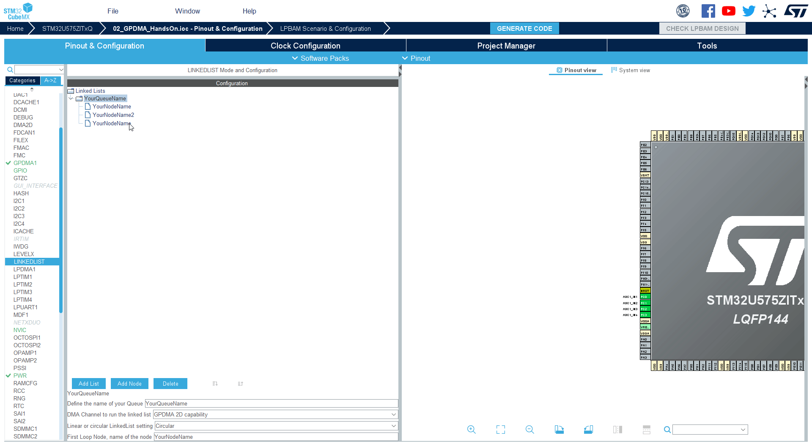
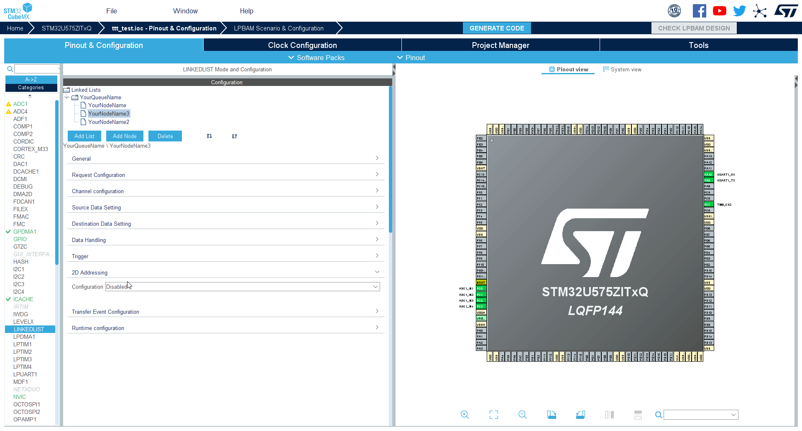
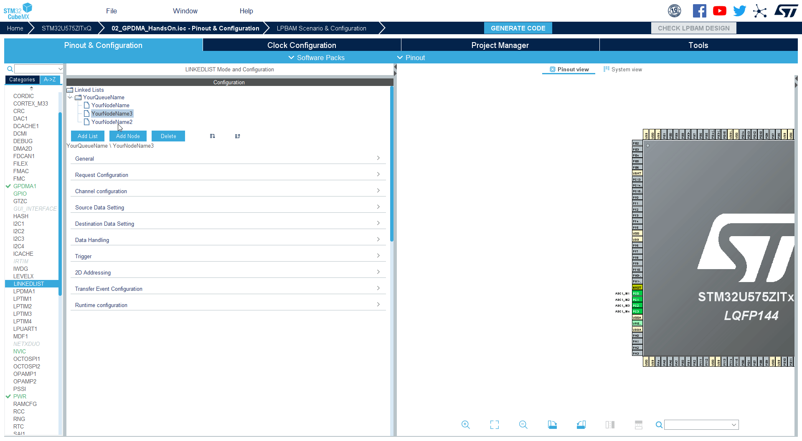

----!
Presentation
----!

# Select LINKEDLIST & Add new node

1. Select LINKEDLIST
2. Add new node


# Set name

1. Select last node
2. Set node name to `YourNodeName3`

In section **General** set node name to `YourNodeName3`

```c
YourNodeName3
```



# Set source and destination

1. In section **Source Data Settings** set **Source Address Increment After Transfer** to `ENABLE`
2. In section **Source Data Settings** set Data Width to Half-Word
3. In section **Source Data Settings** set **Destination Address Increment After Transfer** to `ENABLE`
4. In section **Source Data Settings** set Data Width to Half-Word


# Set 2D addresing

1. In section **2D addressing** set **Configuration** to `Enabled`
2. In section **2D addressing** set **Destination Address Offset** to `30` (16halfwords = 2*16bytes minus 2bytes)

```c
30
```

3. In section **2D addressing** set **Block Destination Address Offset** to `-126` (return to benning is 64*2bytes but we want to capture next sample so -1*2bytes)

```c
-126
```

4. In section **2D addressing** set **Repeat Counter** to `16` (we will transfer 4*2*16=128bytes = 64 samples)

```c
16
```


   
# Set Runtime configuration

1. In **Runtime configuration** set **Source Address** to `data`

```c
data
```

2. In **Runtime configuration** set **Destination Address** to `data2`

```c
data2
```

3. In **Runtime configuration** set **Data Size** to `8`

```c
8
```


# Modify node order

Set `YoutNodeName3` to middle position
1. Click on `YourNodeName3` 
2. Click to `Move up`


# Change UART source buffer

1. Select YoutNodeName2
2. Open section **Runtime configuration** set **Source Address** to `data2`

```c
data2
```



# Generate code

1. **Generate code**
2. Go to **CubeIDE**
