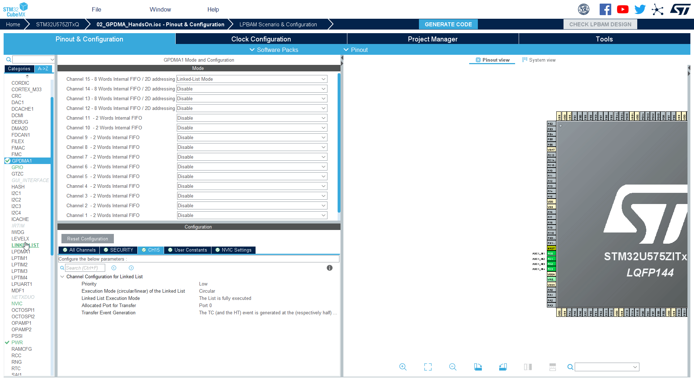

----!
Presentation
----!

# Configure events

The events can allow GPDMA to generate interrupts/events or disable this functionality so not interrupt/event wil be created by DMA channel. 

We will set GPDMA only to generte the event/interrupt with last node in list

# Generate event in block transfer

This option is used for our node which is using uart. 


# Generate event in last node

This option will be used in our first nodes. Because they are not last. They will **not generate any events**. 


# Select linked list

1. Open `LINKEDLIST`
2. Select `YourNodeName` node
3. In **Transfer Event Generation** section set **Transfer Event Generation** to `The TC event is generate at the end of the last linked-list item`
4. Select `YourNodeName3` node
5. In **Transfer Event Generation** section set **Transfer Event Generation** to `The TC event is generate at the end of the last linked-list item`
6. Select `YourNodeName2` node
7. In **Transfer Event Generation** section set **Transfer Event Generation** to `The TC event is generate at the end of each block`



Because we are in loop the `end of the last linked-list item` condition is newer met so node willl not generate any event/interrupt. 
Only `YourNodeName2` will generate event/interrupt for each block. We have only one block so one interrupt

# Generate code

1. Click on **Generate Code**
2. Go to **CubeIDE**


# Create callback 

Create callback function like bellow by adding it to `/* USER CODE BEGIN 0 */` section

```c
void GPDMA_TransmitComplete(DMA_HandleTypeDef *hdma){
	__NOP();
}
```

```c-nc
/* USER CODE BEGIN 0 */
void GPDMA_TransmitComplete(DMA_HandleTypeDef *hdma){
	__NOP();
}
/* USER CODE END 0 *
```

set it as function prototype in section `/* USER CODE BEGIN PFP */`

```c
void GPDMA_TransmitComplete(DMA_HandleTypeDef *hdma);
```

```c-nc
/* USER CODE BEGIN PFP */
void GPDMA_TransmitComplete(DMA_HandleTypeDef *hdma);
/* USER CODE END PFP */
```

# Set calback and IT

set callback to GPDMA handle `handle_GPDMA1_Channel15` snad start GPDMA by `HAL_DMAEx_List_Start_IT` (we are replacing `HAL_DMAEx_List_Start`)
In section ` /* USER CODE BEGIN 2 */`

```c
  handle_GPDMA1_Channel15.XferCpltCallback=GPDMA_TransmitComplete;
  HAL_DMAEx_List_Start_IT(&handle_GPDMA1_Channel15);
```


```c-nc
  /* USER CODE BEGIN 2 */
  MX_YourQueueName_Config();

  HAL_DMAEx_List_LinkQ(&handle_GPDMA1_Channel15, &YourQueueName);

  handle_GPDMA1_Channel15.XferCpltCallback=GPDMA_TransmitComplete;
  HAL_DMAEx_List_Start_IT(&handle_GPDMA1_Channel15);

  ATOMIC_SET_BIT(huart1.Instance->CR3, USART_CR3_DMAT);

  __HAL_UART_ENABLE(&huart1);

  HAL_ADC_Start(&hadc1);

  HAL_TIM_Base_Start(&htim15);
  /* USER CODE END 2 */
  ```

# What we have 

We added events to our application generated at specific point. 
And we can handle IRQ from GPDMA
