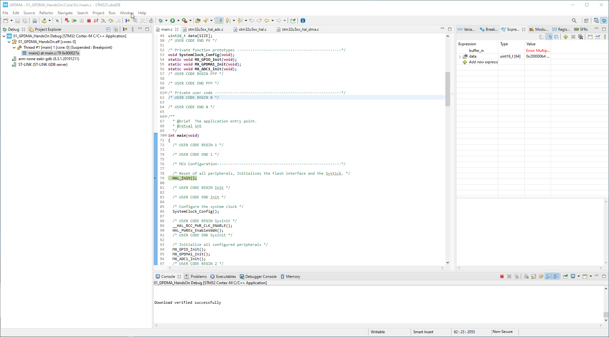
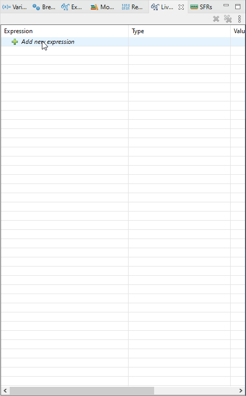
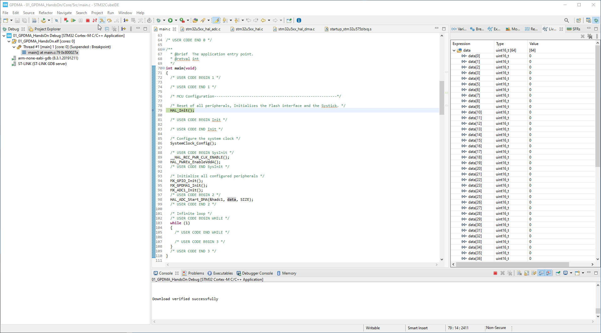

----!
Presentation
----!

# Create buffer where to store ADC values

We create array `data` of 16bit elements wuth size as `SIZE`which is 64 elements

Like this

```c
uint16_t data[64];
```

Put the array and size into `main.c` to section ` USER CODE BEGIN PV` like bellow

```c-nc
/* USER CODE BEGIN PV */
uint16_t data[64];
/* USER CODE END PV */
```

# Enable VDDA

To save more power the VDDA is disabled on U5 by default. 
We must enable it by adding 

```c
  __HAL_RCC_PWR_CLK_ENABLE();
  HAL_PWREx_EnableVddA();
```

to `/* USER CODE BEGIN SysInit */` section in `main.c`

```c-nc
  /* USER CODE BEGIN SysInit */
  __HAL_RCC_PWR_CLK_ENABLE();
  HAL_PWREx_EnableVddA();
  /* USER CODE END SysInit */
```

# Start ADC and DMA

To start ADC+DMA we can use HAL function `HAL_ADC_Start_DMA`
We use it like this:

```c
  HAL_ADC_Start_DMA(&hadc1, data, 64);
```

we put it into section `USER CODE BEGIN 2` like bellow

```c-nc
  /* USER CODE BEGIN 2 */
  HAL_ADC_Start_DMA(&hadc1, data, 64);
  /* USER CODE END 2 */
```

`&hadc1` - is ADC handle which contains information about ADC1 and related DMA channel

`data` - buffer where to store data from ADC
`SIZE` - `data` buffer size 

# Compile code and run debug

1. Run debug [Link](./../utility_config/ide_debug.md)

# In debug open Live Expression

Live expression showing changes in watched variables



# Add variable to live watch



# Run code and check changing content

Fun code by pressing `F8` or press Run 



# What we created


