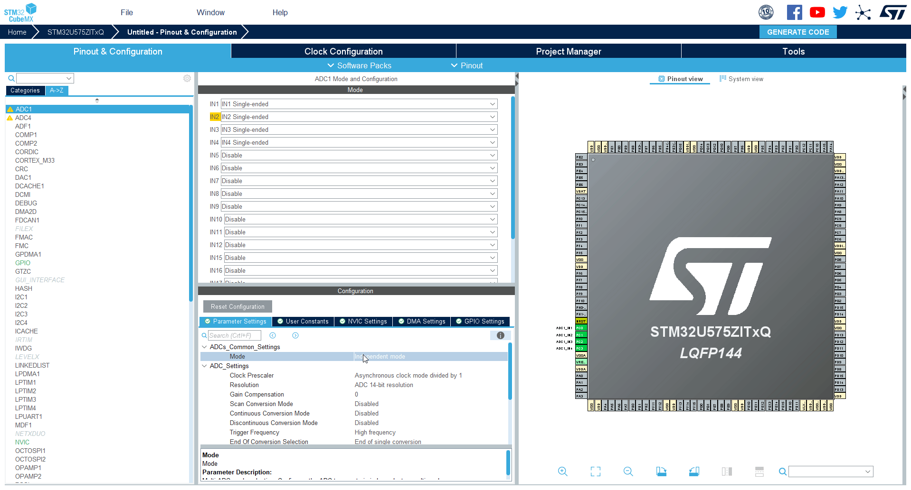
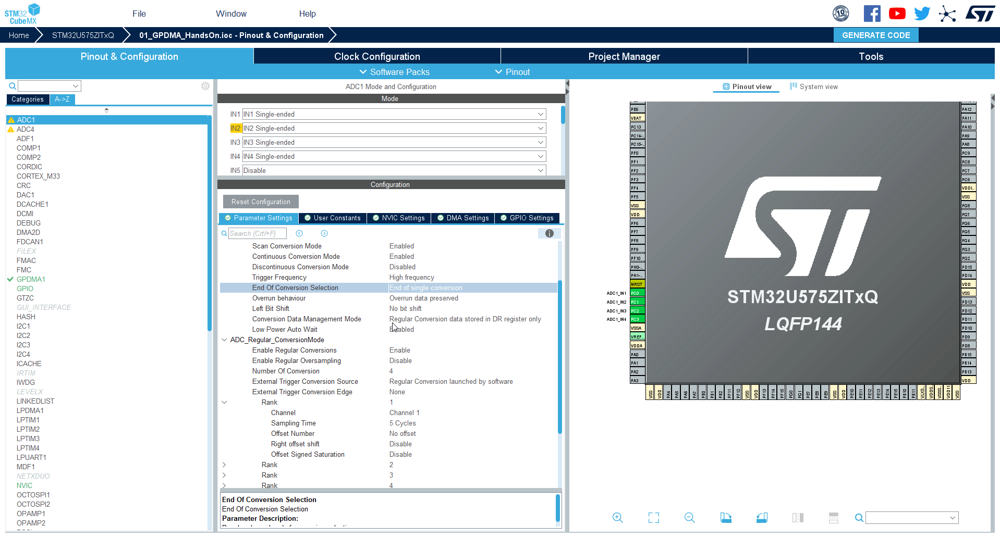
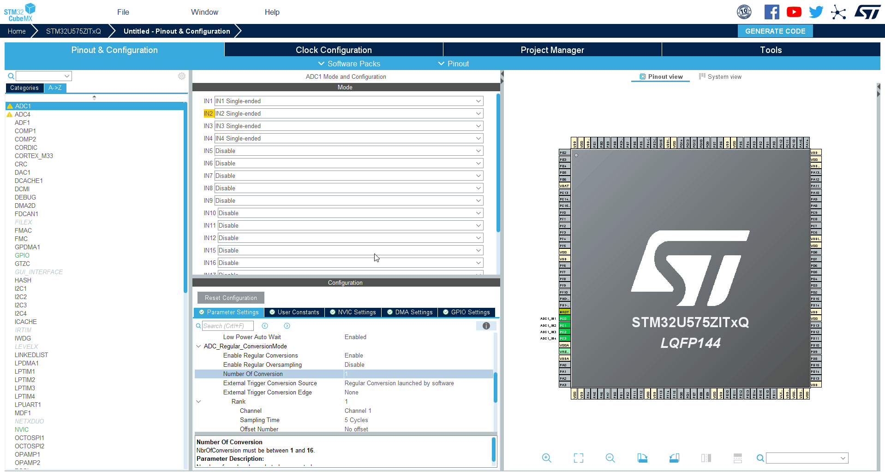
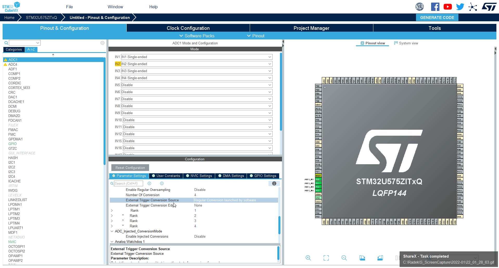
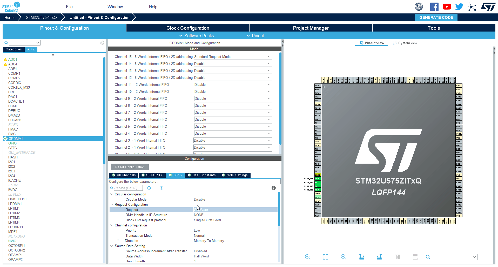
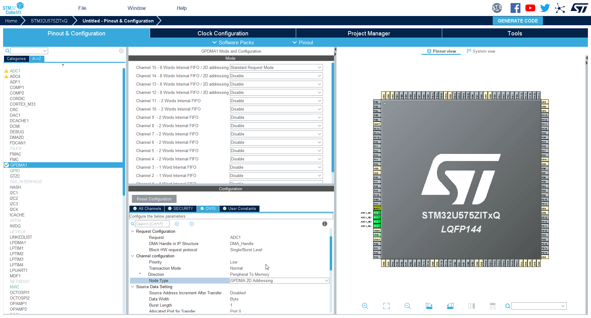

----!
Presentation
----!

# Select ADC1 periphery

Select `ADC1` in **Analog**

# Enable 4 adc channels
Enable channels IN1 to IN4

# Configure the ADC 1/4

1. Set `Continuous conversion mode` to **Enable**

This optiion run ADC in loops. When ADC finish converting all its channesl it will start again from beginning.

2. Set `Low power wait` to **Enable**

This option will stop ADC until the DATA are read form it. It is good to prevent overrun. And we are sure that we have still correct order of channels.

3. Set `Enable Regular Conversions` to **Enable**

# Configure ADC 2/4

1. Set `Conversion Data Management Mode` to **DMA Circular Mode**

After ADC convert value it will create request for DMA. Curcular mode here means that after ADC finish all regular channels it will continue generate DMA request in next run too.

# Configure the ADC 3/4

1. Set `number of conversion` to **4**

This will set ADC to do 4 ADC conversion which we can set.

# Configure the ADC 4/4

1. You can set ADC channel for each `Rank`

Each rank will have assing one ADC channel to convert. It is possible to select same chanel each time.

# Select GPDMA1

1. Sececd `GPDMA1` in **System Core**
2. Enable channel with 2D addressing (12-15)

# Configure GPDMA1 CH15 1/2

1. Select CH15(or channel which you selected CH12-CH15)
2. Set `Circular Mode` to **Enable**
3. Set `Request` to **ADC1**

# Configure GPDMA1 CH15 2/2

1. Set `Source Data Settings` - `Data Width` to **Half Word**
2. Set `Destination Data Settings` - `Data Width` to **Half Word**
3. Set `Destination Data Settings` - `Destination Address Increment After Transfer` to **Enable**

# Set project name and Generate project and Import to CubeIDE

1. How to generate project is described here [Link](./../utility_config/mx_generate_code.md)
2. Import project to CubeIDE [Link](./../utility_config/ide_import_project.md)

<ainfo>
When used CubeIDE instead of CubeMX to create project no import is needed
</ainfo>

