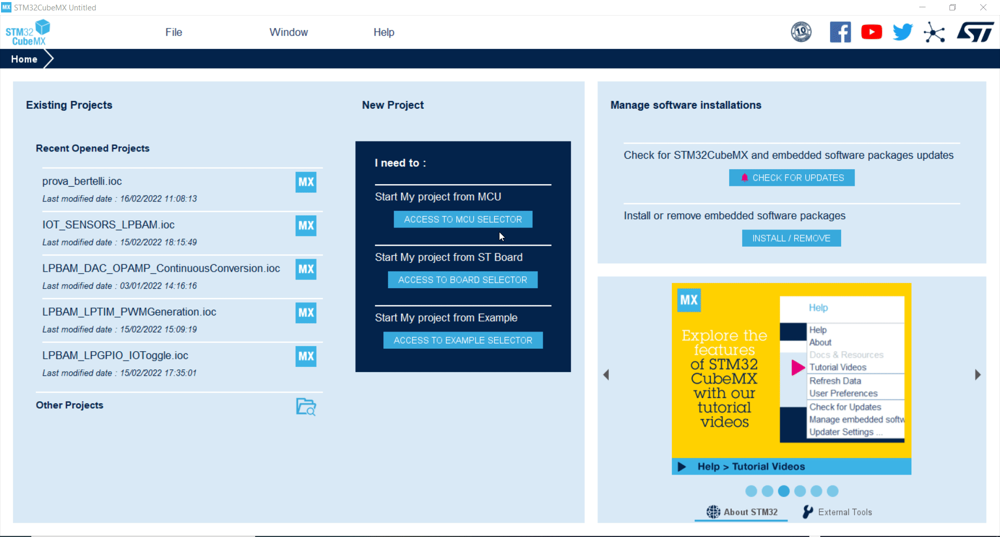

# Cube MX Nucleo-U575 Selection

## Steps to get started with NUCLEO-U575ZI-Q

1. Open Cube MX
2. Acess to MCU Selector
3. Select Nucleo-U575ZI-Q Board
4. Peripheral initialized in default mode, select NO
5. Select Without Trust Zone enable

