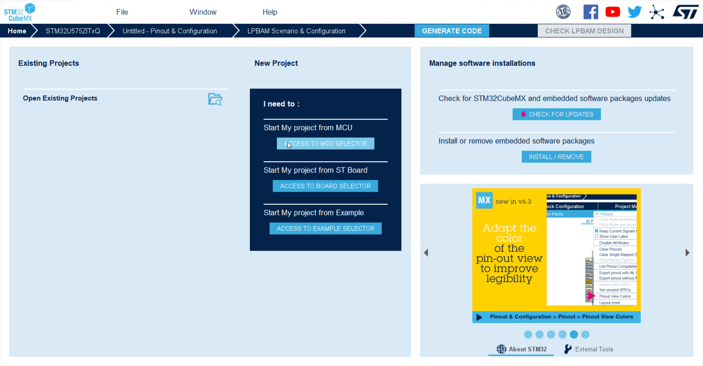

# **Cube MX MCU Selection**

## Steps to get started with NUCLEO-U575ZI-Q

1. Open Cube MX (Similar steps for Cube MX version integrated in Cube IDE)
2. Acess to **MCU Selector**
3. Select **STM32U575ZIT6Q** Board
4. Select **Without Trust Zone enabled**

<ainfo>
We will configure only basic peripherals to get lowest power consumption.
</ainfo>
