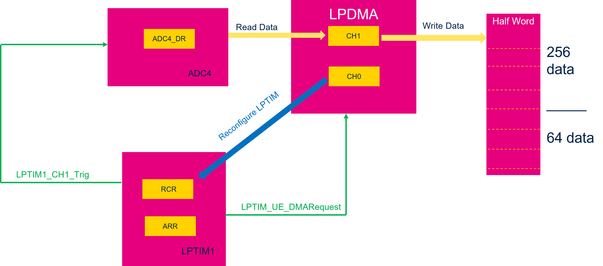
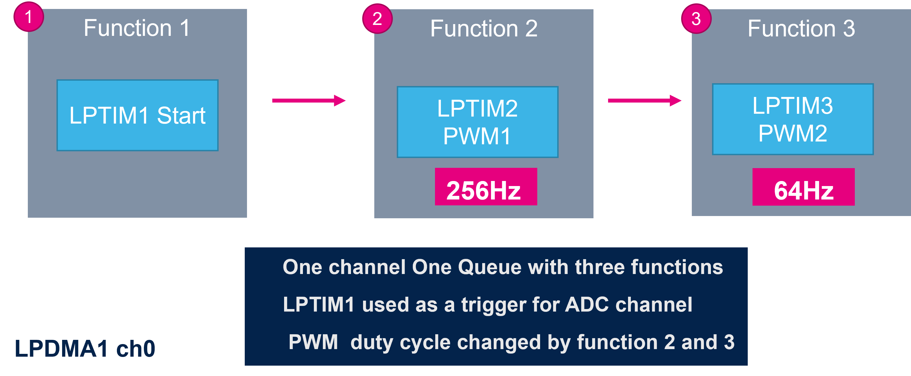
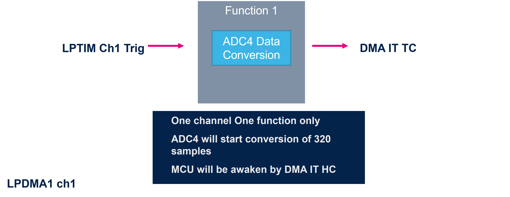

# **Hands On Overview**
In LPBAM Handson we will implement the following scenario making use of **two queues**.

We will use **ADC4** and **LPTIM1** which are peripherals available in **Stop2** into Smart Run Domain.

- **ADC4** conversion will be triggered by **LPTIM1** at 256Hz for 1s.
- **ADC4** converts data samples that are transferred to **SRAM4** by **LPDMA ch1** in STOP2 mode
- After 1s we change the **LPTIM** frequency to trigger 64Hz conversion rate for 1s
- **LPDMA ch1** will be used for peripheral to memory transfer and **LPDMA ch0** for **LPTIM** reconfiguration keeping MCU in **Stop2**
- Wakeup will happen on **DMA TC IT** triggered by ADC4 when 320 half words are acquired

<ainfo>
Same application can also run on a single queue. 
Our purpose it to show how to handle multiple LPDMA channels and how complexity is reduced thanks to LPBAM tool configurator integrated into STM32CubeMx
</ainfo>

---

# Queue 1

 

 # Queue 2
 

 