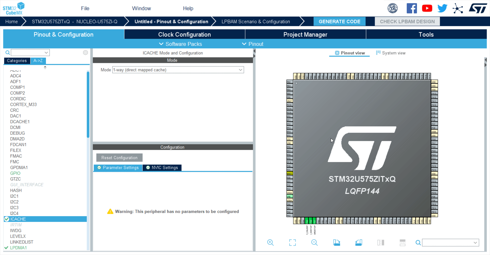
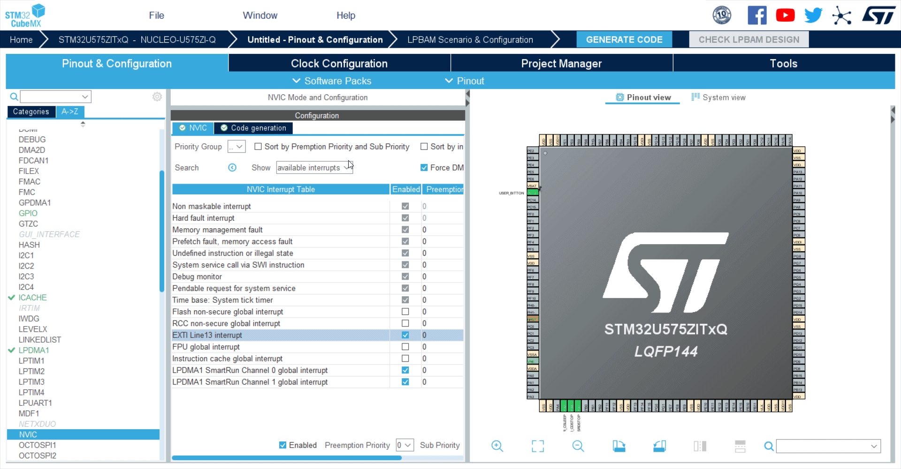

# **Cube MX Peripherals Configuration**

## Steps to initialize the peripherals

*NOTE* In order to start from a clean situation select Pinout and Clear Pinouts
Shortcut is CTRL+P

### 1. **ICACHE**

*Enabled to optimize power consumption*

 First thing we need to do is to Initialize Cache in 1-way (direct mapped cache).
   
Note: Skipping this step will cause a warning later one. Cache initialization is needed to achieve best low power consumption performance

---

### 2. **LPDMA**

*Two channels will be used respectively for ADC4 sampling and Timer ARR register update*

1. Initialize CH0 and CH1 in Linked List Mode
2. Set CH1 as circular
3. Enable interrupts for both channels in NVIC settings

---

### 3. **PWR**

*SMPS will be enabled here to achieve best power consumption performance. Smart Run Domain Debug pins will also be selected*

1. From Debug Pins tab flag the three options note that PA5,PA6,PA7 appears in GPIO Settings tab 
2. Select SMPS as Power Regulator from Power Saving tab

Note: Role of PA5,PA6,PA7 will be understood later in this session

---

### 4. **SYS**

  *We will use Systick as system timer*

1. Modify default Timebase Source to Systick

### 5. **GPIO**

  *External ISR on PC13 mapped to User Button will be used to enter in STOP2 mode*

1. Go to pinout view, type PC13
2. Assign GPIO_EXT13 to PC13
3. Right Click on PC13 select Enter User Label and name it USER_BUTTON

---

### 6. **NVIC**

  *Enable EXT ISR on PC13 and double check interrupt vector setting*

1. Select NVIC Tab
2. Enable EXTI Line13 interrupt
3. Double check that LPDMA ch1 and ch0  ISRs are enabled

---

### 7. **Clock Configuration**

  *Set SysClock @160Mhz*

1. On top tab select Clock COnfiguration
2. Chose PLLCLK from System Clock Mux
3. Write 160Mhz in HCLK

