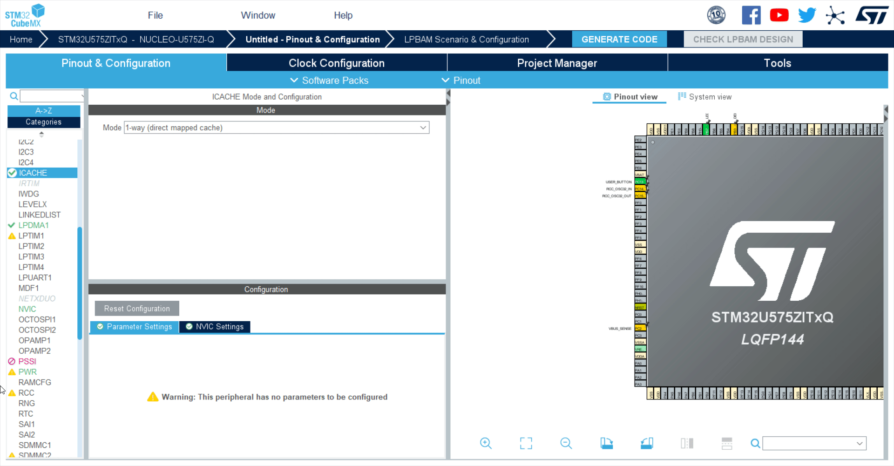
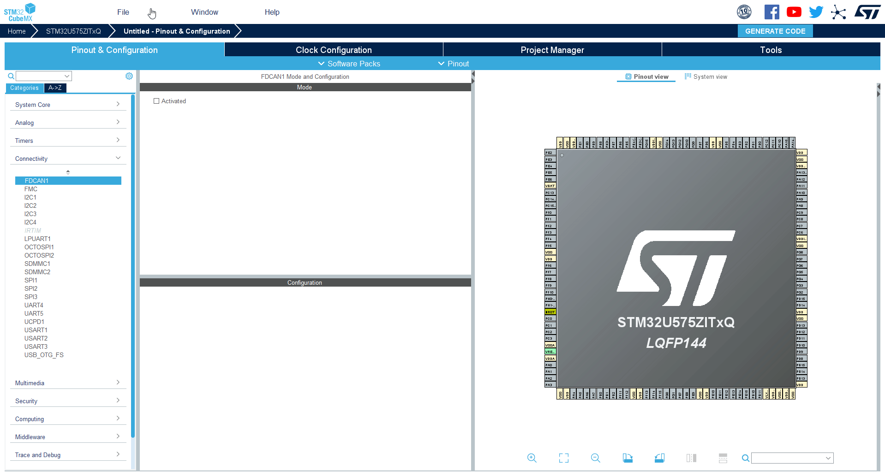
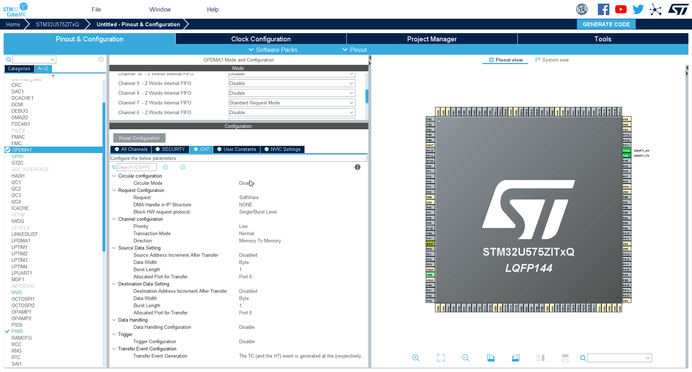
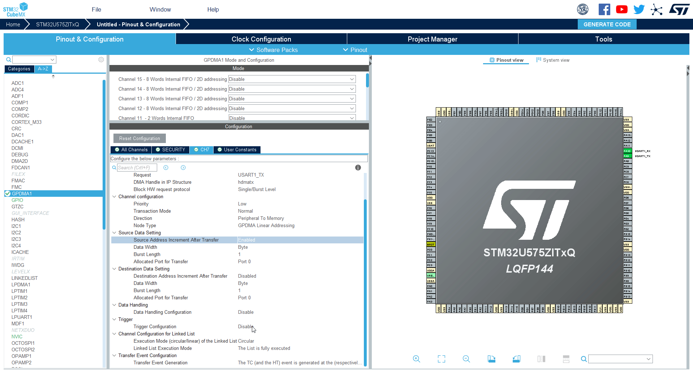

----!
Presentation
----!

# 0- Put in reset state LED RED and LED GREEN,UCPD_DBn and UCPD_FLT from Pinout View 
This will help us to keep lowest power consumption using only essential GPIOs.
We will only use Blue LED and Button to get a visual output and know the power state of MCU

---

# 1- ICACHE

**The instruction cache tends to reduce the number of accesses to the memory, reducing the overall current consumption**

We have to Initialize Cache in 1-way (direct mapped cache).

<awarning>   
Skipping this step will cause a warning later one. 
</awarning>

---

# 2 - LPDMA 

**Two channels will be used respectively for ADC4 sampling and Timer ARR&CNT register updates**

1. Initialize CH0 and CH1 in Linked List Mode
2. Enable interrupts CH1 in NVIC settings
3. Keep all default setting for the other fields

---

# 3 -PWR

**SMPS will be enabled here to achieve best power consumption performance even in run mode**

1. From Debug Pins we can not we have the three options note that PA5,PA6,PA7 appears in GPIO Settings tab 

<ainfo>
Role of PA5,PA6,PA7 will be understood later in this session we will note use the for the time being
</ainfo>

2. Select SMPS as Power Regulator from Power Saving tab

---

# 4 - SYS 

**We will use Systick as system timer**

1. Modify default Timebase Source from TIM17 to Systick

---

<!--- # 5 -USART #

**Usart will be used to display ADC data buffer values**

1. Click on USART1
2. Mode=Asyncronous
3. Check that by default GPIOs are PA9,PA10 (these are the ones mapped on STLINK)

 -->

# 5- UART+DMA

<aerror>
This is not finalized it, it will be done by time of TTT, please only refere to simple UART configuration
</aerror>

We will use GPDMA to automatically send data over UART1. 
When the buffer is full it will trigger the GPDMA which automatically transfer all data. 

# Enable UART1

1. Select `UART1`
2. Select `Asynchronous` mode

3. Check the pins are `PA9` and `PA10`

4. Set baudrate to `115200`

# Set GPDMA

1. Select `GPDMA`
2. Select `Channel 7`
   

3. Select channel 7 - `CH7` tab 

# GPDMA configuration

| Configuration | selected option |
| --- | --- |
| Circulat Mode | Enable |
| Request | UART1_TX |
| Source Address Increment After Transfer | ENABLE
| Trigger Configuration | Trigger of selected DMA request on the frising edge of the selected trigger input |
| Trigger Selection | LPDMA CH1 TCF |

1. Set **Circular mode** to `ENABLE`

2. Set Request to UART_Tx

3. Set **Source Address increment After Trasfer** to `ENABLE`

4. Set **Trigger configuration** to `Trigger of selected DMA request on the frising edge of the selected trigger input`

5. Set **Trigger Selection** to `LPDMA CH1 TCF`

---

# 6-DEBUG 

**Set SWD debug pins**

Add SWD debug port from debug tab to avoid need for uncommenting GPIO_Init every time we need to go in low power.

Selected pins by default are PA13, PA14 mapped on STLINK

# 7- CLOCK CONFIGURATION 

We can keep default value with MSIS selected and HCLK @4MHz

----
