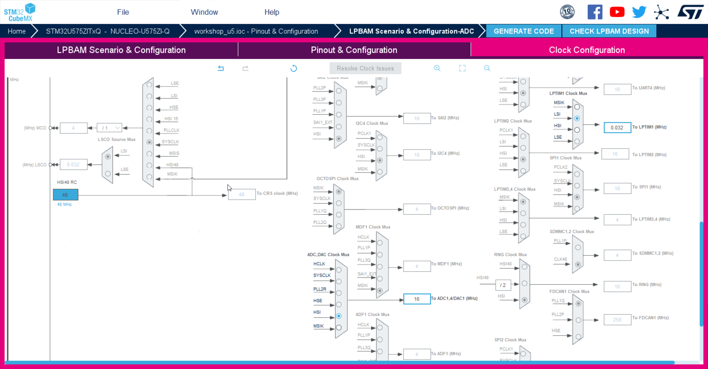
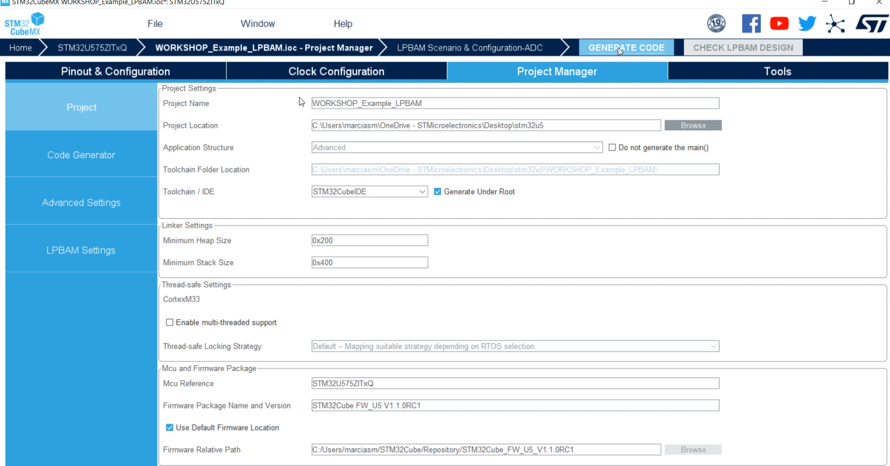

# LPBAM Scenario & Configuration

<ainfo>
In this chapter we will talk about peripherals nodes for the sake of semplicity.
More correct vocabulary would be `LPBAM Function`
Each block added to the Queue is actually handling more than a single DMA transfer.  Collection of nodes = LPBAM Function
</ainfo>

## Cube Mx 6.5 integrates new tab to easily configure LPBAM peripherals and functions

   1.Click on the upper tab named 'LPBAM Scenario and Configuration'

   2.Click on + simbol on top left

Let's see how it looks like:

<ainfo>
LPBAM Scenario and Configurator is intened to be a tool to configure peripherals which are available for LPDMA independently from the power state we select
</ainfo>
---

# LPBAM Managment #

1. Change name of Queue1 to TIMER
2. Click on Add Queue, create new queue and name it ADC

---

# LPBAM Function Toolbox #

*we will add LPTIM and ADC nodes in LPBAM configuration*

1. Make sure to be on TIMER Queue and not on ADC one
2. Select LPTIM1 from the list
3. Click on START and note that one node is added to the chart
4. Click on PWM two times to add two nodes

5. Make sure to move to adc tab 
6. Select ADC4 from the list and Conversion Data

---

# LpbaAp1/Scenario/Conversion/TIMER #

*Queue tab remains unchanged*

1. Make sure to be on Conversion Queue and not on adc one
2. Select LPTIM1:Start_1 and change Start mode to continuos Mode
3. Select LPTIM1:PWM_2 and enable period and pulse update state: We used 127 for period and 64 for pulse with repetition counter of 255.
  <ainfo>
  Idea is to have 256 repetitions of a square wave at 256Hz meaning 1 second. After 255 repetition an update event is generated with the possibility to change PWM value
  </ainfo>
4. Click LPTIM1:PWM_3 and enable period and pulse update state. We used 511 for period and 255 for pulse value and put repetition value =63
 <ainfo>
 Idea is to have 64 repetitions of a square wave at 64Hz meaning 1 second
 </ainfo>

# LPbamAp1/Scenario/ADC #

*On the right panel we set parameters for the ADC4 sampling*

1. Make sure to be on adc Queue and not on timer one
2. On adc tab select transfer complete interrupt Enable
3. Click on ADC4:Conversion_data_4 (progressive number may vary but it does not matter) 
4. Provide Data Buffer Name, in our case it will be Data_Sequence
5. Data Buffer Offset=0
6. Number of Data=320
   <ainfo>
   Number of Data=320 has been chosen to have the whole buffer filled in 2 seconds
   </ainfo>

   
<!-- need to check if trigger is needed at this stage -->

# Pinout & Configuration #

## ADC4 ##

*In this step we configure the peripherals available in Smart Run Domain*

1. Click on Top on Pinout&Configuration tab
2. Select ADC4
3. Chose Vref as channel <!--maybe would be better to try out with a different channel to see changes in the data buffer acquired -->
4. On Parameter setting tab choose Sequencer= Sequencer set to not fully configurable
5. Scan Conversio Mode = Forward
6. DMA Continuous Request = Enabled
7. Low Power Auto Wait = Enable
8. SamplingTimeCommon1 = 1.5Cycles <!-- actually we have tried with 160_5 clk cycles but it seems no more an option-->
9. NVIC Settings - Enable ADC4 Global Interrupt
   
   

   ---

<awarning>
## Check LPBAM DESIGN
By clicking on related button we should get a reminder mentioning that LPTIM is not configured
</awarning>
<!--add picture here -->

---

   ## LPTIM1 ##

*In this step we configure the LPTIM which is available in Smart Run Domain*

1. Select LPTIM1
2. Mode = Counts internal clock events
3. Channel_1_Active - no IO used
4. Choose Compare as capture-Compare section
5. Give Period = 128 and Pulse=64 <!-- need to check the impact that this number has-->

 

 ---

  ## PWR ##

*We will enable SRAM Power down in Stopmode 1,2,3*

1. Click on PWR
2. Verify that Low Power is set on the upper tab and SMPS is selected as Power Regulator
3. Enable power down of all SRAM pages in Stop1,2
4. Do not disable it for ICache and SRAM4
5. We keep fast wakup disabled to save power
 <!-- need to check if we can also power down other elements-->

<ainfo>
SRAM4 16KB will not be disabled as it's the only portion available in Stop2
</ainfo>

  <!-- once defined, add related .gif-->

 ---

 # Clock Configuration #

*In this step we configure the clock for LPTIM and ADC4 peripherals*

1. Select LSI for LPTIM - lowest power option
2. Verify that ADC4 is clocked with MISK

<ainfo>
RC are powered off in STOP2 and this is visible from the configurator. PLL is also disabled. Cube MX is helping us to limit the number wrong selections
</ainfo>
<!-- not sure makes sense adding a dedicated .gif here -->

 

 # Project Manager #

Let's come back to the Cube MX Project Manager Tab
and enter the following projects settings

1. Give name to your project Select Cube IDE as toolchain
2. Click on code generator and  in **HAL Settings** select "Set all free pins as analog"
3. Click on generate code
4. Open Project and switch to Cube IDE

<awarning>
At this stage we get a warning mentioning we need to run consistency check on LPBAM, we can anyway proceed with project generation without any further action
</awarning>
<!-- maybe we should add here a .gif -->

