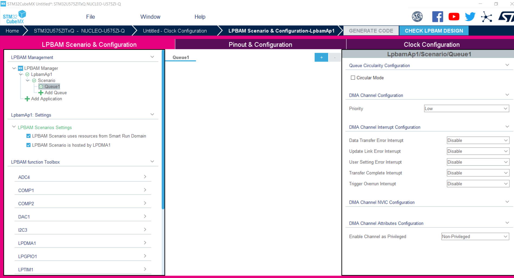
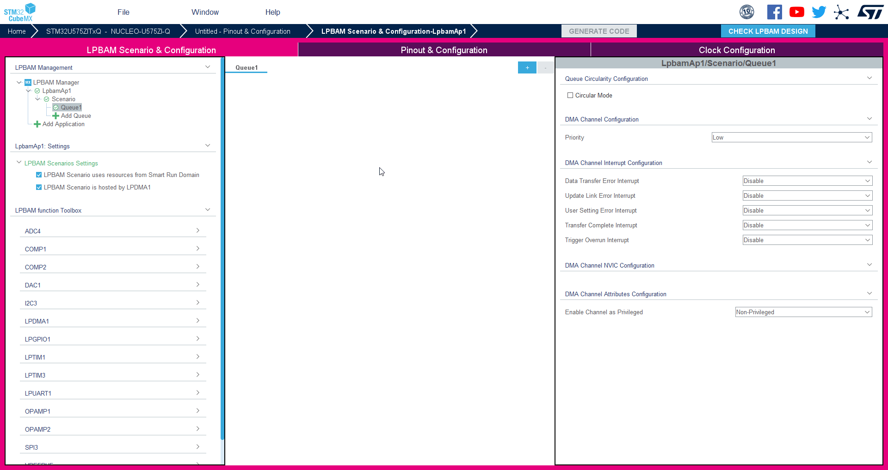
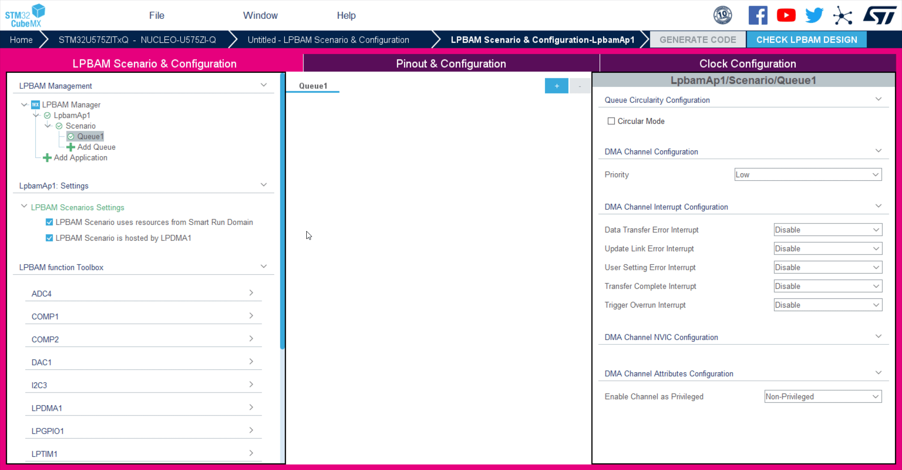
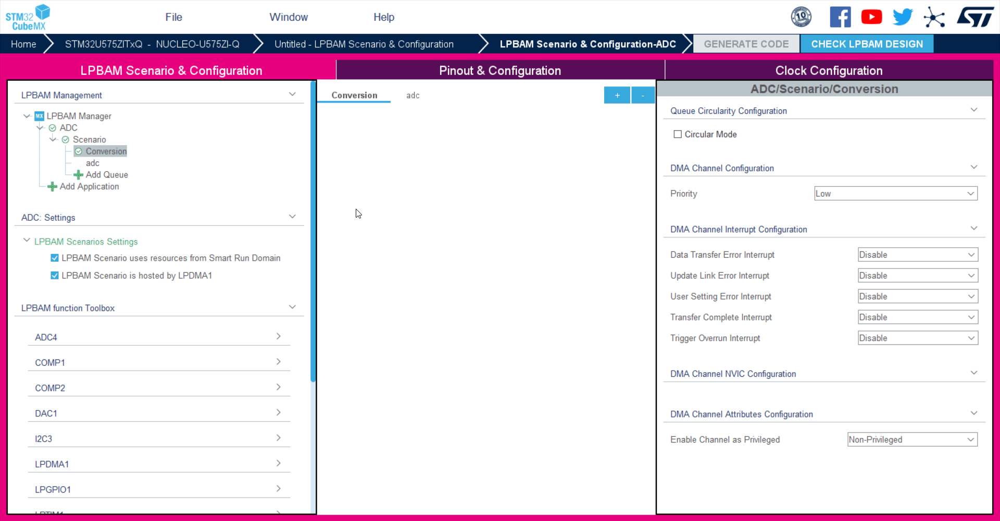
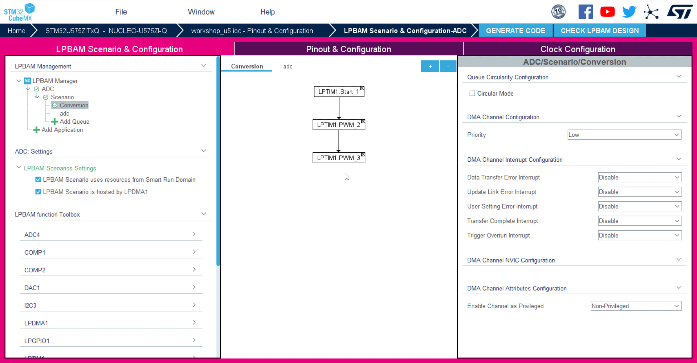
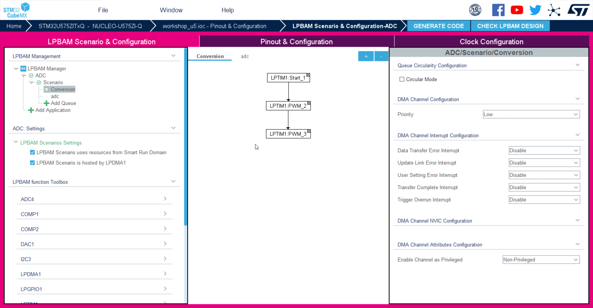
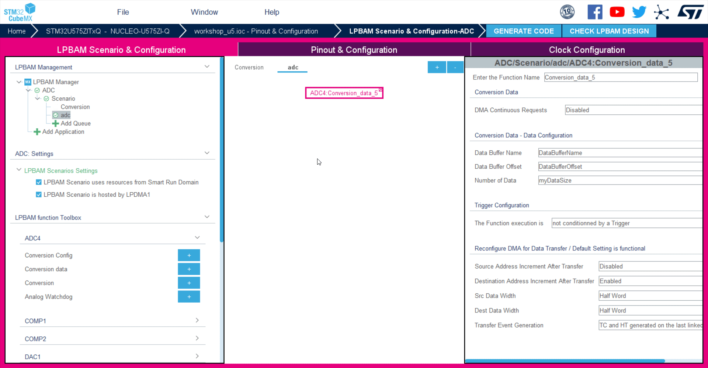
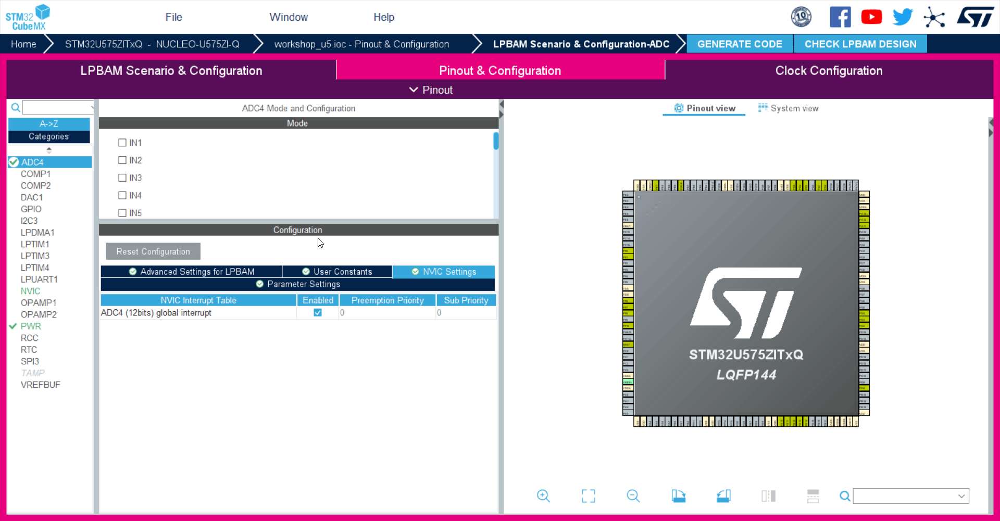
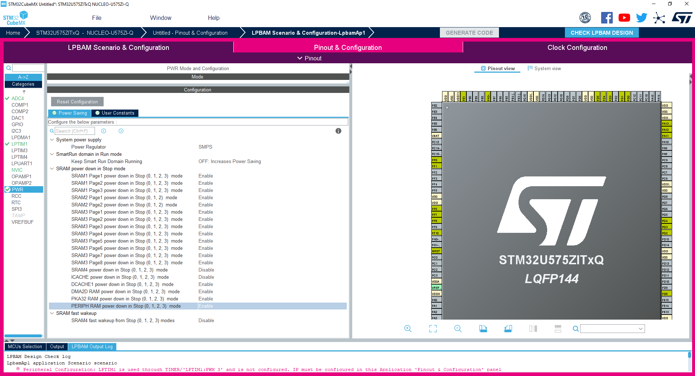
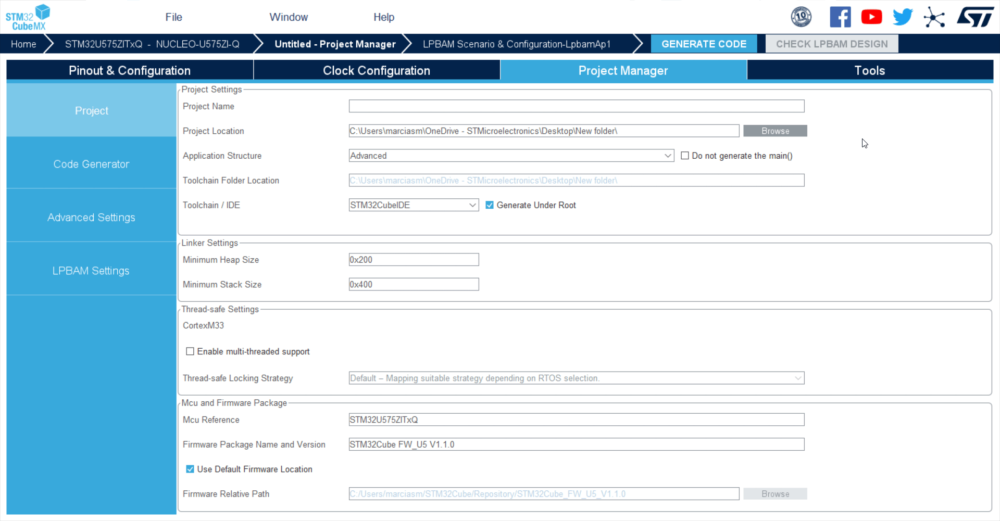

----!
Presentation
----!

# 1- Cube Mx 6.5 integrates new tab to easily configure LPBAM peripherals and functions

<ainfo>
In this chapter we will talk about peripherals nodes for the sake of semplicity.
More correct vocabulary would be `LPBAM Function`

Each block added to the Queue is actually handling more than a single DMA transfer. 

Collection of nodes = LPBAM Function
</ainfo>

   1.Click on the upper tab named **LPBAM Scenario and Configuration**

   2.Click on **+** simbol on top left

Let's see how it looks like:

<ainfo>
LPBAM Scenario and Configurator is intended to be a tool to configure peripherals which are available for LPDMA independently from the power state we select
</ainfo>

---

# 2- LPBAM Managment 

1. Change name of Queue1 to **TIMER** by right click
2. Click on **Add Queue**, create new queue and name it **ADC** ( press enter to exit from rename mode)

---

# 3- LPBAM Function Toolbox

**we will add LPTIM and ADC nodes in LPBAM configuration**

1. Make sure to be on **TIMER** Queue and not on **ADC** one
2. Select **LPTIM1** from the list
3. Click on **START** and note that one function is added to the chart
4. Click on **PWM** two times note that two new functions will appear in the central tab

5. **Make sure to move to ADC queue tab** 
6. Select **ADC4** from the list and **Conversion Data**

---

# 4- LpbaMAp1/Scenario/TIMER 

**Queue tab for TIMER remains unchanged**

1. **Make sure to be on TIMER Queue and not on ADC one**
2. Select **LPTIM1:Start_1** and change Start mode to **Continuos Mode**
3. Select **LPTIM1:PWM_2 **and enable the following 
   
   -**period update state** 

   -**pulse update state** 

   -**repetition update state**

We assign the following values:

<ainfo>
Frequency = 1/ {(1/LPTIM_CLK) * (PRESCALER_DIV_Value) * (PERIOD_Value + 1)}
In our case we will set later LPTIM_CLK=LSI=32.768kHZ and PRESCALER_DIV_Value=1
</ainfo>
 ---
 
-Period Value=**127**

-Pulse Value=**63**

-Repetition Counter Value = **255** 

  <ainfo>
  Idea is to have 256 repetitions of a square wave at 256Hz meaning 1 second. 
  After 255 repetition an update event is generated with the possibility to change PWM value
  </ainfo>
  
  ---

1. Click **LPTIM1:PWM_3** and enable period and pulse update state as done previously. 

We can assign the following values:

-Period Value=**511**

-Pulse Value=**255**

-Repetition Counter Value = **63** 
   
---

 <ainfo>
 Idea is to have 64 repetitions of a square wave at 64Hz meaning 1 second
 </ainfo>

---

# 5- LPbamAp1/Scenario/ADC 

*On the right panel we set parameters for the ADC4 sampling*

1. **Make sure to be on adc Queue and not on timer one**
2. On ADC tab select **transfer complete interrupt Enable**
3. Click on ADC4: **Conversion_data_4** (progressive number may vary but it does not matter) 
4. Provide Data Buffer Name, in our case it will be **Data_Sequence**
5. Data Buffer Offset=**0**
6. Number of Data=**320**
7. All other settings can be kept with default value
<ainfo>
Number of Data=320 has been chosen to have the whole buffer filled in 2 seconds
</ainfo>

<ainfo>
Trigger configuration reported in the left tab is related to DMA transfer trigger
</ainfo>

   

---
# 6- ADC4

**In this step we configure the peripherals available in Smart Run Domain**

1. Click on Top on **Pinout&Configuration** tab
2. Select **ADC4**
3. Chose **Vrefint channel** 
4. On Parameter setting tab choose Sequencer= **Sequencer set to not fully configurable**
5. DMA Continuous Request = **Enabled**
6. Low Power Auto Wait = **Enabled**
7. SamplingTimeCommon1 = **1.5Cycles** (default settings, no changes needed)
8. NVIC Settings - **Enable ADC4 (12bits) Global Interrupt**
   
   

<!--add picture here --> 

<awarning>
CHECK LPBAM DESIGN

By clicking on Check LPBAM DESIGN button we should get a reminder mentioning that LPTIM is not configured
</awarning>
---

# 7- LPTIM1 

**In this step we configure the LPTIM which is available in Smart Run Domain**

1. Select **LPTIM1**
2. Mode = **Counts internal clock events**
3. Channel_1_Active - **no IO used**
4. in Parametrs Settings, choose **Compare** as Capture-Compare section
5. Give Period = **127** and Pulse=**63** 

 
 
---

# 8- PWR 

**We will enable SRAM 1,2,3 Power down in Stopmode 1,2,3**

<ainfo>
This configurator was developed in purpose for STM32U5 to help developers to easily achieve target power consumption
</ainfo>

1. Click on **PWR**
2. Verify that Low Power is set on the upper tab and **SMPS** is selected as Power Regulator
3. Enable power down of all SRAM pages in Stop1,2
4. **Do not disable it for ICache and SRAM4**
5. We keep fast wakup disabled to save power
 <!-- need to check if we can also power down other elements-->

<ainfo>
SRAM4 16KB will not be disabled as it's the only one available in Stop2
</ainfo>

  <!-- once defined, add related .gif-->

 ---

# 9- Clock Configuration 

**In this step we configure the clock for LPTIM and ADC4 peripherals**

1. Select **LSI** for **LPTIM** - lowest power option
2. Verify that **ADC4** is clocked with **MISK**
3. Wake up clock should be **MSI** as default 

<ainfo>
RCs are powered off in STOP2 and this is visible from the configurator.

PLL is also disabled.

Cube MX is helping us to make the right choice
</ainfo>
<!-- not sure makes sense adding a dedicated .gif here -->

 

# 10- Project Manager 

Let's come back to the Cube MX Project Manager Tab
and enter the following projects settings

1. Give name to your project 
2. Select **Cube IDE** as toolchain
3. Click on **code generator** and  in **HAL Settings** select "**Set all free pins as analog**"
4. Click on generate code
5. Open Project and switch to **Cube IDE**

<awarning>
At this stage we get a warning mentioning we need to run consistency check on LPBAM, we can anyway proceed with project generation without any further action
</awarning>
<!-- maybe we should add here a .gif -->

---

