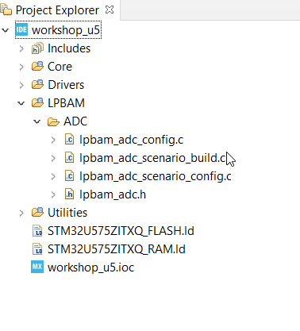

----!
Presentation
----!

<!-- # **Cube IDE** #  -->

<!--this whole chapter can be turned in presentation mode  -->

# 1- File structure

## Project Explorer

Apart from usual folders, we have a new LPBAM folder containing function needed to implement the functionality.
  
  
Note that we got a subfolder called **Lpbamap1** which is the name of our LPBAM Application.

---

<!-- here we can add a description of what to expect in the various folders -->



**Note**: `lpbam_lpbamp1.h`  is the entry point to LPBAM configuration, it contains all the functions that needs to be called into `main.c`

We will not call DeInit, Stop and Unlink anyway this is a good trace to see the APIs generated by Cube Mx.


<ainfo>
Exact content of each .c and .h file inside LpbamAp1 and related functions will be described in chapter 7
</ainfo>

---

```c-nc
/* Exported functions ------------------------------------------------------------------------------------------------*/
/* LpbamAp1 application initialization */
void MX_LpbamAp1_Init(void);

/* LpbamAp1 application Scenario scenario initialization */
void MX_LpbamAp1_Scenario_Init(void);

/* LpbamAp1 application Scenario scenario de-initialization */
void MX_LpbamAp1_Scenario_DeInit(void);

/* LpbamAp1 application Scenario scenario build */
void MX_LpbamAp1_Scenario_Build(void);

/* LpbamAp1 application Scenario scenario link */
void MX_LpbamAp1_Scenario_Link(DMA_HandleTypeDef *hdma);

/* LpbamAp1 application Scenario scenario unlink */
void MX_LpbamAp1_Scenario_UnLink(DMA_HandleTypeDef *hdma);

/* LpbamAp1 application Scenario scenario start */
void MX_LpbamAp1_Scenario_Start(DMA_HandleTypeDef *hdma);

/* LpbamAp1 application Scenario scenario stop */
void MX_LpbamAp1_Scenario_Stop(DMA_HandleTypeDef *hdma);

```
# 2 - main.c

Let's start by including the LPBAM Library header file in `
 `/* USER CODE BEGIN Includes */ ` at ~line#26

**Note** is named after the Scenario, might change if you provided a different name to it
  
```c
/* Entry point for our LPBAM application*/
#include "lpbam_lpbamap1.h"
```

Let's also add the array containing adresses for the two DMA handlers in `/* USER CODE BEGIN PV */` at ~line#54

```c
/* Array containing addresses of LPDMA handlers for the 2 channels*/
DMA_HandleTypeDef *LPBAM_LpbamAp1_Scenario_DMAHandlers[2];

/* Buffer for ADC4 data */
uint16_t Data_Sequence[320] = {0U};
```
---

---

Now we copy the function which are part of `lpbam_adc.h` to initialize LPBAM, build the scenario, link and start. Reference section is `/* USER CODE BEGIN 2 */ ` at ~line#110 

```c
/* LPBAM ADC application init */
MX_LpbamAp1_Init();
/* LPBAM ADC application scenario init */
MX_LpbamAp1_Scenario_Init();
/* LPBAM ADC application build */
MX_LpbamAp1_Scenario_Build();
/* LPBAM scenarios link with LPDMA handlers */
LPBAM_LpbamAp1_Scenario_DMAHandlers[0U] = &handle_LPDMA1_Channel0;
LPBAM_LpbamAp1_Scenario_DMAHandlers[1U] = &handle_LPDMA1_Channel1;
/* LPBAM ADC application link */
MX_LpbamAp1_Scenario_Link(LPBAM_LpbamAp1_Scenario_DMAHandlers[0U]);
/* LPBAM ADC application start */
MX_LpbamAp1_Scenario_Start(LPBAM_LpbamAp1_Scenario_DMAHandlers[0U]);
```
Below `MX_LpbamAp1_Scenario_Start` let's place
the function to Enable/Disable the debug in STOP mode and to enter in STOP2 Mode 

<ainfo>
Please remeber to stay inside the `/* USER CODE BEGIN 2` and `/* USER CODE END 2` sections otherwise content will be deleted upon next code generation via CubeMx
</ainfo>

```c
/* API to disable Debug in STOP mode */
HAL_DBGMCU_DisableDBGStopMode();
/* API to enter in STOP2 */
HAL_PWREx_EnterSTOP2Mode(PWR_STOPENTRY_WFI);
```

<ainfo>
 `HAL_DBGMCU_DisableDBGStopMode` is the function contributing the most to low power, it stops clock from being distributed over the debug interface
 </ainfo>
<p>

</p>
 <awarning>
 `HAL_DBGMCU_EnableDBGStopMode` shall be used if you wish to enter Debug Mode
 </awarning>

---
# 3 - LPBAM 

Let's move now to the LPBAM folder
 in `lpbam_lpbamp1_scenario_build.c` let's add buffer declaration under `/* USER CODE BEGIN EV */` at ~line#37.
 
 This will contain the ADC buffer.

 ```c
extern uint8_t Data_Sequence[320];
 ```
now in `lpbam_lpbamp1_scenario_config.c` at ~line#449
in function `MX_ADC4_MspInit`  in `USER CODE BEGIN ADC4_MspInit 0` please add the below 

```c
HAL_PWREx_EnableVddA();
```
---

in function `MX_ADC_Q_DMA_TC_Callback` at ~line#764 in `USER CODE BEGIN ADC_DMA_TC_Callback ` add:

```c
HAL_LPTIM_PWM_Stop(&hlptim1, LPBAM_LPTIM_CHANNEL_1);
```
---

# 4- Linker

Linker file should be modified as follows.
  
Basically you can delete SRAM4 and redefine a new one

```c
MEMORY
{
  RAM	(xrw)	: ORIGIN = 0x28000000,	LENGTH = 16K
  FLASH	(rx)	: ORIGIN = 0x08000000,	LENGTH = 2048K
}
```

`Note` in standard application with wider use of power modes and peripheral you might need to place buffers and DMA handlers in dedicated SRAM4 section by using __attribute__ e.g.
 `uint16_t buffer_adc[64] __attribute__((section(".sram4")))`;


<ainfo>
The LPBAM utility includes two types of variables:

1- Variables used by the program executed by CPU. They can be placed at any available SRAM address.

2- Variables used by the DMA in order to execute linked-list queue. They must be placed at SRAM addresses accessible by the DMA instance.

These variables are LPBAM descriptors and data buffers.

**To optimize memory usage, it is recommended to place only the variables used during linked-list queue execution in SRAM4 when the LPBAM scenario is built to be executed by the LPDMA**

</ainfo>


