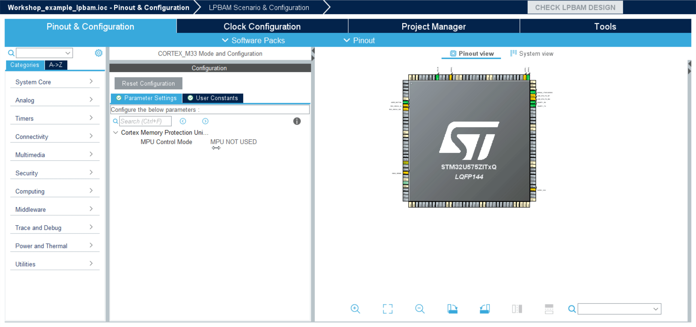
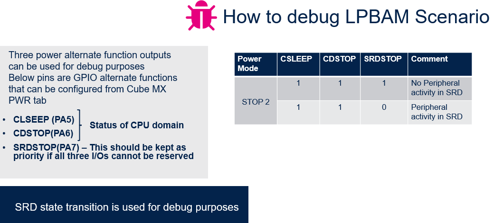
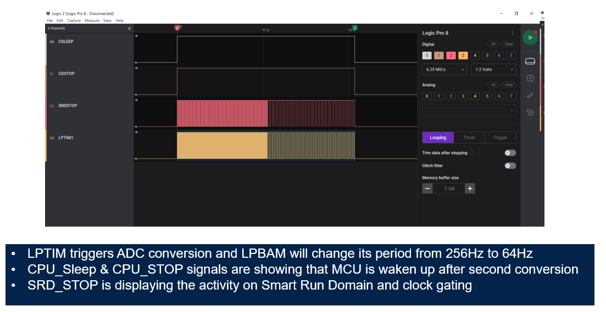
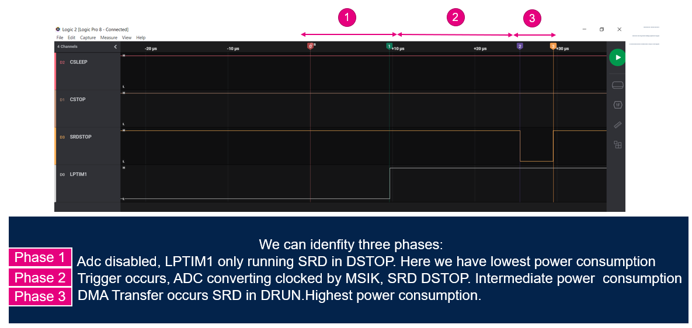

----!
Presentation
----!

# Debug

<awarning>
Debugging LPBAM application is not a trivial task if we really want to see low power consumption from MCU.

In this chapter, we will provide indications on how to debug LPBAM application in low power mode.

Attendees are not required to follow all the steps but the aim is to make you aware of LPBAM Debug strategies in STOP2
</awarning>

# 1- Debug PINS

In Cube MX we set CPU Sleep, CPU domain stop and Smart Run Domain Stop Pin to debug LPBAM application and check if system is moving to STOP2 and LPDMA transfers are happening.

<ainfo>
It's important to note that SRD is an active low signal which shows that LPDMA transfer is happening.
</ainfo>

---

# 2- Logic Analyzer view
LPTIM output was enabled for this step following the optional code modification presented in Cube IDE chapter. Assigned IO is PC1.

Zooming into the triggering section we can identify three phases we have to keep in mind for next consideration on low power benchmark

