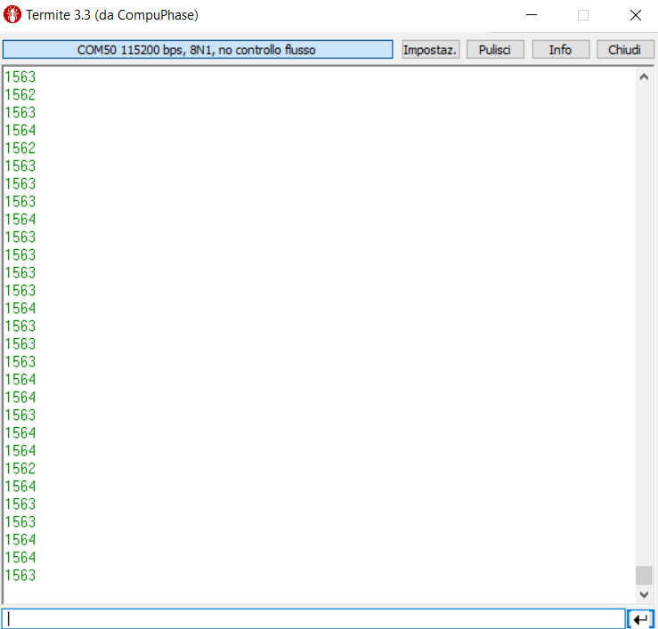

----!
Presentation
----!

## 1- Led Blinking

Debugging LPBAM application is not a trivial task if we really want to see low power consumption from MCU.

During code development, we have added different features that will make up able to understand if the application is running correctly and will also enable us to verify that we are getting the expected behaviour of the Smart Run Domain.

In our code we forced BLUE LED to be on after reset with fast blinking.
If the application is running correctly you should be able to see:

- fast blinking after reset
- slow blinking after button press

If you achieved this it means that the system is waking up autonomously from STOP2 after DMA IT TC.

---

## 2- UART

In code we added a printf to show content of the ADC data buffer.
You can open your preferred terminal use baud 115200, 8N1 no flow control, and check if there something similar to 1500
This is equivalent to Vref=1.2V by ADC4 which is 12bit and powered at 3.3V

---

## 3- Debug PINS

<awarning>
This step will require logic analyzer, if attendees do not have, this part will be performed by instructor only 
</awarning>

In Cube MX we set CPU Sleep, CPU domain stop and Smart Run Domain Stop Pin to debug LPBAM application and check if system is moving to STOP2 and LPDMA transfers are happening.

It's important to note that SRD is an active low signal

---

## 4- Logic Analyzer view
LPTIM output was enabled for this step following the optional code modification presented in Cube IDE chapter. Assigned IO is PC1.

Zooming into the triggering section we can identify three phases we have to keep in mind for next consideration on low power benchmark

