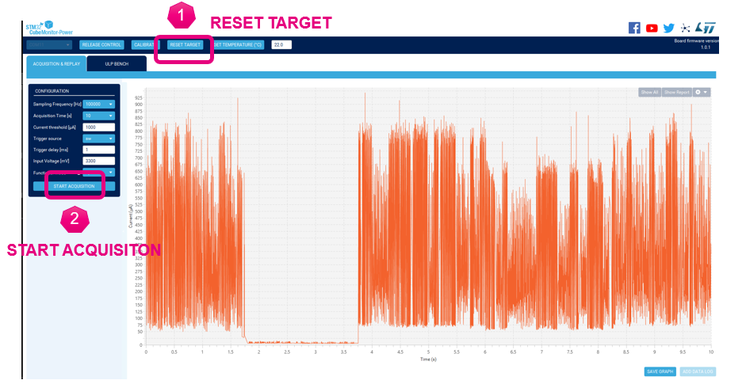
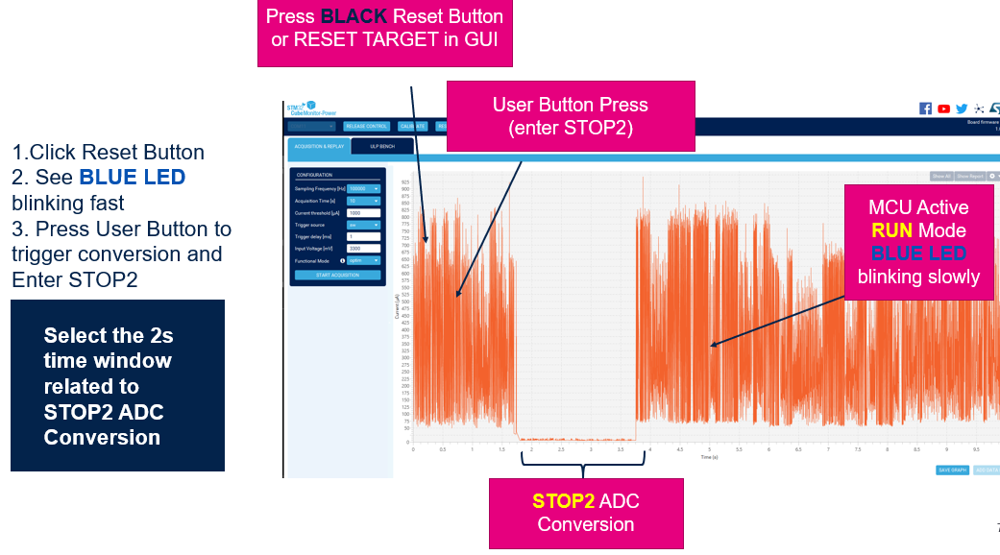

----! 
Presentation
----!

# Power Measurement

We will now measure power consumption using STM32L562E-DK and `STM32 Cube Monitor Power`

Please follow the below steps

# 1 Board Switch and jumper config settings


# 2 Board connection to Nucleo-U575ZIQ
CN20 is on the reverse side of the board


# 3 STM32CubeMonitor-Power settings


# 4  Power measurement

<awarning>
If Nucleo-U575 is no more connected and does not reset, reconnect jumper to JP5 and run a new power cycle
</awarning>




# 5 Power sequence




# 6 LPBAM Power consumption result


<ainfo>
This power consumption is already remarkable but can be firtherly optimized by disabling UART, PWR debug pins setting as Analog mode
</ainfo>

---

# 7 MSIK Frequency change

 In lpbam_lpbamp1_config.c go to function `MX_SystemClock_Config` and modify both MSIX and MISC Clock ranges assigning Range 1 which means 24MHz

 ```c
RCC_OscInitStruct.MSIClockRange = RCC_MSIRANGE_1;

  RCC_OscInitStruct.MSIKClockRange = RCC_MSIKRANGE_1;
 ```

----

Open`Power Monitor` and run again the measurement - we should notice that results is quite unchanged


<ainfo>
This is truly remarkable: we have changed clock speed by a factor twelve for but power consumption has not changed.
This happens because SRD is adjusting clock gating so DMA transfer will become longer in time but less frequent
</ainfo>

# 8 ADC Sampling Frequency change

We now try to modify ADC sampling frequency to check power consumption changes when sampling frequency is increased bya  factor 10x

In lpbam_lpbamp1_scenario_build.c go to function `MX_TIMER_Q_Build` modify sampling  `TIMER queue PWM_2 build` and `TIMER queue PWM_3 build` as follows

```c
 /**
    * TIMER queue PWM_2 build
    */
  pPWMFull_LPTIM.UpdatePeriod = ENABLE;
  pPWMFull_LPTIM.PeriodValue = 51;
  pPWMFull_LPTIM.UpdatePulse = ENABLE;
  pPWMFull_LPTIM.PulseValue = 25;
  pPWMFull_LPTIM.UpdateRepetition = ENABLE;
  pPWMFull_LPTIM.RepetitionValue = 255;
  if (ADV_LPBAM_LPTIM_PWM_SetFullQ(LPTIM1, LPBAM_LPTIM_CHANNEL_1, &pDMAListInfo_LPTIM, &pPWMFull_LPTIM, &PWM_2_Desc, &TIMER_Q) != LPBAM_OK)
  {
    Error_Handler();
  }

    /**
    * TIMER queue PWM_3 build
    */
  pPWMFull_LPTIM.PeriodValue = 12;
  pPWMFull_LPTIM.PulseValue = 6;
  pPWMFull_LPTIM.RepetitionValue = 63;
  if (ADV_LPBAM_LPTIM_PWM_SetFullQ(LPTIM1, LPBAM_LPTIM_CHANNEL_1, &pDMAListInfo_LPTIM, &pPWMFull_LPTIM, &PWM_3_Desc, &TIMER_Q) != LPBAM_OK)
  {
    Error_Handler();
  }
```


<ainfo>
Important to note that as expected consumption is not minimal We will compare this number vs the application w/o LPBAM
</ainfo>
