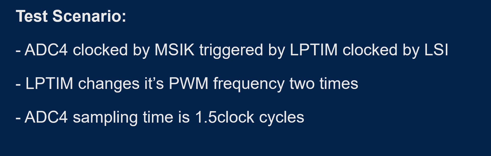
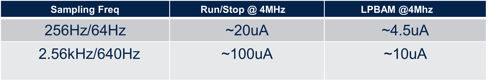
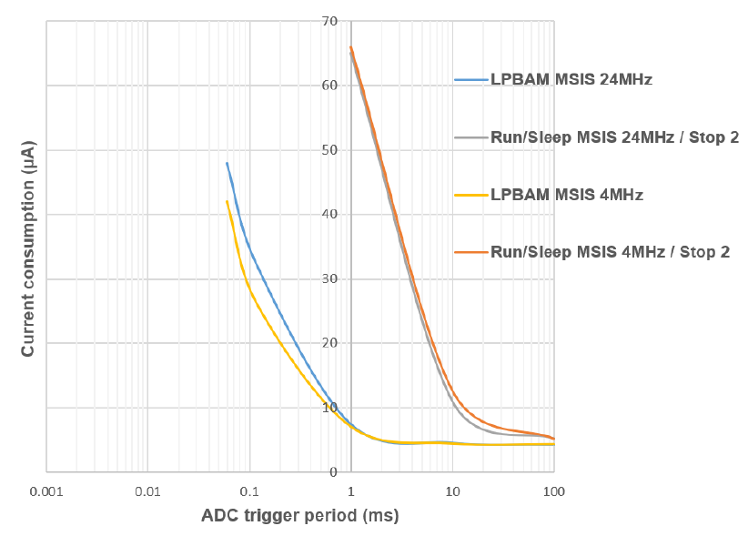
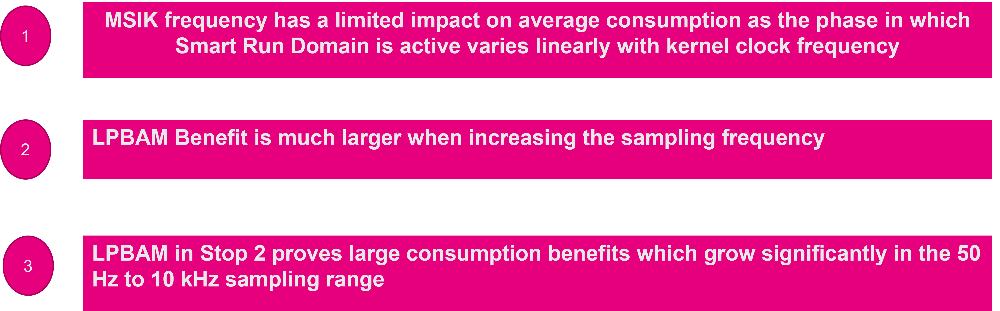
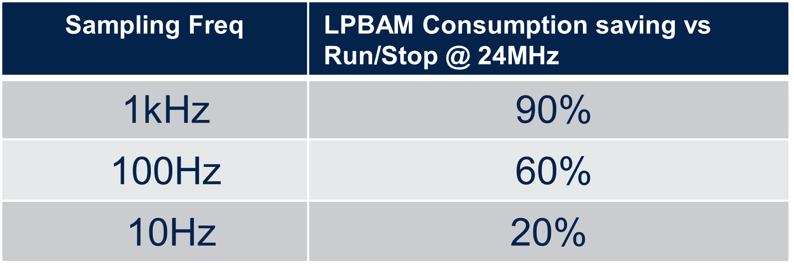

# Results discussion

We tested LPBAM approach vs standard approach of waking from STOP via interrupt to run the conversion obtaining the following current measurements

We also measured current while changing MSIK value in LPBAM example getting the following results

---

## A full characterization of this scenario was performed

# Scenario Characterization

The below curves are showing full characterization of behaviour of our scenario comparing Run/Stop/Sleep mode approach with LPBAM one

Based on that we can confirm our initial finding on LPBAM functionality.
On a wider picture, LPBAM brings the below saving vs Run/Stop mode

<asuccess>
## These findings are totally confirming our measurements and hypotesis ##
</asuccess>