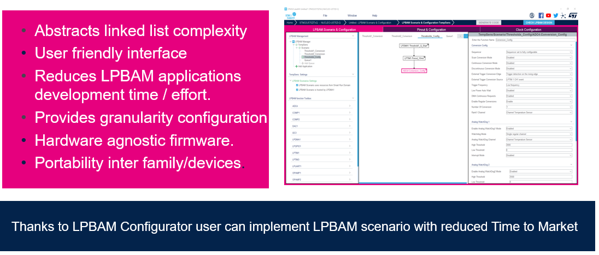
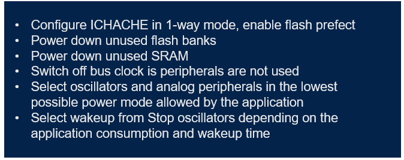
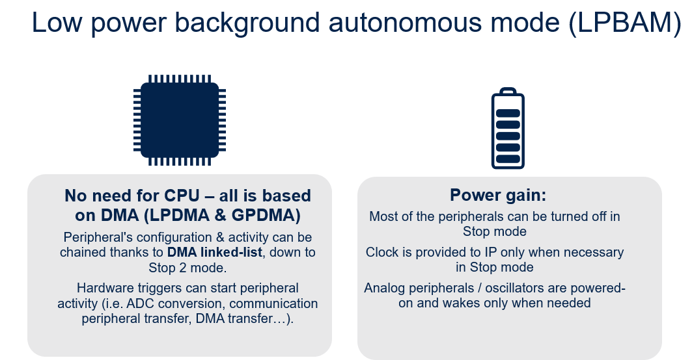

# WRAP UP

- STM32U5 enables disruptive innovation to achieve the best in class ultra low power performance thanks to LPBAM. 

- Most of the peripheral configuration and code needed to achive the lowest power consumption are generated by STM32Cube Mx thanks to **LBAM Tool**.

## LPBAM Tool ##

**Main steps to reduce power consumption directly handled by CubeMX are**:

