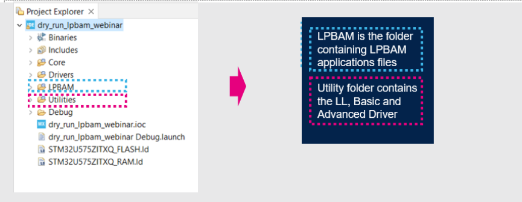
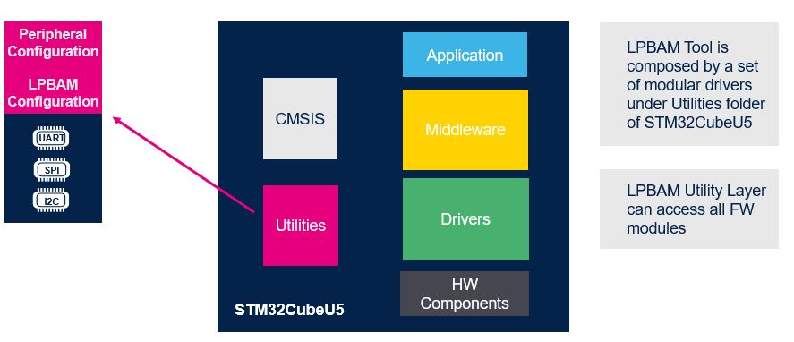
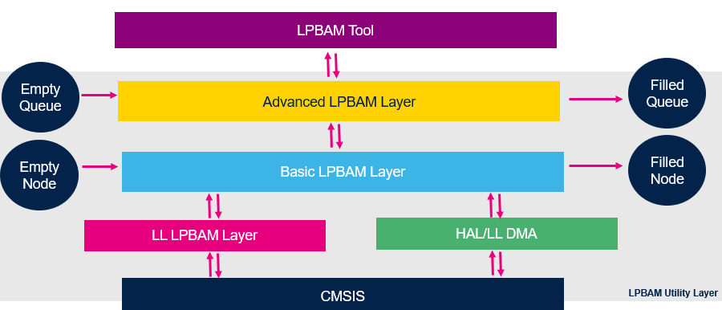
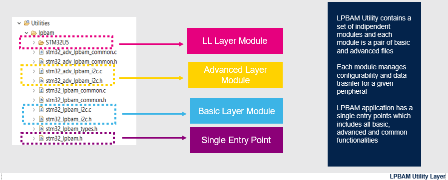
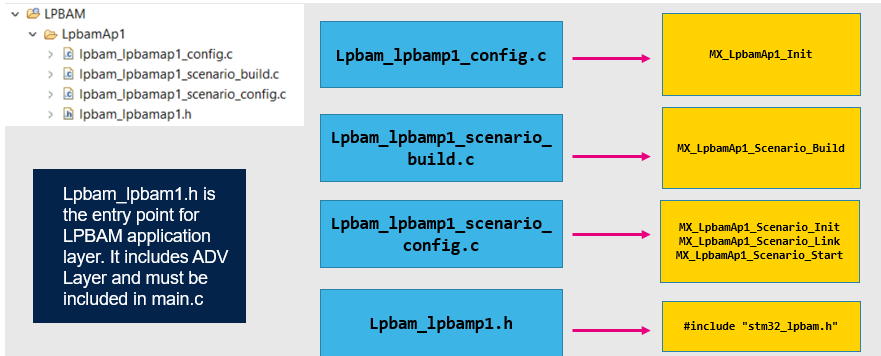
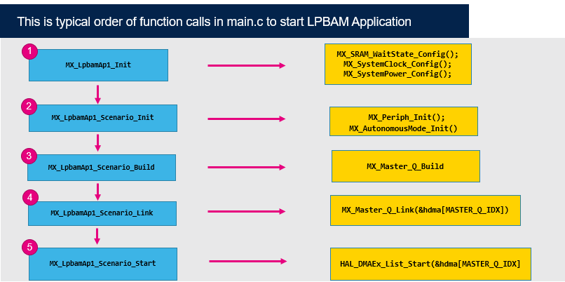
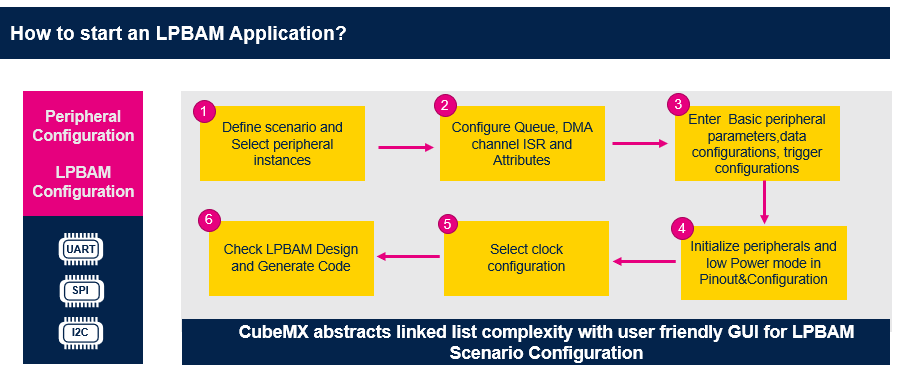

----!
Presentation
----!

<!-- # Generate Code 
We are now going to walk trought the code generated by STM32CubeMX and LPBAM Tool -->

# 1- LPBAM Project tree

In project explored we notice that our project includes two new folders 

# 2- STM32Cube U5
Cube MX 6.5.0 integrates LPBAM configurator for STM32U5 thanks to the presence of LPBAM utilities which is a set of modular drivers located  in STM32CubeU5 FW pack.
In the picture below we can see how Utility folder is linked to  CMSIS, DRIVERS, MIDDLEWARE.
LPBAM utility can access all FW Modules.
It can call Driver HAL for GPDMA or drivers of other peripherals

# 3- LPBAM Utility Layer
LPBAM Utility exposes layers or drivers with three levels of abstraction:**LL**, **Basic** and **Advanced**.
**Basic** and **Advanced** layer are HW agnostic, instead **LL** contains device specific configuration for each supported peripheral.
**LPBAM tool is built on top of Advanced LPBAM Layer** and interacts directly with this Advanced Layer drivers which provides predefined set of function that can be customized to easilty build your low power application.

The first user layer is named **Basic LPBAM layer** it offers a full sets of scenario creation via transversal API which are operating with **Node granularity**.

**Advanced layer** provides predefined, ready to use scenario, more in detail a set of elementary functions that can be customized and concatenated to build an end-application with **Queue granularity**.

The LL layer LPBAM layer is used by the Basic and Advanced LPBAM Layer.

<ainfo>
LPBAM tool is a separated layer making use of Advanced LPBAM layer to configure peripherals.
</ainfo>

# 4- Utilities folder

# 5- LPBAM Application folder

# 6- LPBAM User Sequence

# 7- Low Level LPBAM Layer
This is how we move from application to the **LL Layers** via **Advanced** and **Basic Layers**:

# 8 - LPBAM Tool

