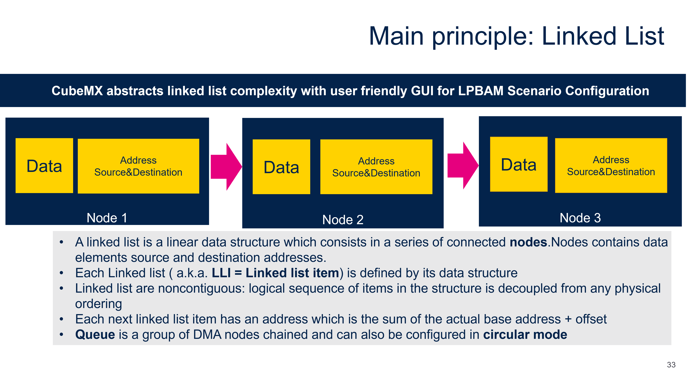
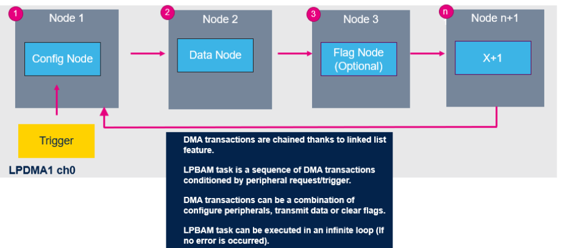
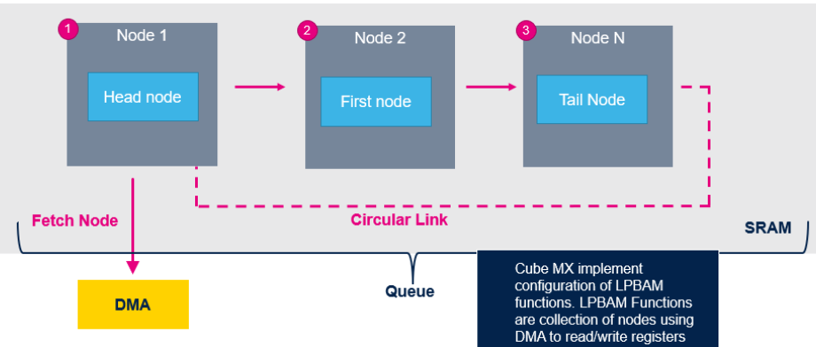

----!
Presentation
----!

# 1 - Quick Summary Linked List

We saw linked list in previous section so this will be just a quick recap

# 2 - LPBAM Bases
An LPBAM task is a series of elementary DMA nodes linked between them in a specific order to do a functional operation that can be conditioned by trigger signal or peripheral request

# 3 - Linked List Mode

Each DMA transfer has its own configuration stored in an SRAM area. In case of LPDMA it is SRAM4(16KB).
Each of this stored configurations is named node.

<ainfo>
From now on we will start talking about functions which are collection of nodes
</ainfo>

- Each function is linked to another node in order to define the next transfer configuration.
- A set of DMA transfer functions linked to each other builds a queue.
- When started, the DMA channel fetches the first linked-list node from SRAM (known as head node).
- After that, the next linked list node is fetched and executed.
- This operation is repeated until the last queue node (known as tail node) is executed.
- The linked-list queue can also be configured in circular mode, the DMA repeats node execution in an infinite loop (from the first circular nodes to tail node).

