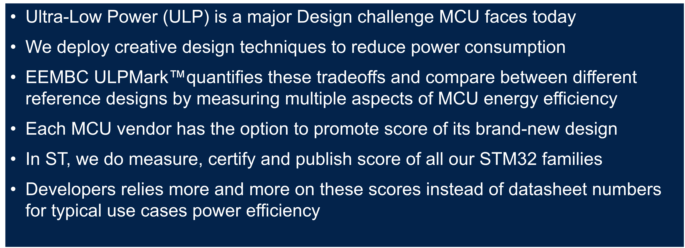
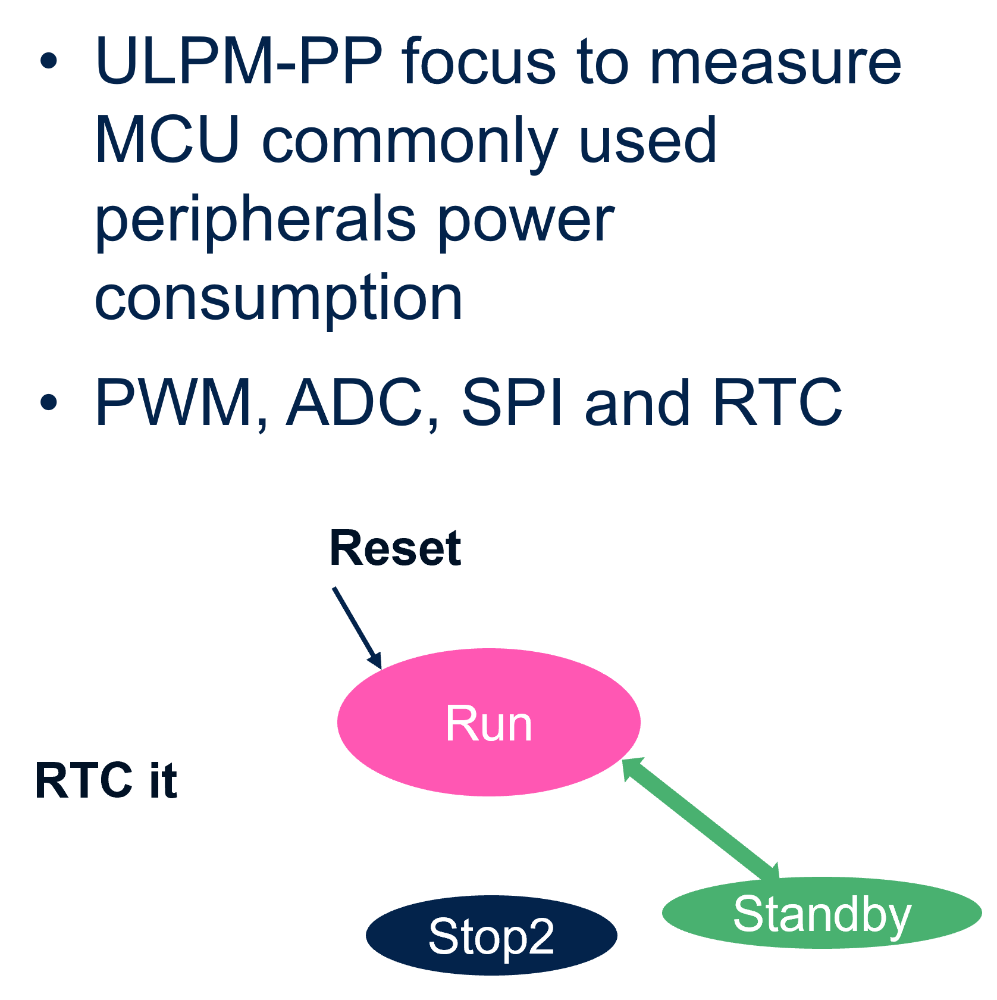
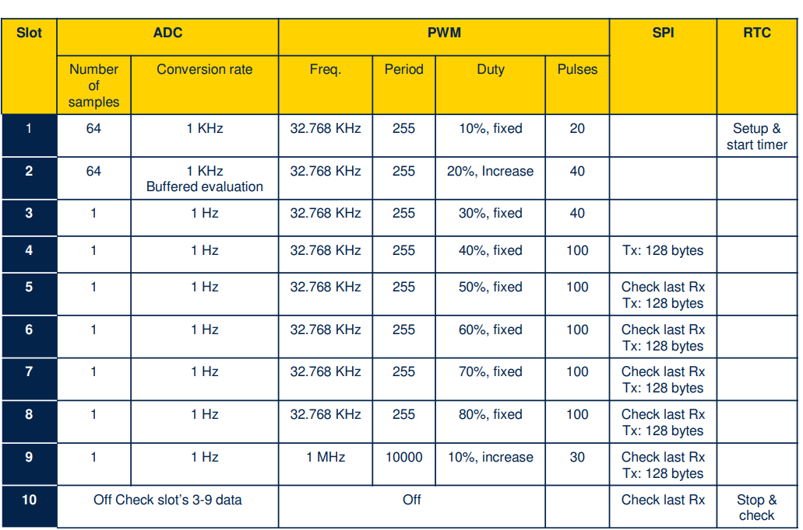
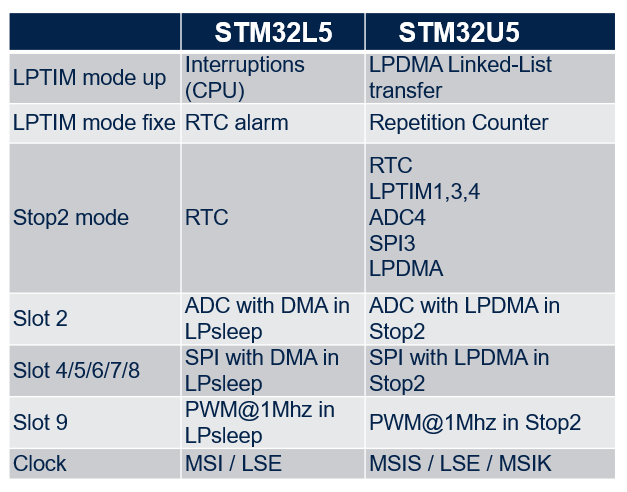
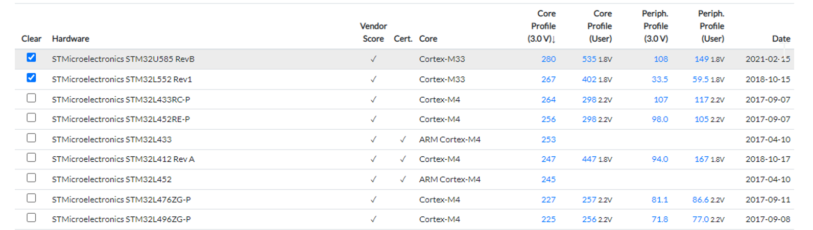

# ULPMark™ overview

## ULPMark™-PeripheralProfile

**EEMBC** (*Embedded Microprocessor Benchmark Consortium*) develops industry-standard benchmarks for
the hardware and software used in autonomous driving, mobile imaging, the Internet of Things, mobile devices,and many other applications.

The ULP subcommittee focuses on power and energy. has different standardized ULP algorithms.
We will focus on  **ULPMark-PeripheralProfile** (or -PP for short).

- Launched in 2016, ULPMark-PPP examines the energy cost of four
peripherals: real-time clock, pulse-width modulation,
analog-to-digital conversion, and SPI communication
- This benchmark defines **ten one-second activity slots**
each with variable usage of ADC, SPI, PWM, RTC,
allowing the MCU and peripherals to sleep after their
activities have completed.

The table gives an overview of the activity in each slot.
As soon as the device finishes the peripheral operation
for that slot it can enter Standby mode.
This means faster peripherals will most likely score
higher since they can remain off longer.

## Architecture Optimization in STM32U5 vs L5

<ainfo>
Thanks to LPBAM, the ULPMark-PP score of the STM32U5
is drastically increased compared to the STM32L5:

- More than three times when VDD is 3.0 volts
- More than 2.5 times when VDD is 1.8 volts.
</ainfo> 

