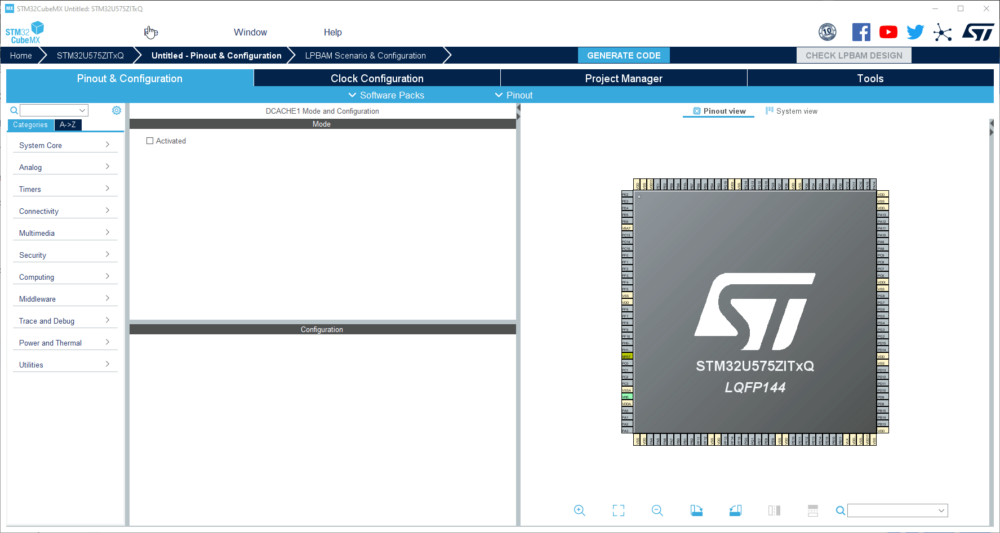

----!
Presentation
----!

# Cache
- Enable **ICACHE 1-way (direct mapped cache)**

# GPIO
- Configure PC7 (Green LED) as Output Push-Pull. Right click on `PC7` and set as `GPIO_Output`
  

# RTC unit 1
Application periodically wakeups from Stop mode.

- To do that Wakeup counter of RTC unit is enabled. Keep default LSI as clock source.

# RTC unit 2

LP Stop mode is entered by ` WFI()` instruction. For this reason:

- Enable `RTC non-secure interrupt` in NVIC Setting tab.

- Set `Wake Up clock to 1Hz` base and `set counter to 2`.Periodic wake up event occurs every 2 seconds. 

# Project Manager
- Select CubeIDE Toolchain

- Write project name and `Generate Code`
  

  