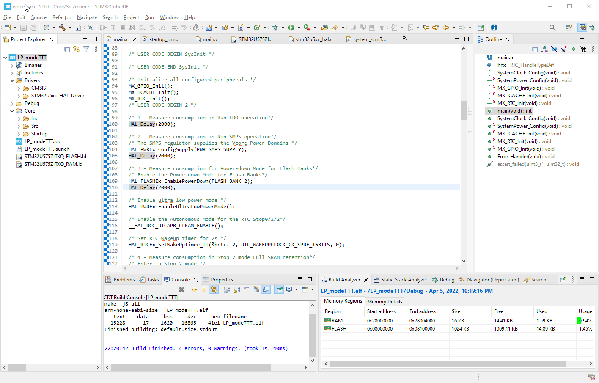
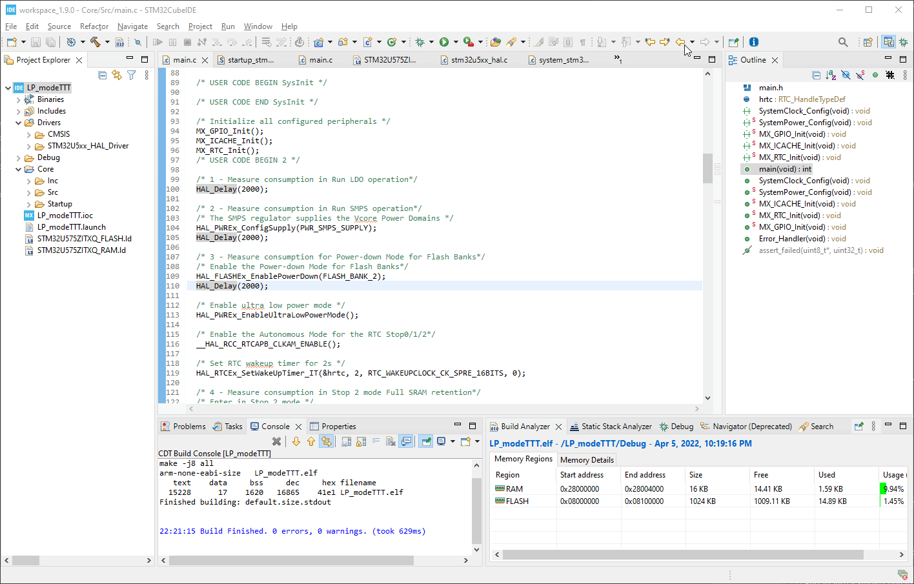
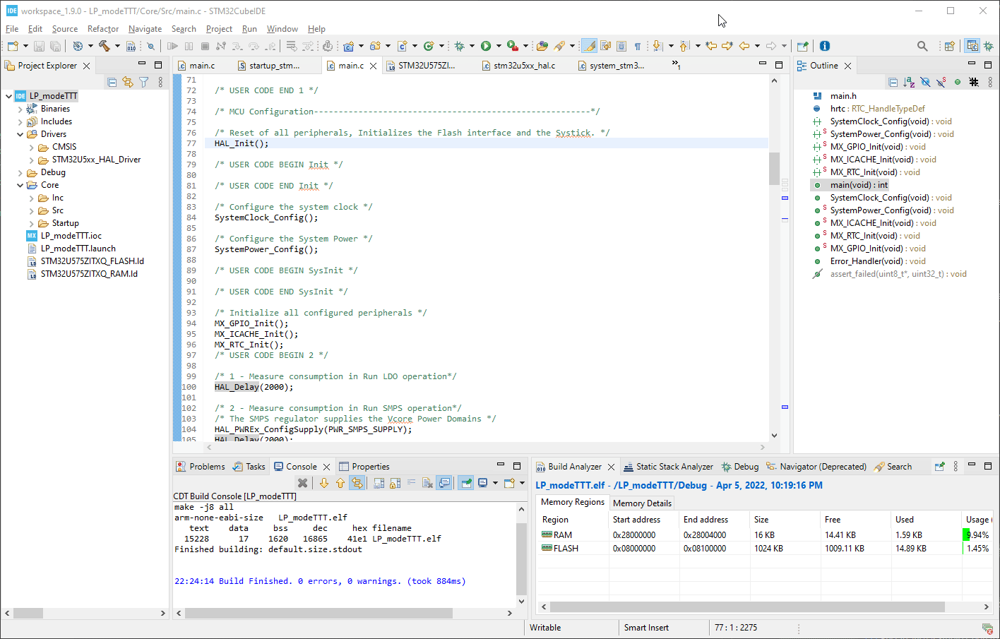
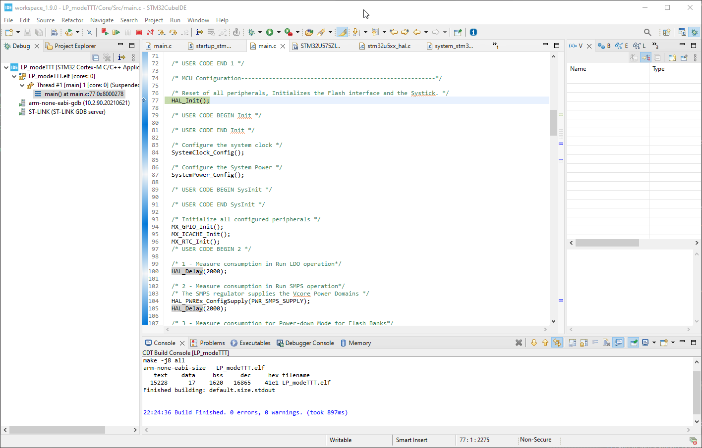

----!
Presentation
----!

# Compile Code

 

# Debug configuration
<awarning> 
Disable Debug in Low Power modes. Otherwise MCU does no enter in genuine LP modes.
</awarning>

 

- Debug configurations window is opened during first debug session or open it manualy.

 

 

- **Disable Debug** in Low Power modes.

 

# Flash device 

 

# Terminate debug session

 

<awarning> 
To avoid extra consumption.
</awarning>

 

  