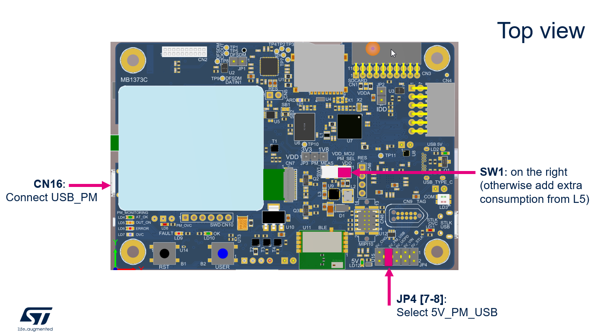
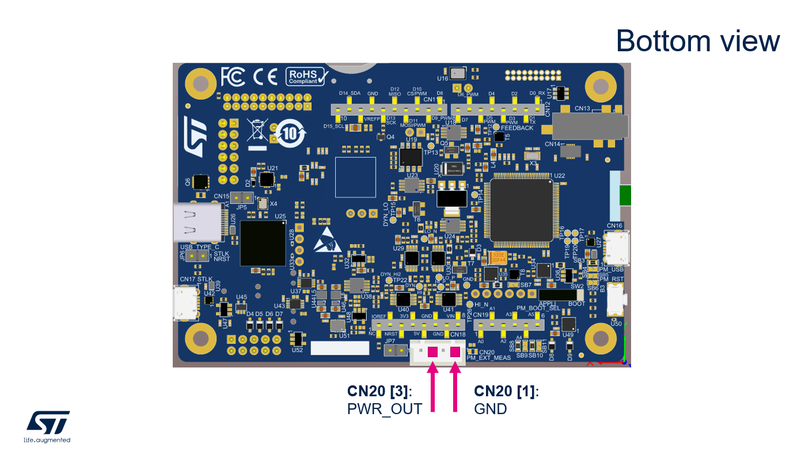
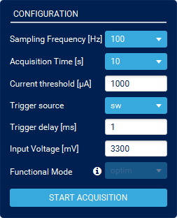

----!
Presentation
----!
# L562 DK Top view
In Low power and LPBAM Hands-on we use Power Shield feature built in L562 Discovery board to for measure purpose and display profile of consumed current in real time.
A small modification of L562 Discovery is needed to be able to measure external power consumption. Keep or switch SW1 in right position (VDD) otherwise extra consumption from L562 MCU is add. Select 5V_PM_USB by JP4 as source for L562 board. Connect USB Micro cable to connector below LCD display.

Ignore displayed Warning message on LCD.

Top view
 

# L562 DK Bottom view
Connect two wires in position 3 & 1 in CN20 as shown in picture below. Wires can be optionally twisted to reduce noise. 

 

# Connect L562-DK board
[Install](https://www.st.com/en/development-tools/stm32cubemonpwr.html) and launch STM32CubeMonitor-Power

Select Virtual Comport associated to L562-DK Power measuring feature and press Take Control.

# Configuration
In Configuration window many parameters can be adjusted. For hands-on purpose let select:
Sampling frequency to – 100kHz to get highest resolution
Acquisition time set to infinitive – endless data recording

And launch Acquisition.

