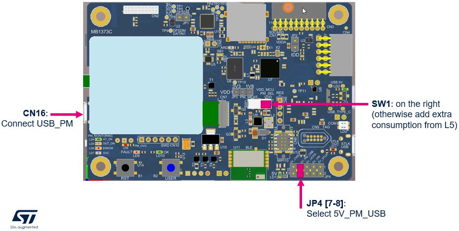
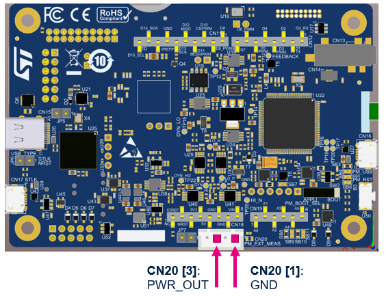
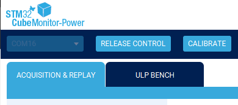
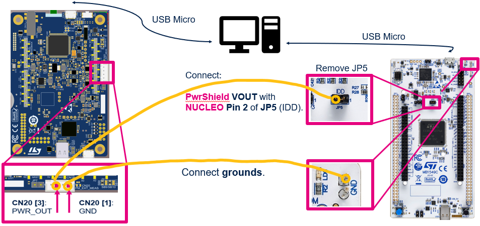
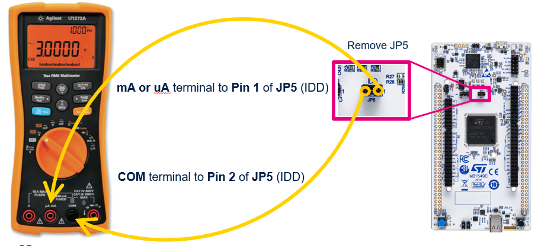
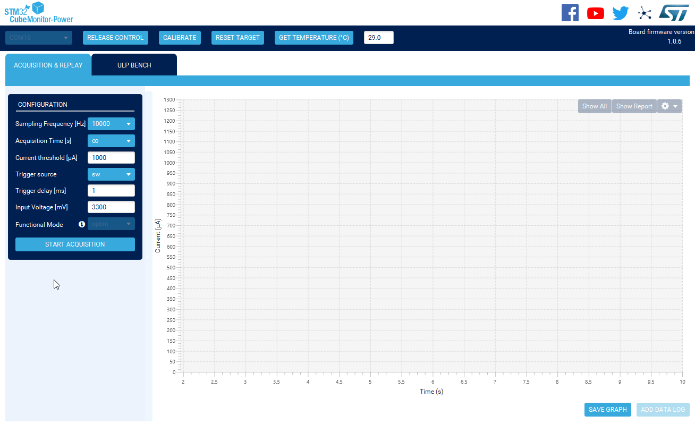

----!
Presentation
----!
# Power Monitor
In Low power and LPBAM Hands-on we use Power Shield feature built in L562 Discovery board to for measure purpose and display profile of consumed current in real time.

# L562 DK Top View
A small modification of L562 Discovery is needed to be able to measure external power consumption. 

- Keep or switch **SW1 in right position (VDD)** otherwise extra consumption from L562 MCU is add. 

- Select **5V_PM_USB by JP4** as source for L562 board. 

- Connect USB Micro cable to connector below LCD display.

<ainfo>
**All** other jumpers setting are irrelevaent for consumption measurement feature.
LCD is active only for JP2 **On** and JP3 **3V3 position selected**
</ainfo> 

 

 

# L562 DK Bottom view
- Connect **two wires in position 3 & 1 in CN20** as shown in picture below. 

<ainfo>
Wires can be optionally twisted to reduce noise.
</ainfo> 

 

 

# Connect L562-DK board
- [Install](https://www.st.com/en/development-tools/stm32cubemonpwr.html) and launch **STM32CubeMonitor-Power**

- Select **Virtual Comport** associated to L562-DK Power measuring feature.

- Press **Take Control**.

# Measuring feature of L562 DK
<awarning>
In most cases this step is not needed. Also ignore displayed **Warning** or **Error** message on LCD. This Warning is aplicatable only for consumption measuring of onboard L562 device.
</awarning> 

 

Only if Virtual Comport is not visible

- **Tap on Measurements** icon on LCD 

- No other task is needed for external power measuring

# Calibrate 
It's required to calibrate Power measuring feature (Offset,..)

- Keep **Wires floating** during during calibration.

- Press **Calibrate**.

# Wiring diagram to Nucleo-U575
- **Remove JP5** on Nucleo

- Connect wires to **GND** and **Pin 2** of **JP5**

 

- or **Connect A-meter** to Pin 1 & 2 of JP5 (following diagram avoiding negative values on screen)

 

# Configuration
In Configuration window many parameters can be adjusted. For hands-on purpose let select:

- **Sampling frequency to 10kHz** to get adequate resolution

- **Acquisition time set to infinitive** – endless data recording

- **Start Acquisition**.

# Show report
- FULL and SELECT FRAME consumption details (Min, Max, Average, Energy)
- Acqusition must be **stoped**
- Press **Show Report**

