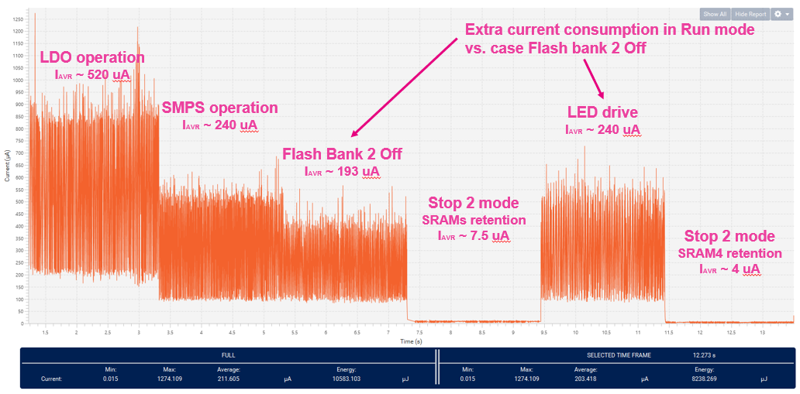
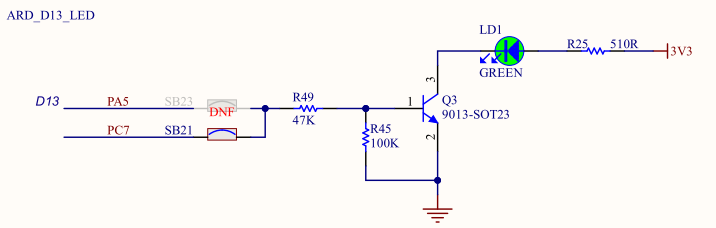

----!
Presentation
----!

# Measured consumption

## Measure consumption in Stop 2 mode given by SRAMs retention off
- Consumption is reduced to aprrox. 4 uA.
- Triangle wave due to Low Power regulator operation

## Higher consumption in Run sequence when LED is driven
- Extra current consumption is given by biasing of BJT transistor.
- LED is not driven directly from GPIO thus LED current is not visible and measured.

