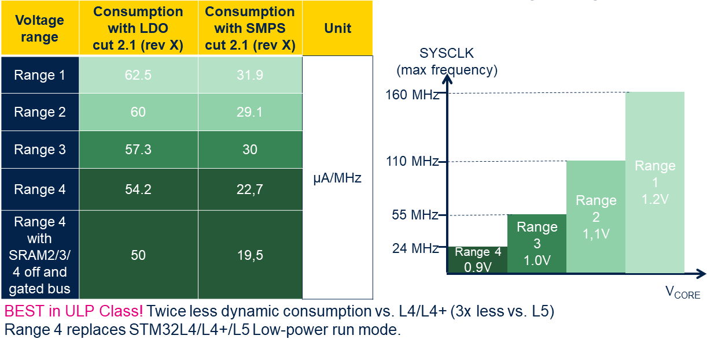
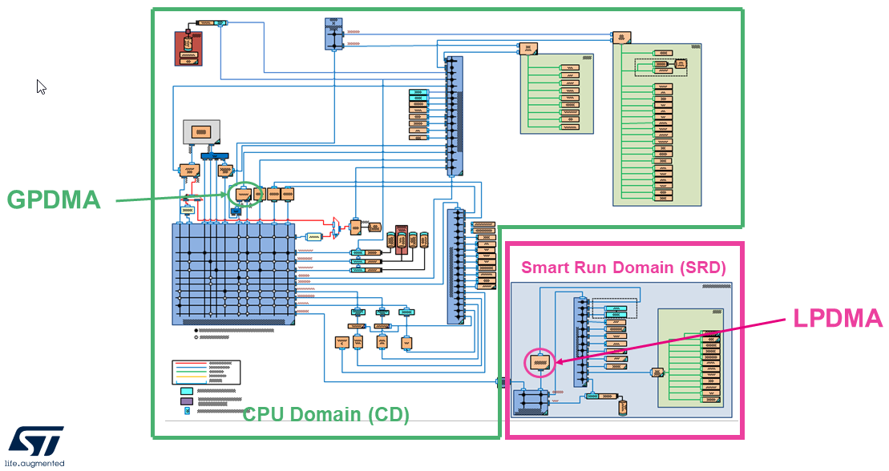
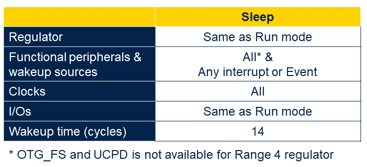
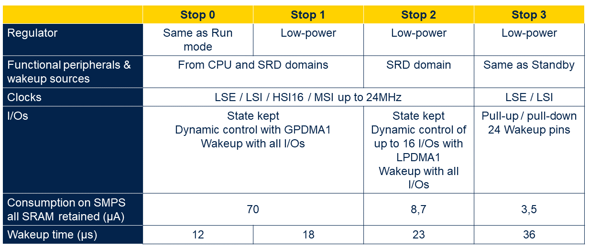
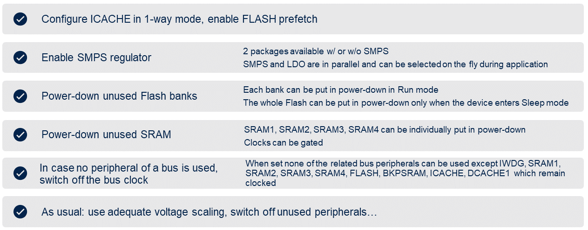
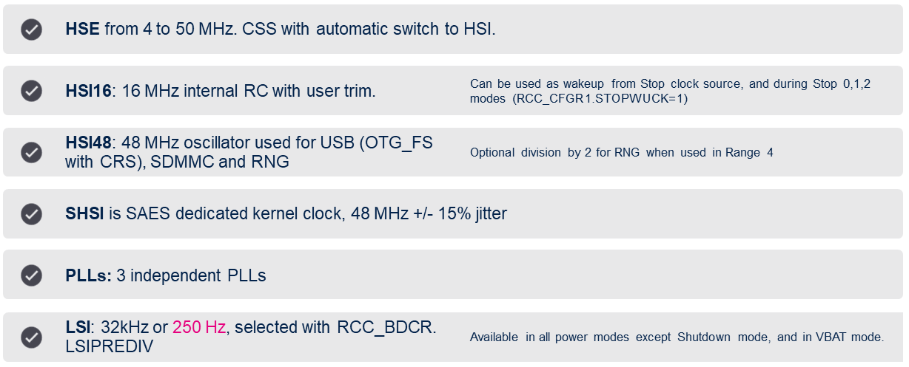
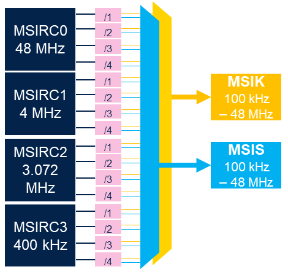
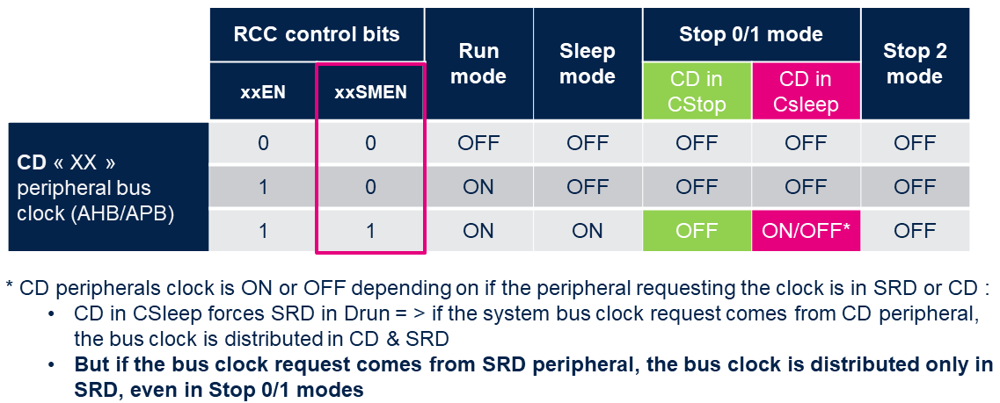
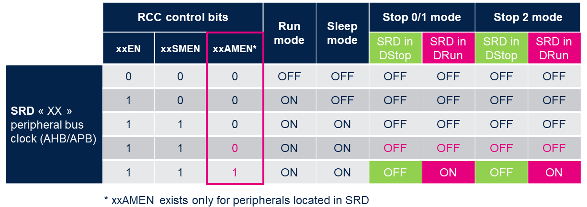

----!
Presentation
----!
# Power Supply
<ainfo>
STM32U5xxxxxx and STM32U5xxxxxx**Q**
</ainfo>

 

**2 packages** available w/ or w/o SMPS

Internal voltage regulator: LDO and SMPS (requiring external 4.7 µF + 2.2 µH)
SMPS and LDO are in parallel and can be selected on the fly during application

- LDO: less noise 

- SMPS: better efficiency

All power modes are supported with SPMS and LDO:

- Exit from Stop and Standby modes is done in the selected regulator, always in range 4

- Exit from Shutdown and boot from reset is  always done on LDO 

<awarning>
SMPS is designed for supplying only internal load (cannot be used for supplying external components)
</awarning>

 

## Internal Vcore voltage level
 

# Dynamic vs. Static operation
<ainfo>
BEST in ULP Class! Twice less dynamic consumption vs. L4/L4+ (3x less vs. L5)
</ainfo>

 

STM32U5 is designed to perform dynamic scenario in **Autonomous mode(LPBAM)**

- Off load Core domain and thus reduce wakeup sequences

DataSheet values for LP modes are Static consumption only

- No tasks are performed
  
- 2MB flash and 40nm technology leads to higher results vs. L4/L4+
  
- Keep STM32U5 in ULP mode without any activity is not efficient

<awarning> 
Device selection must follow **Application demand** and NOT DataSheet comparison.
</awarning>

 

## Current consumption profile periodical ADC acquisition and I2C trasmit in Stop mode
 

# System Architecture
Two digital domains CPU domain (CD) and Smart run domain (SRD)

CD & SRD contains full feature set

SRD contains only reduced peripheries (ADC4, DAC, UART, I2C ,SPI, UART, LPGPIO, SRAM4,…)

**In Run, Sleep, Stop 0 and Stop 1**

- CD & SRD fully powered => all peripherals are functional, thanks to GPDMA1 and LPDMA1

**In STOP2**

- CD in “retention” (lower leakage mode) => no dynamic activity possible

- SRD fully powered => SRD autonomous peripherals are functional thanks to LPDMA1.

## CPU domain (CD) and Smart run domain (SRD) block schema

# Sleep mode
Core stops

High speed clocks run

Sleep Range 4 replaces STM32L4/L5 Low-power sleep mode

# Stop modes
<ainfo>
Lowest power mode with full retention and peripheral activity (LPBAM).
</ainfo>

 

Core stops

High speed clocks runs only on peripheral’s demand

Full retention of SRAM and peripherals registers, with capability to individually **power down** SRAM pages in Stop 0,1,2,3:

- SRAM1 : 3 x 64KB-pages

- SRAM2 : 8KB and 56KB pages

- SRAM3 : 8 x 64KB-pages

- SRAM4

- ICACHE, DCACHE1, DMA2D SRAM, FMAC/FDRAM/USB SRAM, PKA SRAM

Wakeup clock is HSI16 or MSI up to 24 MHz (range 4 only)

Set ULPMEN to reduce consumption 

- Caution: high VDD falling min slew rate

## Stop modes summary

# Stanby, Shutdown, Vbat
## 

# Tips and tricks
Tips how to reduce power consumption in Run, Sleep, Stop modes.

# Clocks
Standard set of internal and external clock's sources

## New MSI (MSIK and MSIS)
**16 frequencies** from 100 kHz to 48 MHz

- The MSI is made of four RC oscillators

- Each MSIRCx feeds a prescaler providing a division by 1, 2, 3 or 4.

- 3.072MHz RC for audio frequencies

- Each MSIRCx has user trim code

Two output clocks are generated:

- **MSIS**, that can be selected as system clock

- **MSIK**, that can be selected by some peripherals as kernel clock. 

MSI-PLL mode can be automatically calibrated with LSE

# Autonomous peripherals clocks requests
The peripheral functionality is autonomous and is not impacted by the MCU power mode changes between Run, Sleep and Stop modes.

Depending on its need, the peripheral generates:

- **A kernel clock request**

- **A bus clock request**

The peripheral releases the request as soon as it does not need the clock anymore. 

**In Stop mode**

- Peripheral receive the requested clock after RC wakeup time (DMA request latency)

- When no clock request is set, the oscillator is automatically powered down

- Hardware asynchronously triggers to start IP and Clock request (I/Os events, LPTIM output triggers, comparators outputs…)

- When needed, the IP request the system clock to update its status register

## Core Domain
A new clock control bits **xxSMEM** for CD peripherals requesting clock when MCU is in Sleep mode.

## Smart Run Domain
Additional SRD Autonomous clock control bits **xxAMEN** to enable SRD peripherals clock when the MCU is in Stop mode with SRD in DRun mode. 

# No more EXTI
<ainfo>
Almost all EXTI lines are not needed for peripheries to generate interrupt for wake up event.BEST in 
</ainfo>

 

All event allow the possibility to wake up the system from Stop 0, 1, 2 modes. 

- Selectable active trigger edge 

**No more “direct” lines from peripherals**

- Peripherals with wakeup capability requests the AHB/APB clock

- When the system clock is present, the peripheral generates an interrupt if enabled

- The interrupt wakes-up the device, and is directly connected to NVIC

## Stop modes summary

