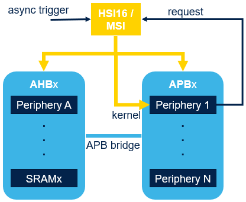

----!
Presentation
----!

# Clocks
Standard set of internal and external clock's sources

## New MSI (MSIK and MSIS)
**16 frequencies** from 100 kHz to 48 MHz

- The MSI is made of four RC oscillators
- Each MSIRCx feeds a prescaler providing a division by 1, 2, 3 or 4.
- 3.072MHz RC for audio frequencies
- Each MSIRCx has user trim code

Two output clocks are generated:

- **MSIS**, that can be selected as system clock
- **MSIK**, that can be selected by some peripherals as kernel clock. 

MSI-PLL mode can be automatically calibrated with LSE

# Autonomous peripherals clock request
The peripheral functionality is autonomous and is not impacted by the MCU power mode changes between Run, Sleep and Stop modes.

Depending on its need, the peripheral generates:

- **A kernel clock request**
- **A bus clock request AHBx / APBx**

The peripheral releases the request as soon as it does not need the clock anymore. 

**In low power mode like Stop modes**

- Peripherals request clock (kernel, AHB, APB)

  - Own request (data transfer, status register update)
  - Hardware asynchronously triggers to start IP and Clock request (I/Os events, LPTIM output triggers,comparators outputs…)

- Peripheral receives the requested clock after RC wakeup time

- The peripheral releases the request as soon as it does not need the clock anymore
  - Oscillator is automatically powered down

# Peripherals clock gating
To enable peripherals Autonomous operation new clock control schema is applied to U5 device

Legacy **xxEN** control bit for clock gating in Run mode

New **xxSMEN** for peripherals mapped in Core Domain (AHB1/APB1 and AHB2/APB2)

- Both xxEN and xxSMEN bits of the peripheral are set to keep clock on in Sleep mode and allow autonomous mode in Stop 0 and Stop 1
- xxSMEN is enabled by default after reset! Take care

Additional **xxAMEN** for peripherals mapped in Smart Run Domain (AHB3/APB3)

- Both xxEN and xxSMEN bits of the peripheral are set, plus the xxAMEN to enable the autonomous mode is enabled in Stop 0, Stop 1 and Stop 2

<awarning> 
If any periphery requests clock -> Once HSI16/MSI is ready it’s propagated to **all enabled peripherals** configured by these control bits – must be well controlled by user to reach best power consumption.
</awarning>

 

