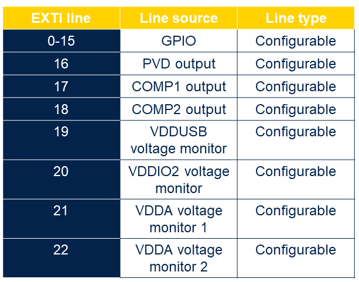

----!
Presentation
----!

# No more EXTI
<ainfo>
Almost all EXTI lines are not needed for peripheries to generate interrupt for wake up event.BEST in 
</ainfo>

 

All event allow the possibility to wake up the system from Stop 0, 1, 2 modes. 

- Selectable active trigger edge 

**No more “direct” lines from peripherals**

- Peripherals with wakeup capability requests the AHB/APB clock
- When the system clock is present, the peripheral generates an interrupt if enabled
- The interrupt wakes-up the device, and is directly connected to NVIC

Individual secure and privilege configuration for each event

