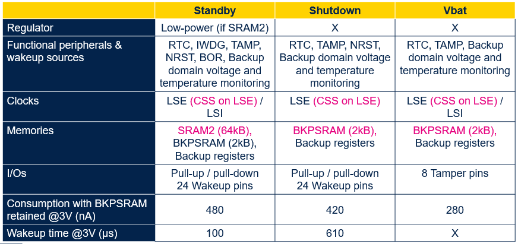

----!
Presentation
----!
# Power Supply
<ainfo>
STM32U5xxxxxx and STM32U5xxxxxx**Q**
</ainfo>

 

**2 packages** available w/ or w/o SMPS

Internal voltage regulator: LDO and SMPS (requiring external 4.7 µF + 2.2 µH)
SMPS and LDO are in parallel and can be selected on the fly during application

- LDO: less noise 
- SMPS: better efficiency

All power modes are supported with SPMS and LDO:

- Exit from Stop and Standby modes is done in the selected regulator, always in range 4
- Exit from Shutdown and boot from reset is  always done on LDO 

SMPS and non-SMPS device are not Pin-to-Pin compatible 
- Not only in SMPS dedicated pins
- Pins on one side are shifted

<awarning>
SMPS is designed for supplying only internal load (cannot be used for supplying external components)
</awarning>

 

## Internal Vcore voltage level
 

# Dynamic vs. Static operation
<ainfo>
BEST in ULP Class! Twice less dynamic consumption vs. L4/L4+ (3x less vs. L5)
</ainfo>

 

STM32U5 is designed to perform dynamic scenario in **Autonomous mode(LPBAM)**

- Off-load the CPU and thus reduce the number of wake-up sequences
- Typical use cases are sensor data acquisition, ADC acquisition, DAC generation…

Datasheet values for LP modes are static consumption only

- No tasks performed

<awarning> 
Device selection must follow **Application demand** and NOT Datasheet comparison (U5 vs. L4/L4+/L5).
</awarning>

 

## Current consumption profile periodical ADC acquisition and I2C trasmit in Stop mode
 

# System Architecture
Two digital domains - CPU Domain (CD) and Smart Run Domain (SRD)

CD & SRD contain full feature set

SRD contains selected peripherals (ADC4, DAC, UART, I2C ,SPI, UART, LPGPIO, SRAM4…)

**In RUN, SLEEP, STOP0 and STOP1**

- Both domains (CD & SRD) fully powered => all peripherals functional thanks to GPDMA1 and LPDMA1

**In STOP2**

- CD in “retention” (low leakage mode) => no dynamic activity possible
- SRD fully powered => SRD autonomous peripherals are functional thanks to LPDMA1

## CPU Domain (CD) and Smart Run Domain (SRD) system architecture

# SLEEP mode
Core stops

High speed clocks run

Sleep Range 4 replaces STM32L4/L5 Low-power sleep mode

# STOP modes
<ainfo>
The lowest low-power mode with full retention (SRAM & peripheral registers) and possible peripheral activity (LPBAM).
</ainfo>

 

Core stops

High speed clocks run only on peripheral’s request

Full retention of SRAM and peripherals registers, with capability to individually **power down** SRAM pages in STOP 0,1,2,3:

- SRAM1 : 3 x 64KB-pages
- SRAM2 : 8KB and 56KB pages
- SRAM3 : 8 x 64KB-pages
- SRAM4
- ICACHE, DCACHE1, DMA2D SRAM, FMAC/FDRAM/USB SRAM, PKA SRAM

Wake-up clock is HSI16 or MSI up to 24 MHz (range 4 only)

Set ULPMEN to further reduce power consumption 

- BOR operates in sampled mode 
- Caution: min. VDD falling slew rate must be respected

## STOP modes summary

Functional peripherals in STOP2 mode – **SRD domain**
- LPDMA, SRAM4, LPUART1, SPI3, I2C3, LPTIM1/2/4, ADF1, DAC1, ADC1, COMP, VREFBUFF, RTC, LPGPIO

New **Low power GPIOs** control dynamically in down to STOP2 mode thanks to LPDMA

# STANDBY - SHUTDOWN - VBAT
Backup domain active

- RTC, LSE, LSI (not in SHUTDOWN)
- TAMP event (extra Supply and Temperature monitoring for TAMP)
- Backup Register
- Clock Security System (CSS) on LSE (32.768 kHz oscillator)

**LSE clock security** system connected to tamper with down to VBAT mode

- Clock missing detection & Over-frequency detection (2 MHz)
- Glitch filtering (2 MHz)

**TAMP**

- Temperature and backup domain voltage monitoring connected to tamper (more details in TN1333 under NDA)
- A tamper detection can erase the backup registers, backup SRAM, SRAM2, caches and cryptographic peripherals

**VBAT Brown-out reset** (1.58V) ensures defined reset state for RTC domain when the VBAT voltage drops below a defined threshold (this is not the case for legacy devices)

Extra **SRAM2 retention** in STANDBY

**2KB BKPSRAM** can be retained (optionally protected by tamper)

# Tips and tricks
Tips how to reduce power consumption in RUN, SLEEP, STOP modes.

