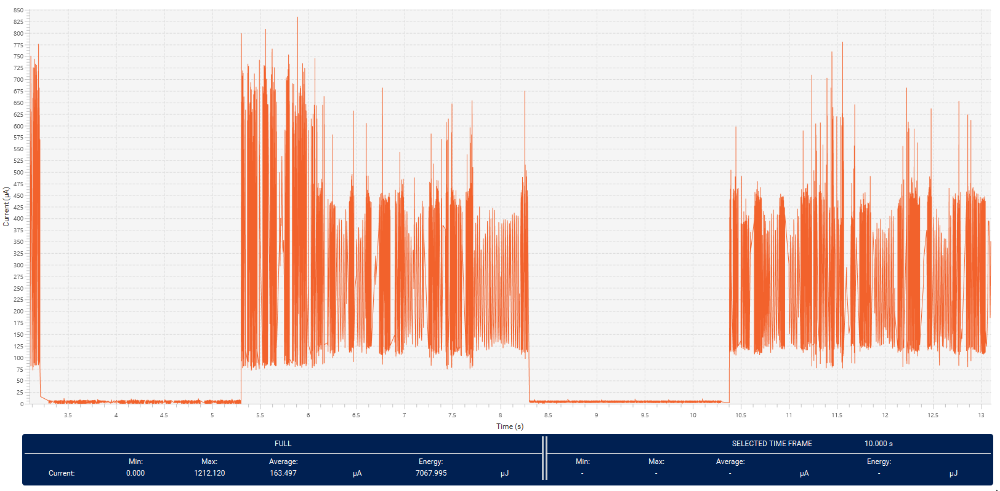

----!
Presentation
----!
# Power Supply
<ainfo>
STM32U5xxxxxx and STM32U5xxxxxx**Q**
</ainfo>
<p> </p>
**2 packages** available w/ or w/o SMPS

Internal voltage regulator: LDO and SMPS (requiring external 4.7 µF + 2.2 µH)
SMPS and LDO are in parallel and can be selected on the fly during application

- LDO: less noise 
- SMPS: better efficiency

All power modes are supported with SPMS and LDO:

- Exit from Stop and Standby modes is done in the selected regulator, always in range 4
- Exit from Shutdown and boot from reset is  always done on LDO 

<awarning>
SMPS is designed for supplying only internal load (cannot be used for supplying external components)
</awarning>
<p> </p>

## Internal Vcore voltage level
 

# Dynamic vs. Static operation
<ainfo>
BEST in ULP Class! Twice less dynamic consumption vs. L4/L4+ (3x less vs. L5)
</ainfo>
<p> </p>
STM32U5 is designed to perform dynamic scenario in **Autonomous mode(LPBAM)**

- Off load Core domain and thus reduce wakeup sequences

DataSheet values for LP modes are Static consumption only

- No tasks are performed
- 2MB flash and 40nm technology leads to higher results vs. L4/L4+
- Keep STM32U5 in ULP mode without any activity is not efficient

<awarning> 
Device selection must follow **Application demand** and NOT DataSheet comparison
</awarning>
<p> </p>

## Current consumption profile periodical ADC acquisition and I2C trasmit in Stop mode
 

# System Architecture
Two digital domains **CPU domain (CD)** and **Smart run domain (SRD)**

CD & SRD contains full feature set

SRD contains only reduced peripheries (ADC4, DAC, UART, I2C ,SPI, UART, LPGPIO, SRAM4,…)

**In Run, Sleep**

- CD & SRD fully powered => all peripherals are functional, thanks to GPDMA1 and LPDMA1

**Stop 0 and Stop 1**

- CD partialy powered & SRD fully powered => peripherals (except high perfomance one) are functional, thanks to GPDMA1 and LPDMA1

**In Stop 2**

- CD in “retention” (lower leakage mode) => no dynamic activity possible
- SRD fully powered => SRD autonomous peripherals are functional thanks to LPDMA1.

## CPU domain (CD) and Smart run domain (SRD) block schema


# Sleep mode
Core stops

High speed clocks run

Sleep Range 4 replaces STM32L4/L5 Low-power sleep mode


# Stop modes
<ainfo>
Lowest power mode with full retention and peripheral activity (LPBAM).
</ainfo>
<p> </p>
Core stops

High speed clocks runs only on peripheral’s demand

Full retention of SRAM and peripherals registers, with capability to individually **power down** SRAM pages in **Stop 0,1,2,3**:

- SRAM1 : 3 x 64KB-pages
- SRAM2 : 8KB and 56KB pages
- SRAM3 : 8 x 64KB-pages
- SRAM4 : 16KB
- ICACHE, DCACHE1, DMA2D SRAM, FMAC/FDRAM/USB SRAM, PKA SRAM

Wakeup clock is HSI16 or MSI up to 24 MHz (range 4 only)

Set ULPMEN to reduce consumption 

- PDR operating in sampling mode
- Caution: min. VDD falling slew rate must be respected

## Stop modes summary


# Stanby, Shutdown, Vbat
Backup domain active

- RTC, LSE, LSI
- TAMP event (extra Supply and Temperature monitoring for TAMP)
- IWDG
- Backup Register
- CSS on LSE

**For Standby**

- optionally SRAM2 (64KB) and BKPSRAM (2KB) can be retained

**For Vbat**

- optionally BKPSRAM (2KB) can be retained

- **VBAT Brownout reset** (1.58V)

# Tips and tricks
Tips how to reduce power consumption in Run, Sleep, Stop modes.


# Let's test all tips - Low power HandsOn Scenario
- Tips and tricks how to reducing consumption step by step 
- Enter in Stop 2 mode and periodically wake up by RTC unit
- LED toggling and monitor consumption profile in **STM32CubeMonitor-Power**


# Power Monitor
## L562 DK Top View
In Low power and LPBAM Hands-on we use Power Shield feature built in L562 Discovery board to for measure purpose and display profile of consumed current in real time.
A small modification of L562 Discovery is needed to be able to measure external power consumption. 

- Keep or switch **SW1 in right position (VDD)** otherwise extra consumption from L562 MCU is add. 
- Select **5V_PM_USB by JP4** as source for L562 board. 
- Connect USB Micro cable to connector below LCD display.

 

## L562 DK Bottom view
- Connect **two wires in position 3 & 1 in CN20** as shown in picture below. 

<ainfo>
Wires can be optionally twisted to reduce noise.
</ainfo> 
<p> </p>
 

## Wiring diagram to Nucleo-U575
- **Remove JP5** on Nucleo

- Connect wires to **GND** and **Pin 2** of **JP5**

 

- or **Connect A-meter** to Pin 1 & 2 of JP5

## Connect L562-DK board
- [Install](https://www.st.com/en/development-tools/stm32cubemonpwr.html) and launch **STM32CubeMonitor-Power**

- Select **Virtual Comport** associated to L562-DK Power measuring feature.

- Press **Take Control**.


## Measuring feature of L562 DK
<awarning>
In most cases this step is not needed. Also ignore displayed **Warning** or **Error** message on LCD. This Warning is aplicatable only for consumption measuring of onboard L562 device.
</awarning> 
<p> </p>

Only if Virtual Comport is not visible

- **Tap on Measurements** icon on LCD 

- No other task is needed for external power measuring

## Calibrate 
It's required to calibrate Power measuring feature (Offset,..)

- Keep Power source unloaded.

- Press **Calibrate**.


## Configuration
In Configuration window many parameters can be adjusted. For hands-on purpose let select:

- **Sampling frequency to 100kHz** to get highest resolution

- **Acquisition time set to infinitive** – endless data recording

- **Start Acquisition**.


# CubeMX
1. Open CubeMx or CubeMX plugin in CubeIDE
2. **Access to MCU selector**
3. Select STM32U575ZI
4. Create New project **without TrustZone activated**
5. Enable **ICACHE 1-way (direct mapped cache)**
6. Configure PC7 (Green LED) as Output Push-Pull. Right click on `PC7` and set as `GPIO_Output`
   


## RTC unit
Application periodically wakeups from Stop mode.

- To do that Wakeup counter of RTC unit is enabled. Keep default LSI as clock source.


LP Stop mode is entered by ` WFI()` instruction. For this reason:

- Enable `RTC non-secure interrupt` in NVIC Setting tab.

- Set `Wake Up clock to 1Hz` base and `set counter to 2`.Periodic wake up event occurs every 2 seconds. 


## Project Manager
- Select CubeIDE Toolchain

- Write project name and `Generate Code`
  


# CubeIDE
- Open **CubeIDE** and related LP_mode project

# Flash linker script
In hands-on we disable Flash Bank 2 and disable data retention in almost all SRAMs. To avoid any HardFault error a correct setup in *linker script STM32U575ZITX_FLASH.ld* is needed.

- Define RAM memory region only for `SRAM4`. Also reduce ROM region to `Flash Bank 1`.

```c
/* Memories definition */
MEMORY
{
  RAM	(xrw)	: ORIGIN = 0x28000000,	LENGTH = 16K
  FLASH	(rx)	: ORIGIN = 0x08000000,	LENGTH = 1024K
}
```
# Comment part of code
In a first part of hands on we don't need GPIO and RTC unit to be activated.

- Commnet following lines in `Initialize all configured peripherals` section:

```c
  /* Initialize all configured peripherals */
 // MX_GPIO_Init();
  MX_ICACHE_Init();
 // MX_RTC_Init();
```

# Vcore range
<awarning>
This step is done by CubeMX generator. Proper Vcore level is set dependetly on System clock.
</awarning>
<p> </p>
Use adequate voltage scaling vs. System clock frequency. Vcore Range 4 replaces STM32L4/L5 Low-power run mode. (<24MHz)

- Enable `Vcore Range 4` in `SystemClock_Config();` function.

```c
(HAL_PWREx_ControlVoltageScaling(PWR_REGULATOR_VOLTAGE_SCALE4)
```

# All Steps done in combo
- **SMPS Vcore supply**

- **Power Down Flash Bank 2**

To be able observe impact of each further steps let put mcu in Stop 2 mode

- **Enter Stop2 mode**

Copy paste following  snippet in `USER CODE BEGIN 2 ` section:

```c
  HAL_Delay(2000);
  /* The SMPS regulator supplies the Vcore Power Domains */
  HAL_PWREx_ConfigSupply(PWR_SMPS_SUPPLY);

  /* Enable the Power-down Mode for Flash Banks*/
  HAL_Delay(2000);
  HAL_FLASHEx_EnablePowerDown(FLASH_BANK_2);

  /* Disable RAM page(s) content lost in Stop mode (Stop 0, 1, 2, 3) */
  HAL_Delay(2000);

/*  HAL_PWREx_DisableRAMsContentStopRetention(PWR_SRAM1_FULL_STOP_RETENTION);
  HAL_PWREx_DisableRAMsContentStopRetention(PWR_SRAM2_FULL_STOP_RETENTION);
  HAL_PWREx_DisableRAMsContentStopRetention(PWR_SRAM3_FULL_STOP_RETENTION);
  HAL_PWREx_DisableRAMsContentStopRetention(PWR_ICACHE_FULL_STOP_RETENTION);
  HAL_PWREx_DisableRAMsContentStopRetention(PWR_DCACHE1_FULL_STOP_RETENTION);
  HAL_PWREx_DisableRAMsContentStopRetention(PWR_DMA2DRAM_FULL_STOP_RETENTION);
  HAL_PWREx_DisableRAMsContentStopRetention(PWR_PERIPHRAM_FULL_STOP_RETENTION);
  HAL_PWREx_DisableRAMsContentStopRetention(PWR_PKA32RAM_FULL_STOP_RETENTION);
*/

  /* Enable ultra low power mode */
  HAL_PWREx_EnableUltraLowPowerMode();

  /* Enter in Stop 2 mode */ 
  HAL_PWREx_EnterSTOP2Mode(PWR_STOPENTRY_WFI);

```
<p> </p>
Compile code, Flash device and **Terminate debug session**
<p> </p>
<awarning> 
Disable Debug in Low Power modes. Otherwise MCU does no enter in genuine LP modes.
</awarning>
<p> </p>


## Measure consumption


# SRAMs retention 
Disable RAM page(s) and caches retention. A content is lost in Stop mode (Stop 0, 1, 2, 3). Copy paste following code in `Begin 2` user section.

- **Uncomment part of code**

```c
/* Disable RAM page(s) content lost in Stop mode (Stop 0, 1, 2, 3) */
HAL_PWREx_DisableRAMsContentStopRetention(PWR_SRAM1_FULL_STOP_RETENTION);
HAL_PWREx_DisableRAMsContentStopRetention(PWR_SRAM2_FULL_STOP_RETENTION);
HAL_PWREx_DisableRAMsContentStopRetention(PWR_SRAM3_FULL_STOP_RETENTION); 
HAL_PWREx_DisableRAMsContentStopRetention(PWR_ICACHE_FULL_STOP_RETENTION);
HAL_PWREx_DisableRAMsContentStopRetention(PWR_DCACHE1_FULL_STOP_RETENTION);
HAL_PWREx_DisableRAMsContentStopRetention(PWR_DMA2DRAM_FULL_STOP_RETENTION);
HAL_PWREx_DisableRAMsContentStopRetention(PWR_PERIPHRAM_FULL_STOP_RETENTION);
HAL_PWREx_DisableRAMsContentStopRetention(PWR_PKA32RAM_FULL_STOP_RETENTION);
```
<p> </p>
Compile code, Flash device and **Terminate debug session**

## Measure consumption in Stop 2 mode given by SRAMs retention off
- Consumption is reduced to aprrox. 4 uA.


# Clocks
Standard set of internal and external clock's sources


## New MSI (MSIK and MSIS)
**16 frequencies** from 100 kHz to 48 MHz

- The MSI is made of four RC oscillators
- Each MSIRCx feeds a prescaler providing a division by 1, 2, 3 or 4.
- 3.072MHz RC for audio frequencies
- Each MSIRCx has user trim code

Two output clocks are generated:

- **MSIS**, that can be selected as system clock
- **MSIK**, that can be selected by some peripherals as kernel clock. 

MSI-PLL mode can be automatically calibrated with LSE


# Autonomous peripherals clocks requests
The peripheral functionality is autonomous and is not impacted by the MCU power mode changes between Run, Sleep and Stop modes.

Depending on its need, the peripheral generates:

- **A kernel clock request**
- **A bus clock request**

The peripheral releases the request as soon as it does not need the clock anymore. 

**In Stop mode**

- Peripheral receive the requested clock after RC wakeup time (DMA request latency)
- When no clock request is set, the oscillator is automatically powered down
- Hardware asynchronously triggers to start IP and Clock request (I/Os events, LPTIM output triggers, comparators outputs…)
- When needed, the IP request the system clock to update its status register

## Core Domain
A new clock control bits **xxSMEM** for CD peripherals requesting clock when MCU is in Sleep mode.


## Smart Run Domain
Additional SRD Autonomous clock control bits **xxAMEN** to enable SRD peripherals clock when the MCU is in Stop mode with SRD in DRun mode. 


# No more EXTI
<ainfo>
Almost all EXTI lines are not needed for peripheries to generate interrupt for wake up event.BEST in 
</ainfo>
<p> </p>

All event allow the possibility to wake up the system from Stop 0, 1, 2 modes. 

- Selectable active trigger edge 

**No more “direct” lines from peripherals**

- Peripherals with wakeup capability requests the AHB/APB clock
- When the system clock is present, the peripheral generates an interrupt if enabled
- The interrupt wakes-up the device, and is directly connected to NVIC

## Stop modes summary


# Back to Hands on
## Uncomment part of code
In a first part of hands on we don't need GPIO and RTC unit to be activated.

**Uncomment** following lines:

```c
MX_RTC_Init();
MX_GPIO_Init();
```
<p> </p>
**Comment** following line EnterSTOPmode in `USER CODE BEGIN 2` user section:

```c
//HAL_PWREx_EnterSTOP2Mode(PWR_STOPENTRY_WFI);
```

# RTC Autonomous mode
- Enable the Autonomous Mode for the RTC Stop0/1/2. RTC is part of Smart Run Domain and dedicated clock enable bit must be set otherwise RTC would not wakeup device from STOP modes. Now device periodically wakeup from Stop2 mode. 
- Copy paste following snippet in `USER CODE BEGIN 2` section.

```c
/* Enable the Autonomous Mode for the RTC Stop0/1/2*/
__HAL_RCC_RTCAPB_CLKAM_ENABLE();
```

# STOP2 mode with RTC periodic wakeup

- Add Systick delay 3s to be able to measure consumption difference by A-meter

- Set `RTC WakeUp timer` for 3s

- Enter `Stop2 mode`
  
Copy paste following snippet in `While(1)` user section. 

```c
	  HAL_GPIO_TogglePin(GPIOC, GPIO_PIN_7);
	  HAL_Delay(3000);
	  HAL_GPIO_TogglePin(GPIOC, GPIO_PIN_7);
	  //Set RTC wakeup timer for 3s
	  HAL_RTCEx_SetWakeUpTimer_IT(&hrtc, 3, RTC_WAKEUPCLOCK_CK_SPRE_16BITS, 0);
	  /* Enter Stop 2 Mode */
	  HAL_PWREx_EnterSTOP2Mode(PWR_STOPENTRY_WFI);
```
<p> </p>
Compile code, Flash device and **Terminate debug session**

**Measure consumption given by STOP2 mode with RTC periodic wakeup**



# Thank you for attention