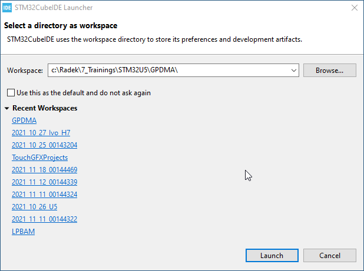
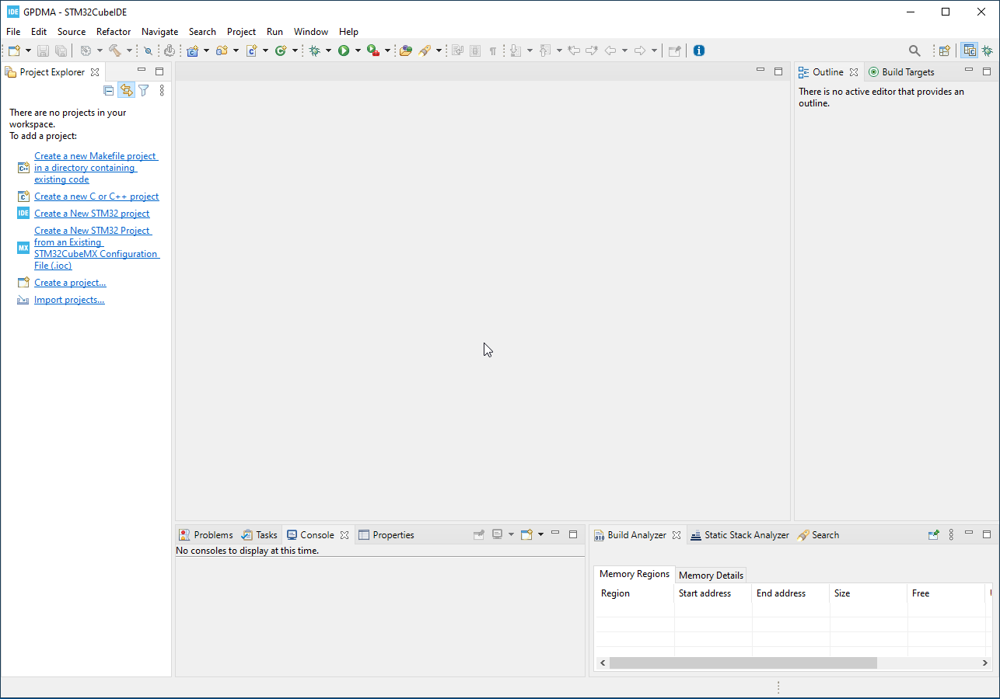
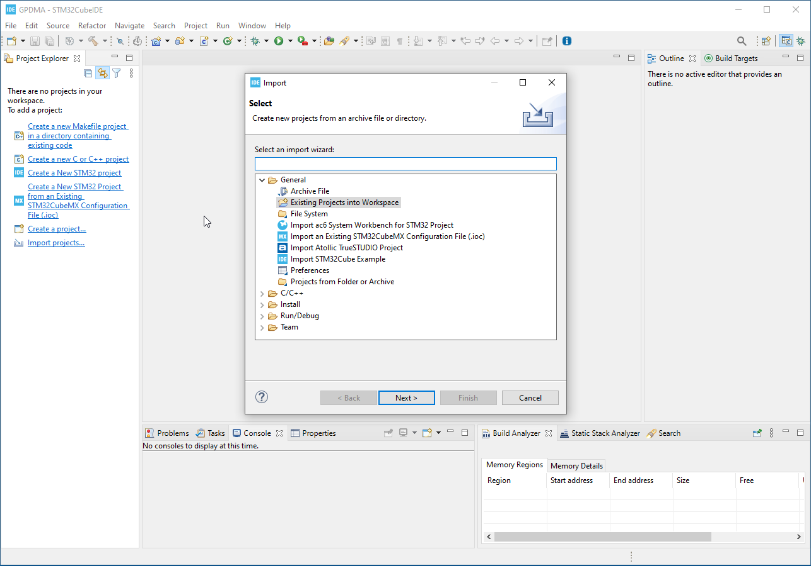

# Import project to CubeIDE

Step by step guide how to import project to CubeIDE

1. Start CubeIDE

2. Select your workspace

## Import project 

4. Menu>File>Import

5. existing project from workspace

6. Select project

7. Click `Finish` button

Now your project is imported into your IDE