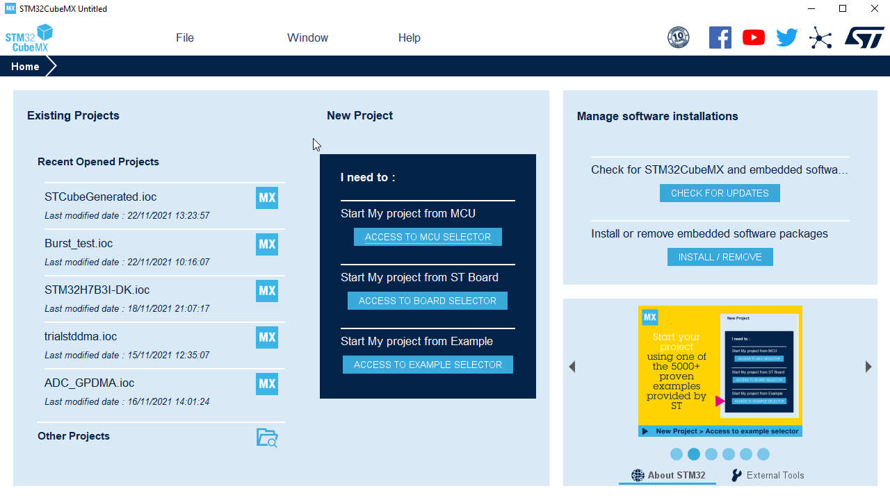
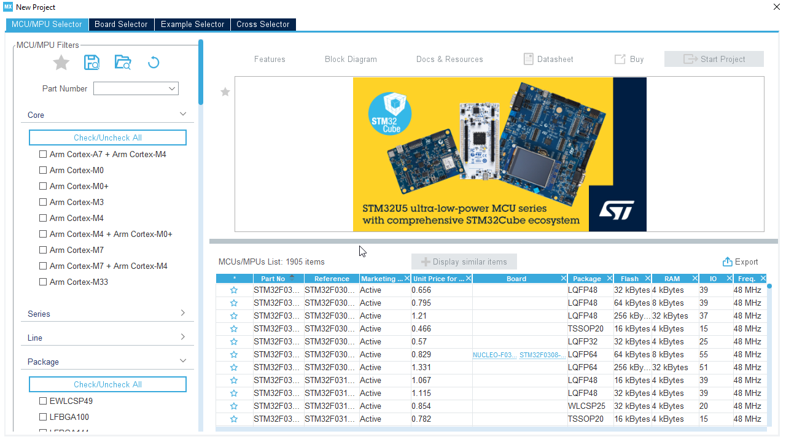
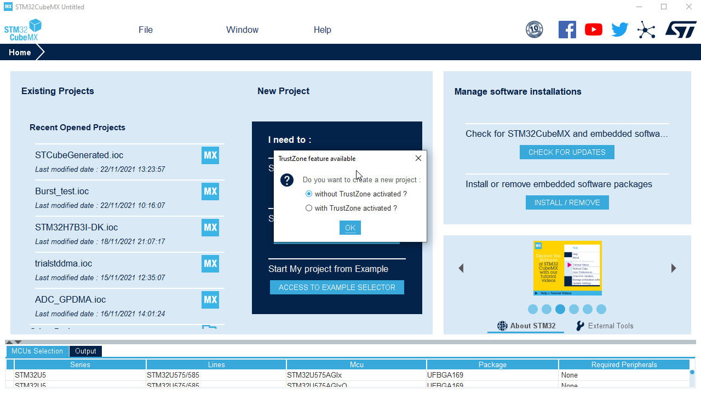

# Create MX project

1. Start CubeMX

2. Select `File>New project`

3. In device selector find your device (`STM32U575ZIT` is on Nucleo)

4. `Start project`

5. No TrustiZone `Without TrustZone activated`

