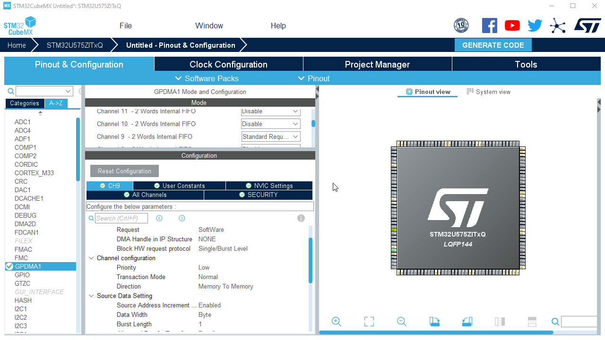
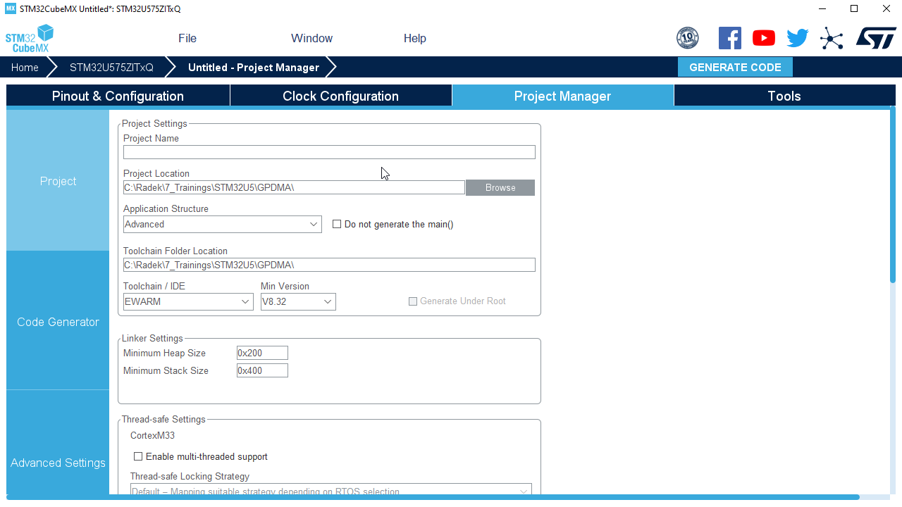
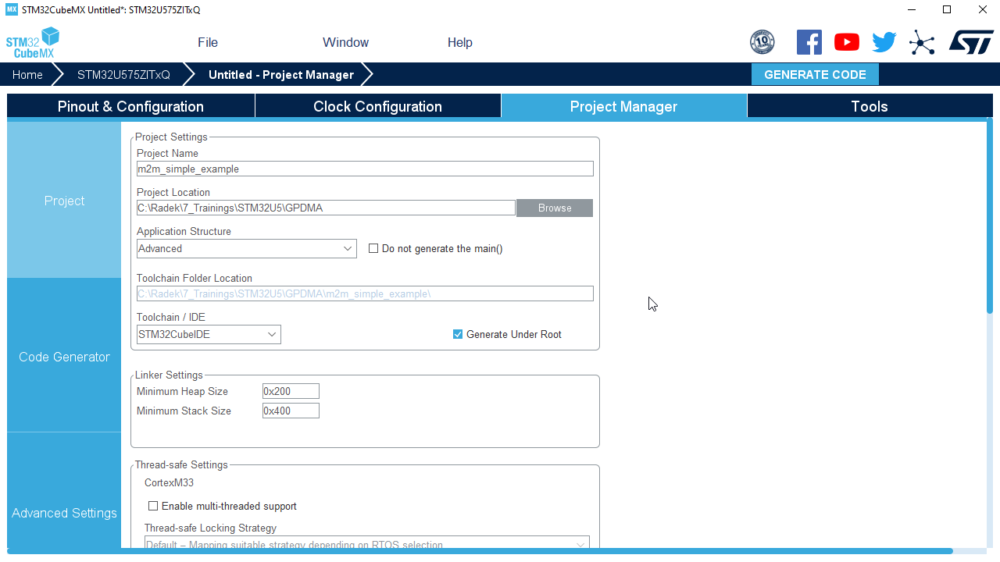

# Store and generate project

1. Open `Program manager` tab

2. Set `project name`

3. Set location where to create project folder

4. Select target IDE - `CubeIDE`

5. Generate project 

6. Optional (confirm use STM32U5 without cache)

